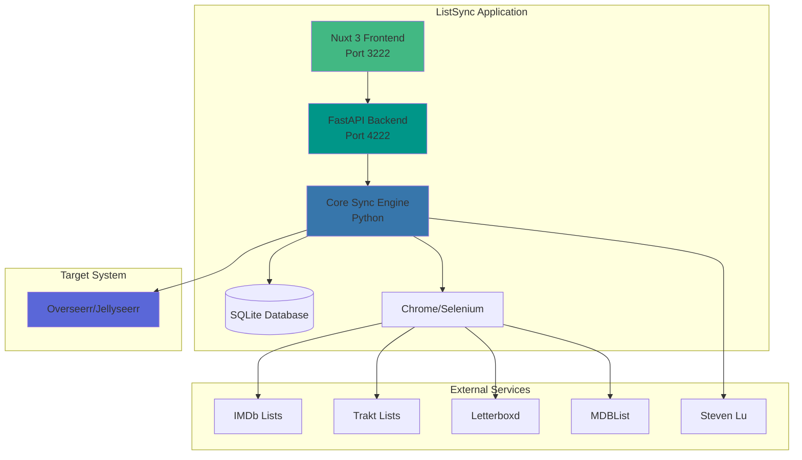

# 🍿 ListSync - Bridge Your Watchlist & Media Server 🎬


[](https://soluify.com/)
[](https://www.linkedin.com/company/soluify)

---

## 🚀 What is ListSync? 

ListSync automatically syncs your watchlists from IMDb, Trakt, Letterboxd, MDBList, and more with Overseerr/Jellyseerr. No more manual adding - just add movies and shows to your favorite watchlist, and they'll appear in your media server automatically.

---

## 📚 Quick Links

- [🚀 Installation Guide](#-getting-started)
- [📋 List Setup Guide](#-obtaining-list-ids)
- [🛠️ Troubleshooting](#-troubleshooting)
- [📖 Documentation](docs/)

---

## 🖥️ Modern Web Dashboard

ListSync now includes a **comprehensive web dashboard** built with Nuxt 3 and Vue 3, providing a modern interface to manage all your sync operations.


**Access your dashboard at:** `http://localhost:3222` (frontend) and `http://localhost:4222/api` (API)

---

## ✨ Key Features

<details>
<summary><strong>🎬 Content Sources</strong></summary>

- **IMDb**: Top 250, Box Office, Custom Lists, Watchlists
- **Trakt**: Trending, Popular, Anticipated, Personal Lists  
- **Letterboxd**: User lists and watchlists
- **MDBList**: Community curated collections
- **Steven Lu**: Popular movies collection

</details>

<details>
<summary><strong>🎯 Smart Automation</strong></summary>

- **Automatic Sync**: Set it and forget it - syncs on your schedule
- **Intelligent Matching**: Advanced title matching with year validation
- **Duplicate Detection**: Never request the same item twice
- **Batch Processing**: Efficiently handles large lists
- **Error Recovery**: Automatic retry for failed items

</details>

<details>
<summary><strong>📊 Management & Monitoring</strong></summary>

- **Modern Web Dashboard**: Beautiful Nuxt 3 interface with real-time updates
- **REST API**: Full control via API ([40+ endpoints](http://localhost:4222/docs))
- **Live Progress**: Watch syncs happen in real-time
- **Detailed Analytics**: Track success rates, failures, and trends
- **Discord Notifications**: Get updates on sync completion

</details>

<details>
<summary><strong>🛠️ Flexible Configuration</strong></summary>

- **Multiple Deployment Options**: Full stack or lightweight core-only
- **Environment-Based Config**: Simple `.env` file configuration
- **Pre-configured Templates**: Jump-start with curated lists
- **Timezone Support**: Accurate timestamps in your local time
- **4K Support**: Automatically request 4K versions when available

</details>

<details>
<summary><strong>🔒 Built for Reliability</strong></summary>

- **SQLite Database**: Local, fast, and reliable data storage
- **Docker Optimized**: Fully containerized with health checks
- **Resource Efficient**: Runs on minimal hardware
- **SeleniumBase**: Robust web scraping with anti-detection
- **Open Source**: Transparent, auditable, community-driven

</details>

---

### Currently in Development for v0.7.0

For the most stable experience, use the source code from the latest release [here](https://github.com/Woahai321/list-sync/releases).

---

## ⚡ Quick Start (3 minutes)

**Get ListSync running in under 3 minutes:**

```bash
# 1. Clone and enter directory
git clone https://github.com/Woahai321/list-sync.git && cd list-sync

# 2. Copy environment file
cp .env.example .env

# 3. Edit .env - Add these three settings:
#    OVERSEERR_URL=http://your-overseerr:5055
#    OVERSEERR_API_KEY=your-api-key
#    IMDB_LISTS=top

# 4. Start ListSync
docker-compose up -d

# 5. Open dashboard
# Visit: http://localhost:3222
```

**That's it!** Your first sync will start automatically. 🎉

---

## 🚀 Getting Started

ListSync offers **flexible deployment options** to suit different use cases, from quick testing to full production deployments with web dashboard.

## 🐳 Docker Deployment Options

<details open>
<summary>📦 <strong>Option 1: Full Stack Deployment</strong> (Recommended)</summary>

### **Complete ListSync with Web Dashboard + API + Core Sync**

**Complete solution with web dashboard, API, and sync engine.**

```bash
# 1. Clone the repository
git clone https://github.com/Woahai321/list-sync.git
cd list-sync

# 2. Copy and configure environment file
cp .env.example .env
nano .env  # Add your Overseerr URL, API key, and lists

# 3. Start with the default docker-compose.yml
docker-compose up -d

# That's it! Access your dashboard at http://localhost:3222
```

**Access Points:**
- 🌐 Web Dashboard: `http://localhost:3222`
- 📡 API Documentation: `http://localhost:4222/docs`
- 🏥 Health Check: `http://localhost:4222/api/system/health`

**Perfect for:**
- 🏠 Home media server enthusiasts
- 👥 Team/family shared access
- 📊 Users who want visual management
- 🔧 Anyone wanting the easiest setup

</details>

<details>
<summary>⚙️ <strong>Option 2: Core-Only Deployment</strong> (Lightweight)</summary>

### **Lightweight Core Sync Engine**

**Minimal setup with just the sync engine**

```bash
# 1. Clone the repository
git clone https://github.com/Woahai321/list-sync.git
cd list-sync

# 2. Copy and configure environment file
cp .env.example .env
nano .env  # Add your Overseerr URL, API key, and lists

# 3. Start with the core docker-compose file
docker-compose -f docker-compose.core.yml up -d

# Done! Sync runs automatically in the background
```

**Perfect for:**
- 🖥️ Headless/remote servers
- 📦 Minimal resource usage (lower RAM/CPU)

**Monitoring Core-Only:**
```bash
# View logs
docker-compose -f docker-compose.core.yml logs -f

```

</details>

---

## 📋 Obtaining List IDs

ListSync supports multiple list services. You can add them using either the raw URL or the list ID.

<details>
<summary>📋 IMDb List ID or URL</summary>

#### **Using the Raw URL**:
1. Navigate to your IMDb list in your browser.  
2. Copy the URL from the address bar. Examples:  
   - Custom lists: `https://www.imdb.com/list/ls012345678/`  
   - IMDb charts: `https://www.imdb.com/chart/top/` (Top 250), `https://www.imdb.com/chart/boxoffice/` (Box Office)  
   - Watchlists: `https://www.imdb.com/user/ur12345678/watchlist`  
3. Paste the URL directly into ListSync.

#### **Using the List ID**:
1. Look at the URL:  
   - Custom lists: `ls012345678`  
   - IMDb charts: Use the chart name (e.g., `top`, `boxoffice`)  
   - Watchlists: `ur12345678`  
2. Use the list ID in ListSync.

#### **Supported IMDb Charts**:
- `top` (Top 250 Movies)  
- `boxoffice` (Box Office)  
- `moviemeter` (MovieMeter)  
- `tvmeter` (TVMeter)  
</details>

<details>
<summary>🔑 Trakt API Configuration (Required)</summary>

### **Setting up Trakt API Access**

ListSync now uses the **official Trakt API v2** for improved reliability and performance. To use Trakt lists, you need to configure API credentials:

#### **Step 1: Create a Trakt Application**
1. Go to [https://trakt.tv/oauth/applications](https://trakt.tv/oauth/applications)
2. Click **"New Application"**
3. Fill in the required fields:
   - **Name**: `ListSync` (or any name you prefer)
   - **Redirect URI**: `urn:ietf:wg:oauth:2.0:oob` (not used but required)
   - Other fields can be left as default
4. Click **"Save App"**

#### **Step 2: Get Your Client ID**
1. After creating the app, you'll see your **Client ID** and **Client Secret**
2. Copy the **Client ID** (the Client Secret is not needed for ListSync)

#### **Step 3: Configure ListSync**
Add your Client ID to your `.env` file:
```bash
# Trakt API Configuration
TRAKT_CLIENT_ID=your_client_id_here
```

Or set it in your docker-compose environment variables:
```yaml
environment:
  - TRAKT_CLIENT_ID=your_client_id_here
```

**That's it!** Trakt lists will now work automatically. No OAuth flow or authentication needed for public lists.

#### **Benefits of API Integration:**
- ✅ **Faster** - API calls are 10-20x faster than web scraping
- ✅ **Reliable** - No more breakage when Trakt updates their UI
- ✅ **Better Data** - Get TMDb IDs and IMDb IDs directly
- ✅ **Rate Limits** - 1000 requests per 5 minutes (more than enough)

</details>

<details>
<summary>📋 Letterboxd URL</summary>

#### **Using the Raw URL**:
1. Navigate to your Letterboxd list in your browser.  
2. Copy the URL from the address bar. Example:  
   - `https://letterboxd.com/user/list/example-list/`  
   - `https://letterboxd.com/user/watchlist/` (for watchlists)
3. Paste the URL directly into ListSync.  
</details>

<details>
<summary>📋 MDBList URL or Username/List Format</summary>

#### **Using the Raw URL**:
1. Navigate to your MDBList list in your browser.
2. Copy the URL from the address bar. Example:
   - `https://mdblist.com/lists/username/listname`
3. Paste the URL directly into ListSync.

#### **Using Username/List Format**:
1. You can also use the simpler format:
   - `username/listname`
2. ListSync will automatically expand this to the full URL.
</details>

<details>
<summary>📋 Steven Lu's Popular Movies</summary>

This is a curated list of popular movies maintained by Steven Lu, available at:
- `https://s3.amazonaws.com/popular-movies/movies.json`

To enable this list, simply add the below vairable:
- `STEVENLU_LISTS=stevenlu`

This will be recognized as the Steven Lu Popular Movies list.
</details>

<details>
<summary>📋 Trakt List ID or URL</summary>

#### **Using the Raw URL**:
1. Navigate to your Trakt list in your browser.  
2. Copy the URL from the address bar. Example:  
   - `https://app.trakt.tv/users/username/lists/listname`  
3. Paste the URL directly into ListSync.

</details>

<details>
<summary>📋 Trakt Special Lists</summary>

#### **Using Shortcut Format**:
ListSync supports a shortcut format of `list-type:media-type`. Examples:
- `trending:movies` - Top trending movies
- `popular:shows` - Popular TV shows
- `anticipated:movies` - Most anticipated movies

#### **Available Types**:
- **List types**: trending, popular, anticipated, watched, collected, boxoffice, streaming, recommendations, favorited 
- **Media types**: movies, shows

Note: The boxoffice list type is only available for movies.

These special lists sync a configurable number of items (default: 20, can be set via TRAKT_SPECIAL_ITEMS_LIMIT environment variable).
</details>


## 🛠️ Configuration

<details>
<summary>⚙️ <strong>Basic Configuration</strong></summary>

### **Essential Settings**

All you need is a `.env` file with three settings:

```bash
OVERSEERR_URL=http://your-overseerr:5055    # Your Overseerr/Jellyseerr URL
OVERSEERR_API_KEY=your-api-key-here         # Get from Overseerr Settings → General
IMDB_LISTS=top                              # Start with IMDb Top 250
```

**Optional Settings:**
```bash
SYNC_INTERVAL=24          # Hours between syncs (default: 24)
AUTOMATED_MODE=true       # Enable automatic syncing (default: true)
OVERSEERR_4K=false        # Request 4K versions (default: false)
DISCORD_WEBHOOK_URL=...   # Discord notifications (optional)
TZ=America/New_York       # Your timezone (default: GMT)
```

</details>

<details>
<summary>🎯 <strong>Pre-configured Lists Template</strong></summary>

### **Jump-Start with Curated Lists**

Want instant content? Use our plug-and-play configuration with curated lists:

```bash
cp .env.plugnplay .env
# Then edit your Overseerr URL and API key
```

Includes these pre-configured lists:

| Provider | List Type | Description |
|----------|-----------|-------------|
| **IMDb** | Chart & Lists | [Top 250 Movies](https://www.imdb.com/chart/top), [Disney Movies](https://www.imdb.com/list/ls026785255) |
| **Trakt** | Trending & Popular | [Trending Movies](https://trakt.tv/movies/trending), [Popular Movies](https://trakt.tv/movies/popular), [Trending Shows](https://trakt.tv/shows/trending), [Popular Shows](https://trakt.tv/shows/popular) |
| **MDBList** | Curated Collections | [Top Weekly Movies](https://mdblist.com/lists/garycrawfordgc/top-movies-of-the-week), [Pixar Movies](https://mdblist.com/lists/linaspurinis/pixar-movies), [Pirated Movies Charts](https://mdblist.com/lists/hdlists/top-ten-pirated-movies-of-the-week-torrent-freak-com) |
| **Steven Lu** | Popular Collection | [Popular Movies Collection](https://movies.stevenlu.com/) |

</details>

<details>
<summary>🌍 <strong>Timezone Configuration</strong></summary>

### **Configure Your Local Timezone**

ListSync automatically timestamps all sync activities and displays them in the web interface. To ensure timestamps match your local time, configure your timezone using **any of the three supported formats** below.

ListSync supports **three timezone formats** for maximum flexibility:

#### **1️⃣ IANA Timezone Names (Recommended - Handles DST Automatically)**
```yaml
# docker-compose.yml or .env file
environment:
  - TZ=Europe/Paris           # France (CET/CEST with DST)
  - TZ=America/New_York       # US Eastern (EST/EDT with DST)
  - TZ=America/Los_Angeles    # US Pacific (PST/PDT with DST)
  - TZ=America/Chicago        # US Central (CST/CDT with DST)
  - TZ=Asia/Tokyo             # Japan
  - TZ=Australia/Sydney       # Australia Eastern
  - TZ=Europe/London          # UK (GMT/BST with DST)
```

#### **2️⃣ Common Abbreviations (Simple & Familiar)**
```yaml
# docker-compose.yml or .env file
environment:
  - TZ=EST                    # US Eastern Standard Time
  - TZ=PST                    # US Pacific Standard Time
  - TZ=CET                    # Central European Time
  - TZ=GMT                    # Greenwich Mean Time
  - TZ=BST                    # British Summer Time
  - TZ=AEST                   # Australian Eastern Standard Time
```

#### **3️⃣ UTC/GMT Offsets (Universal & Simple)**
```yaml
# docker-compose.yml or .env file
environment:
  # UTC offsets
  - TZ=UTC                    # Coordinated Universal Time
  - TZ=UTC+1                  # Central European Time
  - TZ=UTC-5                  # US Eastern Time
  - TZ=UTC-8                  # US Pacific Time
  - TZ=UTC+8                  # China/Singapore Time
  - TZ=UTC+5:30               # India Standard Time
  
  # GMT offsets (equivalent to UTC)
  - TZ=GMT+1                  # Central European Time
  - TZ=GMT-5                  # US Eastern Time
```

#### **🔍 Finding Your Timezone**

- **🌐 IANA Names**: [Wikipedia TZ Database](https://en.wikipedia.org/wiki/List_of_tz_database_time_zones)
- **🌍 UTC Offsets**: [timeanddate.com/time/zones](https://www.timeanddate.com/time/zones/)
- **🖥️ Linux/macOS**: Run `timedatectl` or `cat /etc/timezone`
- **🪟 Windows**: Check "Time zone" in Settings → Time & Language

#### **💡 Which Format Should I Use?**

| Format | Best For | Handles DST? | Example |
|--------|----------|--------------|---------|
| **IANA Names** | Production use | ✅ Yes | `Europe/Paris` |
| **Abbreviations** | Quick setup | ✅ Yes | `EST`, `CET` |
| **UTC/GMT Offsets** | Testing, fixed offsets | ❌ No | `UTC+1`, `GMT-5` |

> **Tip**: Use **IANA timezone names** for production deployments as they automatically handle Daylight Saving Time (DST) transitions!

</details>
</details>

## 🛠️ Manual Installation (Advanced Users)

<details>
<summary>🔧 Local Development & Manual Setup</summary>

For **developers** or **advanced users** who want to run ListSync without Docker or need a **development environment**.

### **Prerequisites**
- Python 3.9+
- Node.js 18+ (for web dashboard)
- Chrome/Chromium browser
- Git

### **Quick Manual Setup**

| Installation Method | Command |
| :------------------ | :------------------------------------------------------------ |
|  | `git clone https://github.com/Woahai321/list-sync.git && cd list-sync && poetry install && poetry run python -m list_sync` |
|  | `git clone https://github.com/Woahai321/list-sync.git && cd list-sync && pip install -r requirements.txt && python -m list_sync` |

**Additional Resources:**
- 📖 [Detailed Installation Guide](docs/installation.md)
- 👥 [Contributing Guide](docs/contributing.md)
- 🏗️ [Architecture Overview](docs/architecture.md)

</details>

---
## 📊 Compatibility

<details>
<summary>🌉 SeerrBridge Integration</summary>


[](https://github.com/Woahai321/SeerrBridge)

SeerrBridge is our companion application that provides an alternative to traditional \*arr stack (Radarr/Sonarr) setup. It works alongside ListSync to create a complete media management solution:

- **Automated Processing**: When ListSync adds requests to Jellyseerr/Overseerr, SeerrBridge automatically processes them
- **Browser Automation**: Uses Selenium to automate media fetching through Debrid Media Manager
- **Simplified Setup**: Eliminates the need for complex \*arr stack configuration

#### How ListSync & SeerrBridge Work Together

1. ListSync adds media requests to Jellyseerr/Overseerr
2. SeerrBridge detects the requests via webhook
3. SeerrBridge automatically processes the requests through DMM
4. Media becomes available in your RD library

For detailed information about SeerrBridge, visit the [SeerrBridge Repository](https://github.com/Woahai321/SeerrBridge).
</details>

### Media Server Compatibility

|                                                                                                                                                                                                                                                                                     Application                                                                                                                                                                                                                                                                                     |    Status    | Notes                              |
| :---------------------------------------------------------------------------------------------------------------------------------------------------------------------------------------------------------------------------------------------------------------------------------------------------------------------------------------------------------------------------------------------------------------------------------------------------------------------------------------------------------------------------------------------------------------------------------: | :----------: | :--------------------------------- |
|     | ✅ Supported | Full functionality with Overseerr  |
|  | ✅ Supported | Full functionality with Jellyseerr |
|         | ✅ Supported | Compatible through Jellyseerr      |
|          | ✅ Supported | Compatible through Jellyseerr      |

### Supported List Services

|                                                                                                                                                                                                                                                                                   Service                                                                                                                                                                                                                                                                                   |    Status    | Notes                                                        |
| :-------------------------------------------------------------------------------------------------------------------------------------------------------------------------------------------------------------------------------------------------------------------------------------------------------------------------------------------------------------------------------------------------------------------------------------------------------------------------------------------------------------------------------------------------------------------------: | :----------: | :----------------------------------------------------------- |
|              | ✅ Supported | Full support for lists, watchlists, and charts              |
|            | ✅ Supported | Full support for lists and user watchlists                  |
|  | ✅ Supported | Special lists include trending, popular, anticipated (configurable item limit) |
|  | ✅ Supported | Fixed pagination for watchlists with "Older" button support |
|          | ✅ Supported | Support for username/listname format or full URLs          |
|      | ✅ Supported | Popular movies from JSON API  |

---

## 📋 Notes

- **Security Best Practices:** Please read scripts you find online before running them.
- **API Credentials:** Always keep your API credentials secure.
- **Rate Limiting:** Be mindful of Overseerr's rate limiting policies during imports.
- **Permissions:** Only import and manage media you have the rights to handle.

---

## 🏗️ System Architecture

<details>
<summary><strong>View System Architecture Diagram</strong></summary>



For a detailed technical breakdown, see our [Architecture Documentation](/docs/architecture.md).

</details>

---

## 💰 Support ListSync's Development

If you find ListSync useful and would like to support its development, consider becoming a sponsor:

➡️ [Sponsor us on GitHub](https://github.com/sponsors/Woahai321)

Thank you for your support!

---

## 📖 Documentation

For comprehensive documentation, visit our [Documentation Hub](/docs/index.md) or explore specific guides:

- **[User Guide](/docs/user-guide.md)** - Complete usage guide with examples
- **[Installation Guide](/docs/installation.md)** - Detailed installation instructions
- **[Configuration Guide](/docs/configuration.md)** - Environment setup and configuration
- **[API Documentation](/docs/api.md)** - Complete REST API reference
- **[Architecture Overview](/docs/architecture.md)** - Technical architecture and design

## 🛠 Troubleshooting

If you encounter any issues while using ListSync, please check our [Troubleshooting Guide](/docs/troubleshooting.md) for solutions to common problems.

## 🤝 Contributing

We welcome contributions! For guidelines on how to contribute, please see our [Contributing Guide](/docs/contributing.md).

## 📄 License

This project is licensed under the [MIT License](https://opensource.org/license/mit). Review the LICENSE file for more details.

## 🛡️ Legal Information

For important legal information about using ListSync, please refer to our [Legal Disclaimer](/docs/legal-disclaimer.md).

## Star History

<a href="https://www.star-history.com/#Woahai321/list-sync&Date">
 <picture>
   <source media="(prefers-color-scheme: dark)" srcset="https://api.star-history.com/svg?repos=Woahai321/list-sync&type=Date&theme=dark" />
   <source media="(prefers-color-scheme: light)" srcset="https://api.star-history.com/svg?repos=Woahai321/list-sync&type=Date" />
   
 </picture>
</a>
