# 🍿 ListSync - Bridge Your Watchlist & Media Server


[](https://soluify.com/)
[](https://www.linkedin.com/company/soluify)

---

## 🍿 What is ListSync? 

ListSync automatically syncs your watchlists from IMDb, Trakt and many more with Overseerr/Jellyseerr. No more manual adding - just add movies, shows, and anime to your favorite watchlist, and they'll appear in your media server automatically.

<div align="center">

[](#-getting-started)
[](#-api-keys--list-configuration)
[](docs/)

</div>

---

## 🍿 Modern Web Dashboard

ListSync includes a **web dashboard** built with Nuxt 3 and Vue 3, providing an interface to manage all your sync operations.


---

### Currently in Development for v0.7.0

For the most stable experience, use the source code from the latest release [here](https://github.com/Woahai321/list-sync/releases).

---

## 🍿 Quick Start

**No configuration needed!** Just run this command to start the container and use the setup wizard:

```bash
docker run -d --name listsync-full -p 3222:3222 -p 4222:4222 -v listsync-data:/usr/src/app/data ghcr.io/woahai321/list-sync:main
```

Access the dashboard at `http://localhost:3222` and complete the setup wizard to connect your media server and watchlists.


---

## 🍿 Getting Started

ListSync offers **flexible deployment options** to suit different use cases, from quick testing to full production deployments with web dashboard.


## 🍿 Docker Deployment

<details open>
<summary>🍿 <strong>Full Stack Deployment</strong> (Recommended)</summary>

```bash
# Clone and setup
git clone https://github.com/Woahai321/list-sync.git && cd list-sync

# (Optional: Configure a .env file)
# Use pre-built image
docker-compose up -d

# Or build from source
docker-compose -f docker-compose.local.yml up -d --build
```

**Access:**
- Dashboard: `http://localhost:3222`
- API Docs: `http://localhost:4222/docs`
- Health: `http://localhost:4222/api/system/health`

All 3 services (Core Sync, FastAPI Backend, Nuxt Frontend) run in a single container managed by supervisor.

</details>

<details>
<summary>🍿 <strong>Option 2: Core-Only Deployment</strong> (Lightweight)</summary>

### **Lightweight Core Sync Engine**

**Minimal setup with just the sync engine**

```bash
# 1. Clone the repository
git clone https://github.com/Woahai321/list-sync.git
cd list-sync

# 2. Copy and configure environment file
cp .env.example .env
nano .env  # Add your Overseerr URL, API key, and lists

# 3. Start with the core docker-compose file
docker-compose -f docker-compose.core.yml up -d

# Done! Sync runs automatically in the background
```

**Monitoring Core-Only:**
```bash
# View logs
docker-compose -f docker-compose.core.yml logs -f

```

</details>

---

## 🍿 API Keys & List Configuration

### 🔑 API Keys

<details>
<summary>🔑 Trakt API Configuration (Required)</summary>

### **Setting up Trakt API Access**

ListSync now uses the **official Trakt API v2** for improved reliability and performance. To use Trakt lists, you need to configure API credentials:

#### **Step 1: Create a Trakt Application**
1. Go to [https://trakt.tv/oauth/applications](https://trakt.tv/oauth/applications)
2. Click **"New Application"**
3. Fill in the required fields:
   - **Name**: `ListSync` (or any name you prefer)
   - **Redirect URI**: `urn:ietf:wg:oauth:2.0:oob` (not used but required)
   - Other fields can be left as default
4. Click **"Save App"**

#### **Step 2: Get Your Client ID**
1. After creating the app, you'll see your **Client ID** and **Client Secret**
2. Copy the **Client ID** (the Client Secret is not needed for ListSync)

#### **Step 3: Configure ListSync**
Add your Client ID to your `.env` file or via the web dashboard:
```bash
# Trakt API Configuration
TRAKT_CLIENT_ID=your_client_id_here
```

</details>

<details>
<summary>🔑 TMDB API Configuration (Optional)</summary>

### **Setting up TMDB API Access**

ListSync can use the official TMDB API for improved reliability and performance. To use TMDB lists with API access, you need to configure API credentials:

#### **Step 1: Create a TMDB Account**
1. Go to [https://www.themoviedb.org/settings/api](https://www.themoviedb.org/settings/api)
2. Click **"Request an API Key"**
3. Fill in the required fields:
   - **Application Name**: `ListSync` (or any name you prefer)
   - **Application Summary**: `Media list synchronization tool`
   - **Application URL**: `https://github.com/Woahai321/list-sync`
4. Click **"Submit"**

#### **Step 2: Get Your API Key**
1. After approval, you'll receive your **API Key (v3 auth)**
2. Copy the API key

#### **Step 3: Configure ListSync**
Add your API key to your `.env` file or via the web dashboard:
```bash
# TMDB API Configuration
TMDB_KEY=your_api_key_here
```
</details>

<details>
<summary>🔑 TVDB API Configuration (Optional)</summary>

### **Setting up TVDB API Access**

ListSync can use the official TVDB API for enhanced data quality. To use TVDB with API access, you need to configure API credentials:

#### **Step 1: Create a TVDB Account**
1. Go to [https://thetvdb.com/api-information](https://thetvdb.com/api-information)
2. Click **"Register"** to create an account
3. Verify your email address

#### **Step 2: Get Your API Key**
1. Go to [https://thetvdb.com/dashboard/account/apikey](https://thetvdb.com/dashboard/account/apikey)
2. Click **"Create New API Key"**
3. Fill in the required fields:
   - **Application Name**: `ListSync`
   - **Application Summary**: `Media list synchronization tool`
4. Click **"Create"**

#### **Step 3: Configure ListSync**
Add your API key to your `.env` file or via the web dashboard:
```bash
# TVDB API Configuration
TVDB_KEY=your_api_key_here
```
</details>

---

### 🍿 List Providers

<details>
<summary>📋 IMDb</summary>

#### **Using the Raw URL**:
1. Navigate to your IMDb list in your browser.  
2. Copy the URL from the address bar. Examples:  
   - Custom lists: `https://www.imdb.com/list/ls012345678/`  
   - IMDb charts: `https://www.imdb.com/chart/top/` (Top 250), `https://www.imdb.com/chart/boxoffice/` (Box Office)  
   - Watchlists: `https://www.imdb.com/user/ur12345678/watchlist`  
3. Paste the URL directly into ListSync.

#### **Using the List ID**:
1. Look at the URL:  
   - Custom lists: `ls012345678`  
   - IMDb charts: Use the chart name (e.g., `top`, `boxoffice`)  
   - Watchlists: `ur12345678`  
2. Use the list ID in ListSync.

#### **Supported IMDb Charts**:
- `top` (Top 250 Movies)  
- `boxoffice` (Box Office)  
- `moviemeter` (MovieMeter)  
- `tvmeter` (TVMeter)  
</details>

<details>
<summary>📋 Trakt</summary>

#### **Using the Raw URL**:
1. Navigate to your Trakt list in your browser.  
2. Copy the URL from the address bar. Examples:  
   - **User Watchlist**: `https://trakt.tv/users/username/watchlist`
   - **Custom List**: `https://app.trakt.tv/users/username/lists/listname`  
3. Paste the URL directly into ListSync.

#### **Trakt Special Lists**:
ListSync supports a shortcut format of `list-type:media-type`. Examples:
- `trending:movies` - Top trending movies
- `popular:shows` - Popular TV shows
- `anticipated:movies` - Most anticipated movies

**Available Types**:
- **List types**: trending, popular, anticipated, watched, collected, boxoffice, streaming, recommendations, favorited 
- **Media types**: movies, shows

Note: The boxoffice list type is only available for movies.

These special lists sync a configurable number of items (default: 20, can be set via TRAKT_SPECIAL_ITEMS_LIMIT environment variable).
</details>

<details>
<summary>📋 TMDB</summary>

#### **Using the Raw URL**:
1. Navigate to your TMDB list in your browser.
2. Copy the URL from the address bar. Examples:
   - `https://www.themoviedb.org/list/12345`
   - `https://www.themoviedb.org/list/67890-my-favorite-movies`
3. Paste the URL directly into ListSync.

**Note**: TMDB lists require the full URL format for proper access.
</details>

<details>
<summary>📋 TVDB</summary>

#### **Using the Raw URL**:
1. Navigate to your TVDB list in your browser.
2. Copy the URL from the address bar. Examples:
   - `https://www.thetvdb.com/lists/67890`
3. Paste the URL directly into ListSync.

**Note**: TVDB requires the full URL format.
</details>

<details>
<summary>📋 Letterboxd</summary>

#### **Using the Raw URL**:
1. Navigate to your Letterboxd list in your browser.  
2. Copy the URL from the address bar. Examples:
   - **Custom Lists**: `https://letterboxd.com/username/list/my-list/`  
   - **User Watchlist**: `https://letterboxd.com/username/watchlist/`
3. Paste the URL directly into ListSync.

**Note**: Please have patience with this list provider as it relies on web scraping.
</details>

<details>
<summary>📋 AniList</summary>

#### **Using the Raw URL**:
1. Navigate to your AniList profile in your browser.  
2. Copy the URL from the address bar. Examples:
   - **All Lists**: `https://anilist.co/user/username/animelist`  
   - **Specific Status**: `https://anilist.co/user/username/animelist/Planning`
3. Paste the URL directly into ListSync.

#### **Using Just the Username**:
1. You can also just enter the username:
   - `username`
2. This will sync all their anime lists (Watching, Planning, Completed, etc.)

#### **Supported List Statuses**:
- ✅ **Planning** - Anime planned to watch
- ✅ **Watching** - Currently watching
- ✅ **Completed** - Finished anime
- ✅ **Paused** - On hold
- ✅ **Dropped** - Dropped anime
- ✅ **Custom Lists** - User-created custom lists

**Note**: Anime titles are automatically resolved to TMDB IDs via Trakt API for Overseerr compatibility. Resolution works with both English and Romaji titles.
</details>

<details>
<summary>📋 MDBList</summary>

#### **Using the Raw URL**:
1. Navigate to your MDBList list in your browser.
2. Copy the URL from the address bar. Example:
   - `https://mdblist.com/lists/username/listname`
3. Paste the URL directly into ListSync.

#### **Using Username/List Format**:
1. You can also use the simpler format:
   - `username/listname`
2. ListSync will automatically expand this to the full URL.
</details>

<details>
<summary>📋 SIMKL</summary>

**⚠️ SIMKL provider is currently disabled.**

SIMKL API currently only supports authenticated user watchlists and does not support custom public lists. We have been in contact with the developers and the required API endpoint for this tool does not have an ETA.

**Future Plans:**
SIMKL support may be re-enabled if/when SIMKL API adds support for custom public lists.

**For now, please use Trakt, IMDB, Letterboxd or any other provider for list syncing.**
</details>

<details>
<summary>📋 Steven Lu</summary>

This is a curated list of popular movies maintained by Steven Lu, available at:
- `https://s3.amazonaws.com/popular-movies/movies.json`

To enable this list, simply add the below variable:
- `STEVENLU_LISTS=stevenlu`

This will be recognized as the Steven Lu Popular Movies list.
</details>


## 🍿 Configuration

<details>
<summary>🍿 <strong>Basic Configuration</strong></summary>

### **Essential Settings**

All you need is a `.env` file with four settings:

```bash
OVERSEERR_URL=http://your-overseerr:5055    # Your Overseerr/Jellyseerr URL
OVERSEERR_API_KEY=your-api-key-here         # Get from Overseerr Settings → General
TRAKT_CLIENT_ID=your-api-key-here           # Trakt API Client ID
IMDB_LISTS=top                              # Start with IMDb Top 250
```

**Optional Settings:**
```bash
SYNC_INTERVAL=24          # Hours between syncs (default: 24)
AUTOMATED_MODE=true       # Enable automatic syncing (default: true)
OVERSEERR_4K=false        # Request 4K versions (default: false)
DISCORD_WEBHOOK_URL=...   # Discord notifications (optional)
TZ=America/New_York       # Your timezone (default: GMT)

# API Keys for Enhanced Functionality (Optional)
TMDB_KEY=...              # TMDB API Key (for better performance)
TVDB_KEY=...              # TVDB API Key (for enhanced data)

# List Configuration
IMDB_LISTS=top,boxoffice  # IMDb lists to sync
TRAKT_LISTS=...           # Trakt lists to sync
LETTERBOXD_LISTS=...      # Letterboxd lists to sync
ANILIST_LISTS=...         # AniList anime lists to sync (username or full URL)
MDBLIST_LISTS=...         # MDBList lists to sync
# SIMKL_CLIENT_ID=...     # SIMKL API Client ID (DISABLED - see SIMKL section)
# SIMKL_USER_TOKEN=...    # SIMKL OAuth Token (DISABLED - see SIMKL section)
TVDB_LISTS=...            # TVDB lists to sync (full URLs)
TMDB_LISTS=...            # TMDB lists to sync (full URLs)
STEVENLU_LISTS=stevenlu   # Steven Lu popular movies
```

</details>

<details>
<summary>🍿 <strong>Pre-configured Lists Template</strong></summary>

### **Jump-Start with Curated Lists**

Want instant content? Use our plug-and-play configuration with curated lists:

```bash
cp .env.plugnplay .env
# Then edit your Overseerr URL and API key
```

Includes these pre-configured lists:

| Provider | List Type | Description |
|----------|-----------|-------------|
| **IMDb** | Chart & Lists | [Top 250 Movies](https://www.imdb.com/chart/top), [Disney Movies](https://www.imdb.com/list/ls026785255) |
| **Trakt** | Trending & Popular | [Trending Movies](https://trakt.tv/movies/trending), [Popular Movies](https://trakt.tv/movies/popular), [Trending Shows](https://trakt.tv/shows/trending), [Popular Shows](https://trakt.tv/shows/popular) |
| **MDBList** | Curated Collections | [Top Weekly Movies](https://mdblist.com/lists/garycrawfordgc/top-movies-of-the-week), [Pixar Movies](https://mdblist.com/lists/linaspurinis/pixar-movies), [Pirated Movies Charts](https://mdblist.com/lists/hdlists/top-ten-pirated-movies-of-the-week-torrent-freak-com) |
| **Steven Lu** | Popular Collection | [Popular Movies Collection](https://movies.stevenlu.com/) |

</details>

<details>
<summary>🍿 <strong>Timezone Configuration</strong></summary>

### **Configure Your Local Timezone**

ListSync automatically timestamps all sync activities and displays them in the web interface. To ensure timestamps match your local time, configure your timezone using **any of the three supported formats** below.

ListSync supports **three timezone formats** for maximum flexibility:

#### **1️⃣ IANA Timezone Names (Recommended - Handles DST Automatically)**
```yaml
# docker-compose.yml or .env file
environment:
  - TZ=Europe/Paris           # France (CET/CEST with DST)
  - TZ=America/New_York       # US Eastern (EST/EDT with DST)
  - TZ=America/Los_Angeles    # US Pacific (PST/PDT with DST)
  - TZ=America/Chicago        # US Central (CST/CDT with DST)
  - TZ=Asia/Tokyo             # Japan
  - TZ=Australia/Sydney       # Australia Eastern
  - TZ=Europe/London          # UK (GMT/BST with DST)
```

#### **2️⃣ Common Abbreviations (Simple & Familiar)**
```yaml
# docker-compose.yml or .env file
environment:
  - TZ=EST                    # US Eastern Standard Time
  - TZ=PST                    # US Pacific Standard Time
  - TZ=CET                    # Central European Time
  - TZ=GMT                    # Greenwich Mean Time
  - TZ=BST                    # British Summer Time
  - TZ=AEST                   # Australian Eastern Standard Time
```

#### **3️⃣ UTC/GMT Offsets (Universal & Simple)**
```yaml
# docker-compose.yml or .env file
environment:
  # UTC offsets
  - TZ=UTC                    # Coordinated Universal Time
  - TZ=UTC+1                  # Central European Time
  - TZ=UTC-5                  # US Eastern Time
  - TZ=UTC-8                  # US Pacific Time
  - TZ=UTC+8                  # China/Singapore Time
  - TZ=UTC+5:30               # India Standard Time
  
  # GMT offsets (equivalent to UTC)
  - TZ=GMT+1                  # Central European Time
  - TZ=GMT-5                  # US Eastern Time
```

#### **🔍 Finding Your Timezone**

- **🍿 IANA Names**: [Wikipedia TZ Database](https://en.wikipedia.org/wiki/List_of_tz_database_time_zones)
- **🍿 UTC Offsets**: [timeanddate.com/time/zones](https://www.timeanddate.com/time/zones/)
- **🖥️ Linux/macOS**: Run `timedatectl` or `cat /etc/timezone`
- **🪟 Windows**: Check "Time zone" in Settings → Time & Language

#### **🍿 Which Format Should I Use?**

| Format | Best For | Handles DST? | Example |
|--------|----------|--------------|---------|
| **IANA Names** | Production use | ✅ Yes | `Europe/Paris` |
| **Abbreviations** | Quick setup | ✅ Yes | `EST`, `CET` |
| **UTC/GMT Offsets** | Testing, fixed offsets | ❌ No | `UTC+1`, `GMT-5` |

> **Tip**: Use **IANA timezone names** for production deployments as they automatically handle Daylight Saving Time (DST) transitions!

</details>
</details>

## 🍿 Local Development Setup

<details>
<summary>🍿 <strong>Running ListSync Locally (Without Docker)</strong></summary>

### **Prerequisites**
- Python 3.9+, Node.js 18+, Chrome/Chromium, Git

### **Setup**

```bash
# Clone and install dependencies
git clone https://github.com/Woahai321/list-sync.git && cd list-sync
pip install -r requirements.txt -r api_requirements.txt
cd listsync-nuxt && npm install && cd ..
```

### **Configuration**

Create `.env` file with:
```bash
OVERSEERR_URL=http://your-overseerr:5055
OVERSEERR_API_KEY=your-api-key-here
IMDB_LISTS=top
```

### **Start All Services**

Run these commands in **3 separate terminals**:

**Terminal 1 - Core Sync Service:**
```bash
python -m list_sync
```

**Terminal 2 - FastAPI Backend:**
```bash
python start_api.py
```

**Terminal 3 - Nuxt Frontend:**
```bash
cd listsync-nuxt && npm run dev
```

**Access:**
- Dashboard: `http://localhost:3222`
- API Docs: `http://localhost:4222/docs`
- Health: `http://localhost:4222/api/system/health`

</details>

---
## 🍿 Compatibility

<details open>
<summary>🍿 SeerrBridge Integration</summary>


[](https://github.com/Woahai321/SeerrBridge)

SeerrBridge is our companion application that provides an alternative to traditional \*arr stack (Radarr/Sonarr) setup. It works alongside ListSync to create a complete media management solution:

- **Automated Processing**: When ListSync adds requests to Jellyseerr/Overseerr, SeerrBridge automatically processes them
- **Browser Automation**: Uses Selenium to automate media fetching through Debrid Media Manager
- **Simplified Setup**: Eliminates the need for complex \*arr stack configuration

#### How ListSync & SeerrBridge Work Together

1. ListSync adds media requests to Jellyseerr/Overseerr
2. SeerrBridge detects the requests via webhook
3. SeerrBridge automatically processes the requests through DMM
4. Media becomes available in your RD library

For detailed information about SeerrBridge, visit the [SeerrBridge Repository](https://github.com/Woahai321/SeerrBridge).
</details>

---

## 🍿 System Architecture

```mermaid
%%{init: {'flowchart': {'diagramPadding': 20, 'nodeSpacing': 25, 'rankSpacing': 35, 'curve': 'linear'}}}%%
graph LR
    %% Condensed Flow with Reduced Text and More Padding

    %% UI
    subgraph ui["User Interaction"]
        U["🍿 User Opens Dashboard\n(localhost:3222)"] --> D["🍿 Nuxt Dashboard\n(Port 3222)"] --> B["🔌 FastAPI Backend\n(Port 4222)"]
    end

    %% Core
    subgraph core["Core System"]
        B --> C["⚙️ Core Sync Engine\n(Python)"] --> DB[("💾 SQLite DB\n(Lists, History)")]
    end

    %% Providers
    subgraph prov["Data Providers"]
        C --> P["🍿 Provider System\n(Multiple Sources)"]
        
        subgraph scrap["Web Scraping (Selenium)"]
            P --> S["🌐 Selenium\n(Chrome Browser)"]
            S --> I["🍿 IMDb\n(Charts, Lists)"]
            S --> L["🍿 Letterboxd\n(Lists)"]
            S --> M["🍿 MDBList\n(Collections)"]
            S --> Si["🍿 Simkl\n(Watchlists (OAuth))"]
            S --> T["🍿 TVDB\n(Favorites, Lists)"]
        end
        subgraph api["Direct APIs"]
            P --> Tr["🔗 Trakt API --> 🍿 Trakt\n(Lists, Trending)"]
            P --> Tm["🎭 TMDB API --> 🍿 TMDB\n(Lists, Collections)"]
            P --> A["🍿 AniList GraphQL --> 🍿 AniList\n(Anime Lists)"]
            P --> St["🍿 Steven Lu S3 --> 🍿 Steven Lu\n(Movies List)"]
        end
    end

    %% Pipeline
    subgraph pipe["Processing Pipeline"]
        P --> E["🔍 Extract Data\n(Title, Year, ID)"]
        E --> De["🔄 Deduplicate\n(IMDb ID)"]
        De --> Se["🔎 Search Overseerr\n(Fuzzy Match)"]
        Se --> Ch["✅ Check Status\n(Available?)"]
        Ch --> R["🍿 Create Requests\n(Movies, Seasons)"]
    end

    %% Output
    subgraph out["Output & Storage"]
        R --> O["🎯 Overseerr\n(Media Requests)"]
        R --> DB
    end

    %% Feedback
    DB -.->|"Feedback Loop"| C

    %% Darker Colors
    style U fill:#a78bfa,stroke:#6b21a8,stroke-width:2px
    style D fill:#8b5cf6,stroke:#7c3aed,stroke-width:2px
    style B fill:#7c3aed,stroke:#8b5cf6,stroke-width:2px
    style C fill:#9333ea,stroke:#a855f7,stroke-width:3px
    style DB fill:#581c87,stroke:#6b21a8,stroke-width:3px
    style P fill:#a855f7,stroke:#9333ea,stroke-width:2px
    style S fill:#8b5cf6,stroke:#7c3aed,stroke-width:2px
    style Tr fill:#7c3aed,stroke:#6b21a8,stroke-width:2px
    style Tm fill:#6b21a8,stroke:#581c87,stroke-width:2px
    style A fill:#9333ea,stroke:#7c2d12,stroke-width:2px
    style St fill:#9333ea,stroke:#7c2d12,stroke-width:2px
    style E fill:#9333ea,stroke:#6b21a8,stroke-width:2px
    style De fill:#7c3aed,stroke:#581c87,stroke-width:2px
    style Se fill:#7c3aed,stroke:#581c87,stroke-width:2px
    style Ch fill:#7c3aed,stroke:#581c87,stroke-width:2px
    style R fill:#7c3aed,stroke:#581c87,stroke-width:2px
    style O fill:#581c87,stroke:#4c1d95,stroke-width:3px

    %% Subgraph Style
    classDef sub fill:none,stroke:#a855f7,stroke-width:1px,stroke-dasharray: 3 3
    class ui,core,prov,scrap,api,pipe,out sub
```

<details>
<summary><strong>View System Architecture Diagram</strong></summary>



For a detailed technical breakdown, see our [Architecture Documentation](/docs/architecture.md).

</details>

---

## 🍿 Troubleshooting

If you encounter any issues while using ListSync, please check our [Troubleshooting Guide](/docs/troubleshooting.md) for solutions to common problems.

**Quick Fixes:**
- **Sync not working?** Check your Overseerr API key and URL
- **Lists not loading?** Verify list URLs are public and accessible
- **Docker issues?** Ensure ports 3222 and 4222 are available
- **Need help?** Join our [Discord community](https://discord.gg/Dy5xNzEHKw) for support

---

## 🍿 Documentation

For comprehensive documentation, visit our [Documentation Hub](/docs/README.md) or explore specific guides:

- **[User Guide](/docs/user-guide.md)** - Complete usage guide with examples
- **[Installation Guide](/docs/installation.md)** - Detailed installation instructions
- **[Configuration Guide](/docs/configuration.md)** - Environment setup and configuration
- **[API Documentation](/docs/api.md)** - Complete REST API reference
- **[Architecture Overview](/docs/architecture.md)** - Technical architecture and design

---

## 🍿 Support ListSync's Development

If you find ListSync useful and would like to support its development, consider becoming a sponsor:

➡️ [Sponsor us on GitHub](https://github.com/sponsors/Woahai321)

Thank you for your support!

---

## 🍿 Contributing

We welcome contributions! For guidelines on how to contribute, please see our [Contributing Guide](/docs/contributing.md).

---

## 🍿 Notes

- **Security Best Practices:** Please read scripts you find online before running them.
- **API Credentials:** Always keep your API credentials secure.
- **Rate Limiting:** Be mindful of provider's rate limiting policies during imports.
- **Permissions:** Only import and manage media you have the rights to handle.

---

## 🍿 License

This project is licensed under the [MIT License](https://opensource.org/license/mit). Review the LICENSE file for more details.

## 🍿 Legal Information

For important legal information about using ListSync, please refer to our [Legal Disclaimer](/docs/legal-disclaimer.md).

## Star History

<a href="https://www.star-history.com/#Woahai321/list-sync&Date">
 <picture>
   <source media="(prefers-color-scheme: dark)" srcset="https://api.star-history.com/svg?repos=Woahai321/list-sync&type=Date&theme=dark" />
   <source media="(prefers-color-scheme: light)" srcset="https://api.star-history.com/svg?repos=Woahai321/list-sync&type=Date" />
   
 </picture>
</a>

