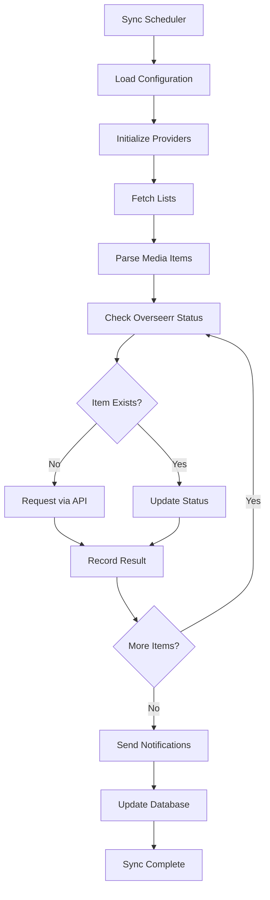
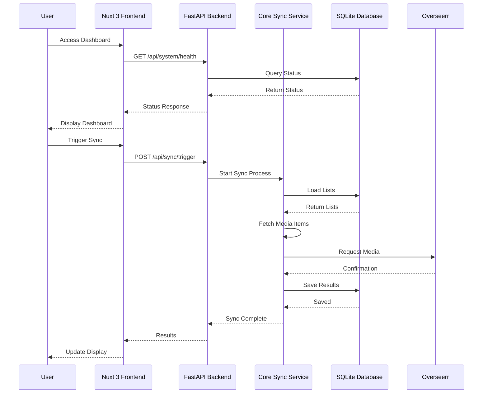
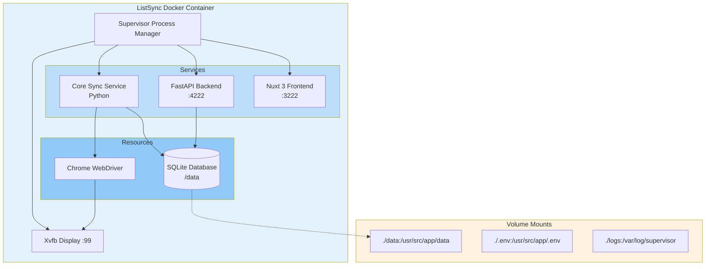

# Architecture Overview

ListSync is a multi-component application designed to automatically synchronize media watchlists from various online platforms to media request services like Overseerr and Jellyseerr. This document outlines the technical architecture, components, and data flows.

## System Architecture

```mermaid
graph TB
    subgraph "ListSync Application"
        CoreSync[Core Sync Service<br/>Python]
        API[FastAPI Backend<br/>Port 4222]
        Frontend[Nuxt 3 Frontend<br/>Vue 3<br/>Port 3222]
        DB[(SQLite<br/>Database)]
        Discord[Discord<br/>Notifications]
        Selenium[Chrome/WebDriver<br/>Selenium]
        
        CoreSync --> DB
        CoreSync --> Selenium
        API --> DB
        API --> CoreSync
        Frontend --> API
        CoreSync --> Discord
    end
    
    subgraph "External Services"
        IMDb[IMDb Lists]
        Trakt[Trakt Lists]
        Letterboxd[Letterboxd Lists]
        MDBList[MDBList]
        StevenLu[Steven Lu Lists]
        Overseerr[Overseerr/Jellyseerr]
        DiscordWebhook[Discord Webhooks]
    end
    
    Selenium --> IMDb
    Selenium --> Trakt
    Selenium --> Letterboxd
    Selenium --> MDBList
    CoreSync --> StevenLu
    CoreSync --> Overseerr
    Discord --> DiscordWebhook
    
    style Frontend fill:#42b883
    style API fill:#009688
    style CoreSync fill:#3776ab
    style DB fill:#003b57
```



## Core Components

### 1. Core Sync Service (`list_sync/`)

The main Python application that handles list synchronization operations.

**Key Modules:**
- `main.py` - Entry point and main sync orchestration
- `config.py` - Configuration management and environment setup
- `database.py` - SQLite operations and data persistence
- `sync_service.py` - Core synchronization logic

**Responsibilities:**
- Automated sync scheduling (configurable intervals from 30 minutes to 24+ hours)
- Web scraping using SeleniumBase with Chrome WebDriver
- Data extraction from multiple list providers
- Request management with Overseerr/Jellyseerr API
- Error handling and retry logic
- Notification dispatch

### 2. List Providers (`list_sync/providers/`)

Modular provider system for different list sources:

**Provider Implementations:**
- **IMDb Provider** - Charts, user lists, watchlists
- **Trakt Provider** - Regular lists and special collections
- **Letterboxd Provider** - User lists and watchlists
- **MDBList Provider** - Custom collections
- **Steven Lu Provider** - Curated popular movies

**Provider Architecture:**
Each provider implements a common interface with methods for:
- URL construction and validation
- Data extraction and parsing
- Error handling and fallback mechanisms
- Support for different list formats

### 3. FastAPI Backend (`api_server.py`)

REST API service providing comprehensive system management capabilities.

**API Categories:**
- **System Health** - Health checks and status monitoring
- **List Management** - CRUD operations for lists
- **Sync Operations** - Manual sync triggers and status
- **Analytics** - Sync statistics and performance metrics
- **Logging** - Application logs and debugging
- **Configuration** - Runtime configuration management

**Key Features:**
- 40+ REST endpoints
- Request/response validation with Pydantic
- CORS support for web interface
- Real-time sync status monitoring
- Comprehensive error handling

### 4. Nuxt 3 Frontend (`listsync-nuxt/`)

Modern web dashboard built with Vue 3 and Nuxt 3.

**Technology Stack:**
- **Vue 3** - Progressive JavaScript framework
- **Nuxt 3** - Vue.js framework with server-side rendering
- **TypeScript** - Type-safe development
- **Tailwind CSS** - Utility-first styling
- **Radix Vue** - Accessible component primitives
- **Shadcn Vue** - Modern UI components

**Dashboard Features:**
- Real-time sync monitoring with composables
- List management interface
- Analytics and statistics visualization
- System health monitoring
- Configuration management
- Responsive design with mobile support

### 5. Database Layer (`list_sync/database.py`)

SQLite-based persistence with automatic migrations.

**Database Schema:**
```sql
-- Lists table
CREATE TABLE lists (
    id INTEGER PRIMARY KEY AUTOINCREMENT,
    list_type TEXT NOT NULL,
    list_id TEXT NOT NULL,
    list_url TEXT,
    item_count INTEGER DEFAULT 0,
    last_synced TIMESTAMP,
    UNIQUE(list_type, list_id)
);

-- Synced items table
CREATE TABLE synced_items (
    id INTEGER PRIMARY KEY AUTOINCREMENT,
    title TEXT NOT NULL,
    media_type TEXT NOT NULL,
    year INTEGER,
    imdb_id TEXT,
    overseerr_id INTEGER,
    status TEXT,
    last_synced TIMESTAMP DEFAULT CURRENT_TIMESTAMP
);

-- Sync interval configuration
CREATE TABLE sync_interval (
    id INTEGER PRIMARY KEY AUTOINCREMENT,
    interval_hours REAL NOT NULL
);
```

**Database Features:**
- Automatic schema migrations
- URL normalization and validation
- Sync history tracking
- Performance optimization
- Data integrity constraints

## Data Flow Architecture

### Sync Operation Flow



### Web Interface Flow



## Deployment Architecture

### Docker Deployment

The application is containerized using a multi-stage Dockerfile:

**Build Stages:**
1. **Python Builder** - Poetry dependency resolution
2. **Node.js Builder** - Nuxt 3 application build
3. **Runtime Image** - Final production image

**Runtime Environment:**
- Python 3.9+ with virtual environment
- Node.js 18+ for frontend serving
- Chrome browser with WebDriver
- Supervisor for process management
- Timezone support with normalization

### Container Architecture



### Volume Mounts

- `./data:/usr/src/app/data` - Persistent database and logs
- `./.env:/usr/src/app/.env` - Configuration file
- `./logs:/var/log/supervisor` - Supervisor logs

### Health Monitoring

Multi-endpoint health checks:
- Frontend availability (port 3222)
- Backend API health (port 4222)
- Database connectivity
- Chrome WebDriver status

## Security Architecture

### Authentication & Authorization

- **Environment-based Configuration** - Sensitive data via environment variables
- **API Key Management** - Secure storage of Overseerr API keys
- **CORS Configuration** - Controlled cross-origin access
- **Input Validation** - Pydantic models for API validation

### Browser Security

- **Sandboxed Chrome** - Isolated browser execution
- **No-sandbox Mode** - Docker-compatible browser operation
- **Headless Operation** - No GUI requirements
- **Resource Limitations** - Controlled memory and CPU usage

## Performance Optimization

### Sync Performance

- **Batch Processing** - Efficient item processing
- **Connection Pooling** - HTTP connection reuse
- **Rate Limiting** - Respectful API usage
- **Caching** - Database query optimization

### Web Performance

- **Server-Side Rendering** - Fast initial page loads with Nuxt SSR
- **Static Generation** - Pre-built pages where possible
- **Component Optimization** - Vue 3 reactivity and tree-shaking
- **Bundle Optimization** - Auto code-splitting and lazy loading
- **Nitro Engine** - Optimized server with built-in caching

### Database Performance

- **Indexed Queries** - Optimized database access
- **Connection Management** - Efficient SQLite usage
- **Data Archiving** - Old sync result cleanup
- **Query Optimization** - Minimal database operations

## Monitoring & Observability

### Logging Strategy

- **Structured Logging** - Consistent log formats
- **Multiple Log Levels** - Debug, Info, Warning, Error
- **Component Separation** - Service-specific logs
- **Log Rotation** - Automated log management

### Metrics Collection

- **Sync Statistics** - Success/failure rates
- **Performance Metrics** - Processing times
- **System Health** - Resource utilization
- **API Metrics** - Request/response tracking

### Notification System

- **Discord Integration** - Rich webhook notifications
- **Status Reporting** - Sync completion summaries
- **Error Alerts** - Failure notifications
- **Progress Updates** - Real-time sync status

## Scalability Considerations

### Horizontal Scaling

- **Stateless Design** - Easy container replication
- **Database Sharing** - Multiple instances can share SQLite (read operations)
- **Load Distribution** - Multiple sync schedules

### Vertical Scaling

- **Resource Optimization** - Efficient memory/CPU usage
- **Chrome Optimization** - Minimal browser resource usage
- **Database Optimization** - Efficient queries and indexing

### Configuration Flexibility

- **Environment-based Setup** - Easy deployment variations
- **Modular Providers** - Easy addition of new list sources
- **Configurable Intervals** - Flexible sync scheduling
- **Feature Toggles** - Conditional functionality

## Technology Decisions

### Backend Technology

- **Python** - Rich ecosystem for web scraping and APIs
- **FastAPI** - High-performance, modern API framework
- **SeleniumBase** - Reliable web automation
- **SQLite** - Lightweight, serverless database

### Frontend Technology

- **Vue 3** - Progressive JavaScript framework with Composition API
- **Nuxt 3** - Full-stack Vue framework with auto-imports
- **TypeScript** - Type safety and developer experience
- **Tailwind CSS** - Utility-first styling approach

### Infrastructure Technology

- **Docker** - Containerization and deployment
- **Supervisor** - Process management and monitoring
- **Chrome** - Reliable browser automation
- **Poetry** - Python dependency management

This architecture provides a robust, scalable, and maintainable solution for automated media list synchronization with comprehensive monitoring and management capabilities. 