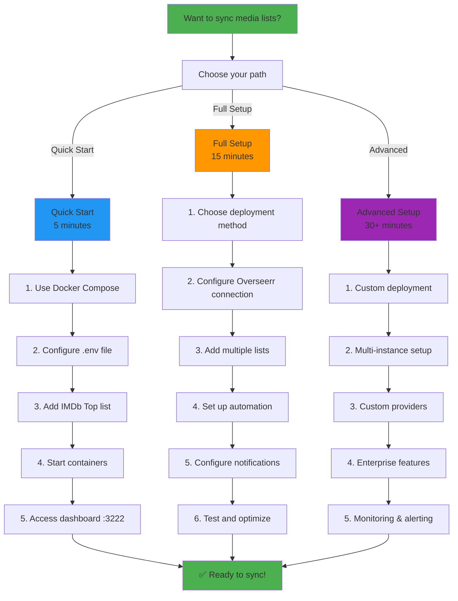

# ListSync Documentation

Welcome to the comprehensive documentation for ListSync - an automated media list synchronization tool that seamlessly syncs watchlists from various online platforms to your Overseerr or Jellyseerr instance.

## 🚀 Quick Start

### 30-Second Setup
```bash
# 1. Clone and configure
git clone https://github.com/Woahai321/list-sync.git
cd list-sync
cp envsample.txt .env

# 2. Edit .env with your details
OVERSEERR_URL=https://your-overseerr-url.com
OVERSEERR_API_KEY=your_api_key_here
IMDB_LISTS=top

# 3. Deploy
docker-compose up -d

# 4. Access dashboard
open http://localhost:3222
```

## 📚 Documentation Structure

### **Core Documentation**
- **[Installation Guide](installation.md)** - Complete setup instructions for all deployment methods
- **[User Guide](user-guide.md)** - Comprehensive usage guide with detailed action workflows
- **[API Reference](api-reference.md)** - Complete REST API documentation with examples
- **[Configuration Guide](configuration.md)** - All configuration options and advanced setup

### **Advanced Documentation**
- **[Troubleshooting Guide](troubleshooting.md)** - Enhanced diagnostic flows and solutions
- **[Architecture Overview](architecture.md)** - Technical architecture and system design
- **[Contributing Guide](contributing.md)** - Development setup and contribution workflow

### **Reference Documentation**
- **[Legal Disclaimer](legal-disclaimer.md)** - Terms of use and legal information

## 🎯 User Journey Overview



## 🏠 Home Users

Perfect for personal media server management:

**Recommended Path:**
1. **[Installation Guide](installation.md#docker-installation-recommended)** - Get ListSync running quickly
2. **[User Guide - Getting Started](user-guide.md#getting-started)** - Basic setup and first sync
3. **[User Guide - List Management](user-guide.md#list-management)** - Add and manage your lists
4. **[Configuration Guide - Basic Setup](configuration.md#basic-home-server-setup)** - Essential configuration

**Quick Reference:**
- **Dashboard**: http://localhost:3222
- **API**: http://localhost:4222
- **Logs**: `docker-compose logs -f`

## 🏢 Power Users & System Administrators

For advanced deployments and automation:

**Recommended Path:**
1. **[Architecture Overview](architecture.md)** - Understand the system design
2. **[Installation Guide - Advanced](installation.md#manual-installation)** - Advanced deployment options
3. **[Configuration Guide - Advanced](configuration.md#power-user-setup)** - Advanced configuration
4. **[API Reference](api-reference.md)** - Integrate with other systems
5. **[Troubleshooting Guide](troubleshooting.md)** - Advanced troubleshooting

**Key Features:**
- Multi-instance deployments
- Custom provider development
- Enterprise monitoring
- API integration

## 💻 Developers & Contributors

For those wanting to contribute or extend ListSync:

**Recommended Path:**
1. **[Contributing Guide](contributing.md)** - Development setup
2. **[Architecture Overview](architecture.md)** - Technical architecture
3. **[API Reference](api-reference.md)** - API design and extension points
4. **[Configuration Guide - Advanced](configuration.md)** - Advanced configuration options

**Tech Stack:**
- **Backend**: Python 3.9+, FastAPI, SeleniumBase
- **Frontend**: Nuxt 3, Vue 3, TypeScript, Tailwind CSS
- **Database**: SQLite with auto-migrations
- **Deployment**: Docker, Docker Compose

## 🔧 Common Tasks

### Quick Actions
| Task | Command | Documentation |
|------|---------|---------------|
| **Start ListSync** | `docker-compose up -d` | [Installation](installation.md) |
| **View Dashboard** | Open http://localhost:3222 | [User Guide](user-guide.md) |
| **Check Status** | `curl localhost:4222/api/system/health` | [API Reference](api-reference.md) |
| **View Logs** | `docker-compose logs -f` | [Troubleshooting](troubleshooting.md) |
| **Trigger Sync** | Click "Sync Now" in dashboard | [User Guide](user-guide.md) |
| **Add List** | Use dashboard or edit .env | [User Guide](user-guide.md) |

### Configuration Examples

**Basic Home Setup:**
```bash
OVERSEERR_URL=http://localhost:5055
OVERSEERR_API_KEY=your-api-key
IMDB_LISTS=top
SYNC_INTERVAL=24
AUTOMATED_MODE=true
```

**Power User Setup:**
```bash
OVERSEERR_URL=https://overseerr.example.com
OVERSEERR_API_KEY=your-api-key
IMDB_LISTS=top,ls123456789,ur987654321
TRAKT_LISTS=username/watchlist,username/favorites
TRAKT_SPECIAL_LISTS=trending:movies,popular:shows
LETTERBOXD_LISTS=username/watchlist
SYNC_INTERVAL=12
OVERSEERR_4K=true
DISCORD_WEBHOOK_URL=your-webhook-url
```

## 📊 Supported List Providers

| Provider | List Types | Example Format | Documentation |
|----------|------------|----------------|---------------|
| **IMDb** | Charts, User Lists, Watchlists | `top`, `ls123456789`, `ur987654321` | [Configuration](configuration.md#imdb-lists) |
| **Trakt** | Lists, Special Collections | `username/list-name`, `trending:movies` | [Configuration](configuration.md#trakt-lists) |
| **Letterboxd** | User Lists, Watchlists | `username/list-name` | [Configuration](configuration.md#letterboxd-lists) |
| **MDBList** | User Collections | `username/collection-name` | [Configuration](configuration.md#mdblist-collections) |
| **Steven Lu** | Popular Movies | `stevenlu` | [Configuration](configuration.md#steven-lu-lists) |

## 🚨 Getting Help

### Before Asking for Help
1. **Check the logs**: `docker-compose logs -f`
2. **Test basic connectivity**: `curl localhost:4222/api/system/health`
3. **Review configuration**: Check your `.env` file
4. **Search documentation**: Use Ctrl+F to search these docs

### Support Channels
- **GitHub Issues**: [Report bugs or request features](https://github.com/Woahai321/list-sync/issues)
- **GitHub Discussions**: [Ask questions and get help](https://github.com/Woahai321/list-sync/discussions)
- **Documentation**: This comprehensive guide covers most scenarios

### Common Issues Quick Fix
| Issue | Quick Fix | Full Guide |
|-------|-----------|------------|
| Can't access dashboard | Check port 3222, restart container | [Troubleshooting](troubleshooting.md#web-interface-issues) |
| Sync not working | Check Overseerr connection, verify lists | [Troubleshooting](troubleshooting.md#sync-issues) |
| All items "already available" | Check 4K settings, verify Overseerr | [Troubleshooting](troubleshooting.md#already-available-for-everything) |
| High memory usage | Reduce list limits, increase sync interval | [Troubleshooting](troubleshooting.md#performance-problems) |

## 🔄 What's New

### Recent Updates
- **Enhanced Web Dashboard**: Modern Nuxt 3 interface with real-time updates
- **Comprehensive API**: 40+ REST endpoints for full system control
- **Advanced Analytics**: Detailed sync statistics and performance metrics
- **Multi-Provider Support**: IMDb, Trakt, Letterboxd, MDBList, Steven Lu
- **Docker Deployment**: One-command setup with Docker Compose

### Upcoming Features
- **Custom Provider Framework**: Easy addition of new list sources
- **Advanced Notifications**: Multiple notification channels
- **Performance Optimization**: Enhanced caching and parallel processing
- **Enterprise Features**: Multi-tenant support and advanced monitoring

## 📈 Performance & Scalability

### System Requirements
- **Minimum**: 2GB RAM, 1GB disk space
- **Recommended**: 4GB RAM, 2GB disk space
- **Network**: Stable internet connection for list fetching

### Performance Characteristics
- **IMDb Lists**: 50-100 items per minute
- **Trakt Lists**: 30-80 items per minute
- **API Requests**: Limited by Overseerr rate limits
- **Database**: 1000+ operations per second

### Scaling Options
- **Horizontal**: Multiple instances with different configurations
- **Vertical**: Resource optimization and caching
- **Geographic**: Regional deployments with different content preferences

## 🛡️ Security & Privacy

### Data Security
- **Local Storage**: All data stored locally in SQLite
- **No Cloud Transmission**: Credentials never sent to third parties
- **Encrypted Configuration**: Optional encrypted credential storage
- **Minimal Data Collection**: Only necessary metadata stored

### Network Security
- **HTTPS Support**: Secure connections to external services
- **CORS Configuration**: Controlled cross-origin access
- **API Security**: Input validation and error handling
- **Docker Security**: Sandboxed execution environment

## 📝 Contributing

We welcome contributions! See our [Contributing Guide](contributing.md) for:
- Development setup
- Code standards
- Testing procedures
- Pull request process

## ⚖️ Legal

By using ListSync, you agree to our [Legal Disclaimer](legal-disclaimer.md). Key points:
- **Personal Use**: Designed for personal, non-commercial use
- **Third-Party Compliance**: Must comply with all platform terms of service
- **No Warranty**: Software provided "as is"
- **Local Data**: All data stored locally, not transmitted to us

---

**Last Updated**: This documentation is continuously updated. Check the repository for the most recent version.

**Need Help?** If you can't find what you're looking for, check the [Troubleshooting Guide](troubleshooting.md) or open an issue on GitHub.
