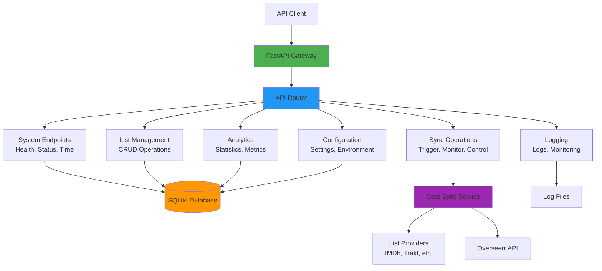
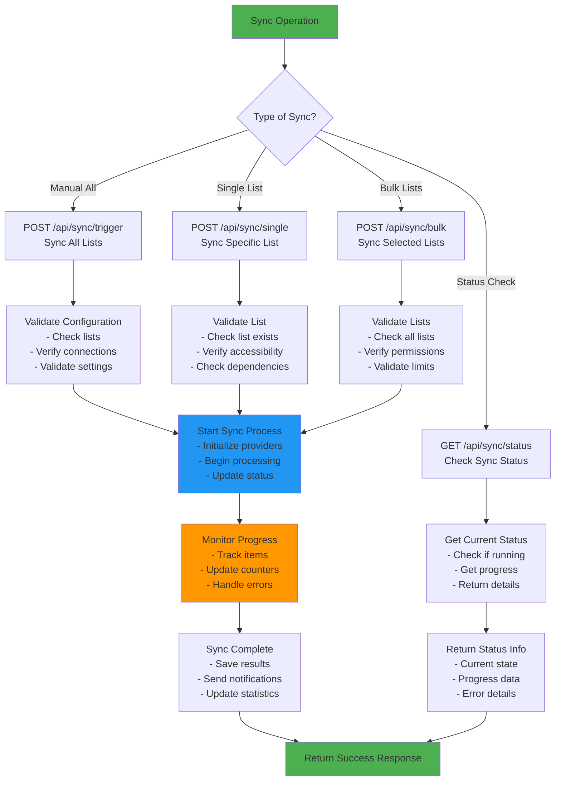
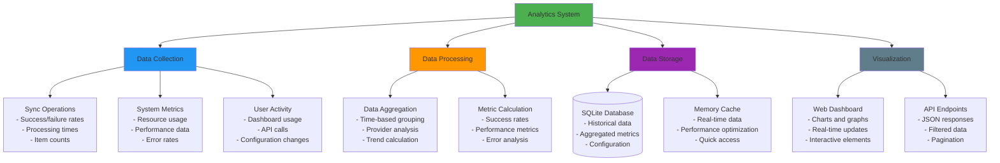

# API Reference - Complete ListSync API Documentation

This comprehensive API reference covers all REST endpoints, data structures, and integration examples for ListSync's FastAPI backend.

## 📋 Table of Contents

1. [API Overview](#api-overview)
2. [Authentication](#authentication)
3. [System Endpoints](#system-endpoints)
4. [List Management](#list-management)
5. [Sync Operations](#sync-operations)
6. [Analytics & Statistics](#analytics--statistics)
7. [Configuration Management](#configuration-management)
8. [Logging & Monitoring](#logging--monitoring)
9. [Data Structures](#data-structures)
10. [Error Handling](#error-handling)
11. [Integration Examples](#integration-examples)

## 🌐 API Overview

### Base Information
- **Base URL**: `http://localhost:4222/api` (default Docker setup)
- **Content Type**: `application/json`
- **Rate Limiting**: No explicit rate limiting (designed for internal use)
- **API Version**: v1

### Interactive Documentation
- **Swagger UI**: `http://localhost:4222/docs`
- **ReDoc**: `http://localhost:4222/redoc`
- **OpenAPI Spec**: `http://localhost:4222/openapi.json`

### API Architecture



## 🔐 Authentication

Currently, the API does not require authentication as it's designed for internal use within the Docker container environment. For production deployments, consider implementing proper authentication and authorization.

### Future Authentication (Planned)
```python
# Example future authentication
headers = {
    "Authorization": "Bearer your-jwt-token",
    "Content-Type": "application/json"
}
```

## 🖥️ System Endpoints

### Health & Status

#### Get System Health
```http
GET /api/system/health
```

Simple health check endpoint returning basic system status.

**Response:**
```json
{
  "database": true,
  "process": true,
  "sync_status": "running",
  "last_sync": "2024-01-15T10:30:00Z",
  "next_sync": "2024-01-15T22:30:00Z"
}
```

**Status Codes:**
- `200 OK` - System healthy
- `503 Service Unavailable` - System unhealthy

#### Get Detailed System Status
```http
GET /api/system/status
```

Comprehensive system health check with detailed information.

**Response:**
```json
{
  "database": {
    "connected": true,
    "file_exists": true,
    "file_size": 1024000,
    "last_modified": "2024-01-15T10:30:00Z",
    "error": null
  },
  "process": {
    "running": true,
    "processes": [
      {
        "pid": 1234,
        "name": "python -m list_sync",
        "status": "running",
        "cpu_percent": 2.5,
        "memory_mb": 128.5
      }
    ],
    "error": null
  },
  "sync": {
    "status": "idle",
    "last_sync": "2024-01-15T10:30:00Z",
    "next_sync": "2024-01-15T22:30:00Z",
    "interval_hours": 12,
    "error": null
  },
  "overall_health": "healthy"
}
```

#### Get System Time
```http
GET /api/system/time
```

Returns current system time and timezone information.

**Response:**
```json
{
  "current_time": "2024-01-15T10:30:00Z",
  "timezone": "UTC",
  "timestamp": 1705312200
}
```

#### Test Database Connection
```http
GET /api/system/database/test
```

Tests database connectivity and returns connection status.

**Response:**
```json
{
  "connected": true,
  "response_time_ms": 5.2,
  "error": null
}
```

### Process Management

#### Get Running Processes
```http
GET /api/system/processes
```

Returns information about running ListSync processes.

**Response:**
```json
{
  "processes": [
    {
      "pid": 1234,
      "name": "python -m list_sync",
      "status": "running",
      "cpu_percent": 2.5,
      "memory_mb": 128.5,
      "start_time": "2024-01-15T09:00:00Z"
    }
  ],
  "total_processes": 1
}
```

#### Get System Logs
```http
GET /api/system/logs
```

Returns recent system logs for debugging.

**Query Parameters:**
- `limit` (optional): Number of log entries to return (default: 100)
- `level` (optional): Filter by log level (INFO, WARNING, ERROR)

**Response:**
```json
{
  "logs": [
    {
      "timestamp": "2024-01-15T10:30:00Z",
      "level": "INFO",
      "message": "Sync completed successfully",
      "category": "sync"
    }
  ],
  "total_entries": 100
}
```

## 📚 List Management

### List Management Workflow

```mermaid
flowchart TD
    Start[List Management] --> CRUD{Operation Type}
    
    CRUD -->|Create| CreateList[POST /api/lists<br/>Add New List]
    CRUD -->|Read| ReadLists[GET /api/lists<br/>Get All Lists]
    CRUD -->|Update| UpdateList[PUT /api/lists/{id}<br/>Update List]
    CRUD -->|Delete| DeleteList[DELETE /api/lists/{id}<br/>Delete List]
    
    CreateList --> Validate[Validate Input<br/>- List type<br/>- List ID<br/>- URL format]
    Validate --> Valid{Valid?}
    Valid -->|No| ReturnError[Return Validation Error]
    Valid -->|Yes| SaveList[Save to Database<br/>- Store configuration<br/>- Update environment<br/>- Refresh cache]
    
    ReadLists --> QueryDB[Query Database<br/>- Get all lists<br/>- Include metadata<br/>- Apply filters]
    QueryDB --> FormatResponse[Format Response<br/>- Include statistics<br/>- Add status info<br/>- Paginate results]
    
    UpdateList --> FindList[Find List by ID<br/>- Check existence<br/>- Validate permissions]
    FindList --> UpdateFields[Update Fields<br/>- Modify configuration<br/>- Validate changes<br/>- Save to database]
    
    DeleteList --> ConfirmDelete[Confirm Deletion<br/>- Check dependencies<br/>- Remove from sync<br/>- Clean up data]
    
    SaveList --> Success[Return Success Response]
    FormatResponse --> Success
    UpdateFields --> Success
    ConfirmDelete --> Success
    ReturnError --> Error[Return Error Response]
    
    style Start fill:#4CAF50
    style Success fill:#4CAF50
    style Error fill:#f44336
    style Validate fill:#FF9800
```

### Get All Lists
```http
GET /api/lists
```

Returns all configured lists with their metadata.

**Query Parameters:**
- `page` (optional): Page number (default: 1)
- `limit` (optional): Items per page (default: 50)
- `type` (optional): Filter by list type (imdb, trakt, etc.)
- `status` (optional): Filter by status (active, inactive)

**Response:**
```json
{
  "lists": [
    {
      "id": 1,
      "list_type": "imdb",
      "list_id": "top",
      "list_url": "https://www.imdb.com/chart/top",
      "description": "IMDb Top 250 Movies",
      "item_count": 250,
      "last_synced": "2024-01-15T10:30:00Z",
      "status": "active",
      "auto_sync": true,
      "priority": "normal",
      "created_at": "2024-01-15T09:00:00Z"
    }
  ],
  "pagination": {
    "page": 1,
    "limit": 50,
    "total_items": 1,
    "total_pages": 1,
    "has_next": false,
    "has_prev": false
  }
}
```

### Add New List
```http
POST /api/lists
```

Adds a new list to the configuration.

**Request Body:**
```json
{
  "list_type": "imdb",
  "list_id": "top",
  "list_url": "https://www.imdb.com/chart/top",
  "description": "IMDb Top 250 Movies",
  "auto_sync": true,
  "priority": "normal",
  "item_limit": null
}
```

**Response:**
```json
{
  "success": true,
  "message": "List added successfully",
  "list": {
    "id": 1,
    "list_type": "imdb",
    "list_id": "top",
    "list_url": "https://www.imdb.com/chart/top",
    "description": "IMDb Top 250 Movies",
    "item_count": 0,
    "last_synced": null,
    "status": "pending",
    "auto_sync": true,
    "priority": "normal"
  }
}
```

### Update List
```http
PUT /api/lists/{list_id}
```

Updates an existing list configuration.

**Path Parameters:**
- `list_id`: ID of the list to update

**Request Body:**
```json
{
  "description": "Updated description",
  "auto_sync": false,
  "priority": "high",
  "item_limit": 100
}
```

**Response:**
```json
{
  "success": true,
  "message": "List updated successfully",
  "list": {
    "id": 1,
    "list_type": "imdb",
    "list_id": "top",
    "description": "Updated description",
    "auto_sync": false,
    "priority": "high",
    "item_limit": 100
  }
}
```

### Delete List
```http
DELETE /api/lists/{list_id}
```

Removes a list from the configuration.

**Path Parameters:**
- `list_id`: ID of the list to delete

**Response:**
```json
{
  "success": true,
  "message": "List deleted successfully"
}
```

## 🔄 Sync Operations

### Sync Operation Workflow



### Trigger Manual Sync
```http
POST /api/sync/trigger
```

Triggers an immediate sync of all configured lists.

**Request Body (optional):**
```json
{
  "dry_run": false,
  "force": false,
  "notify": true
}
```

**Response:**
```json
{
  "success": true,
  "message": "Sync triggered successfully",
  "sync_id": "sync_20240115_103000",
  "estimated_duration": "5-10 minutes"
}
```

### Trigger Single List Sync
```http
POST /api/sync/single
```

Syncs a specific list immediately.

**Request Body:**
```json
{
  "list_id": 1,
  "list_type": "imdb",
  "dry_run": false,
  "force": false
}
```

**Response:**
```json
{
  "success": true,
  "message": "Single list sync completed",
  "items_processed": 250,
  "items_requested": 25,
  "items_available": 200,
  "items_failed": 0,
  "duration_seconds": 120,
  "list_info": {
    "id": 1,
    "type": "imdb",
    "list_id": "top",
    "description": "IMDb Top 250 Movies"
  }
}
```

### Get Sync Status
```http
GET /api/sync/status
```

Returns current sync operation status.

**Response:**
```json
{
  "active": false,
  "status": "idle",
  "current_operation": null,
  "progress": {
    "current": 0,
    "total": 0,
    "percentage": 0
  },
  "last_sync": {
    "timestamp": "2024-01-15T10:30:00Z",
    "duration_seconds": 120,
    "items_processed": 250,
    "success_count": 245,
    "error_count": 5,
    "lists_synced": 3
  },
  "next_sync": {
    "timestamp": "2024-01-15T22:30:00Z",
    "interval_hours": 12
  }
}
```

### Get Live Sync Status
```http
GET /api/sync/status/live
```

Server-sent events endpoint for real-time sync status updates.

**Response Stream:**
```
data: {"status": "running", "progress": 25, "current_list": "imdb:top", "items_processed": 62}
data: {"status": "running", "progress": 50, "current_list": "trakt:trending", "items_processed": 125}
data: {"status": "completed", "results": {"requested": 25, "available": 200, "failed": 0}}
```

## 📊 Analytics & Statistics

### Analytics Overview



### Get Analytics Overview
```http
GET /api/analytics/overview
```

**Query Parameters:**
- `time_range`: `1h`, `24h`, `7d`, `30d` (default: `24h`)

**Response:**
```json
{
  "total_items": 1500,
  "success_rate": 95.2,
  "avg_processing_time": 2.3,
  "active_sync": false,
  "total_sync_operations": 12,
  "total_errors": 8,
  "last_sync_time": "2024-01-15T10:30:00Z",
  "time_range": "24h",
  "provider_breakdown": {
    "imdb": {"items": 800, "success_rate": 96.5},
    "trakt": {"items": 500, "success_rate": 94.0},
    "letterboxd": {"items": 200, "success_rate": 95.0}
  }
}
```

### Get Comprehensive Analytics
```http
GET /api/analytics
```

**Query Parameters:**
- `time_range`: `1h`, `24h`, `7d`, `30d` (default: `24h`)
- `category`: `all`, `sync`, `fetching`, `matching`, `scraping` (default: `all`)

**Response:**
```json
{
  "overview": {
    "total_items": 1500,
    "success_rate": 95.2,
    "avg_processing_time": 2.3
  },
  "sync_analytics": {
    "total_operations": 12,
    "successful_operations": 11,
    "failed_operations": 1,
    "avg_duration_seconds": 120
  },
  "fetching_analytics": {
    "total_fetches": 36,
    "successful_fetches": 34,
    "failed_fetches": 2,
    "avg_fetch_time_seconds": 15.5
  },
  "matching_analytics": {
    "perfect_matches": 450,
    "partial_matches": 45,
    "failed_matches": 5,
    "average_score": 0.92
  },
  "scraping_analytics": {
    "total_scrapes": 24,
    "successful_scrapes": 23,
    "failed_scrapes": 1,
    "avg_scrape_time_seconds": 8.2
  }
}
```

### Get Media Addition Analytics
```http
GET /api/analytics/media-additions
```

Returns data about media items added over time.

**Response:**
```json
{
  "time_series": [
    {
      "timestamp": "2024-01-15T10:00:00Z",
      "items_requested": 25,
      "items_available": 200,
      "items_failed": 0
    },
    {
      "timestamp": "2024-01-15T11:00:00Z",
      "items_requested": 30,
      "items_available": 180,
      "items_failed": 2
    }
  ],
  "total_requested": 1500,
  "total_available": 12000,
  "total_failed": 50
}
```

### Get Source Distribution
```http
GET /api/analytics/source-distribution
```

Returns distribution of media by source (IMDb, Trakt, etc.).

**Response:**
```json
{
  "distribution": {
    "imdb": {
      "count": 800,
      "percentage": 53.3,
      "success_rate": 96.5
    },
    "trakt": {
      "count": 500,
      "percentage": 33.3,
      "success_rate": 94.0
    },
    "letterboxd": {
      "count": 200,
      "percentage": 13.3,
      "success_rate": 95.0
    }
  },
  "total_items": 1500
}
```

## ⚙️ Configuration Management

### Get Sync Interval
```http
GET /api/sync-interval
```

Returns current sync interval configuration.

**Response:**
```json
{
  "interval_hours": 24,
  "next_sync": "2024-01-15T22:30:00Z",
  "last_sync": "2024-01-15T10:30:00Z",
  "automated_mode": true
}
```

### Update Sync Interval
```http
PUT /api/sync-interval
```

**Request Body:**
```json
{
  "interval_hours": 12,
  "automated_mode": true
}
```

**Response:**
```json
{
  "success": true,
  "message": "Sync interval updated successfully",
  "new_interval_hours": 12,
  "next_sync": "2024-01-15T22:30:00Z"
}
```

### Get Overseerr Status
```http
GET /api/overseerr/status
```

Returns Overseerr connection status and configuration.

**Response:**
```json
{
  "connected": true,
  "url": "https://overseerr.example.com",
  "user_id": 1,
  "api_key_configured": true,
  "last_check": "2024-01-15T10:30:00Z",
  "response_time_ms": 45.2
}
```

## 📝 Logging & Monitoring

### Get Log Entries
```http
GET /api/logs/entries
```

**Query Parameters:**
- `limit`: Number of entries (default: 100)
- `offset`: Pagination offset (default: 0)
- `level`: Log level filter (INFO, WARNING, ERROR)
- `category`: Category filter
- `search`: Text search in log messages

**Response:**
```json
{
  "logs": [
    {
      "timestamp": "2024-01-15T10:30:00Z",
      "level": "INFO",
      "category": "sync",
      "message": "Sync completed successfully",
      "details": {
        "items_processed": 250,
        "items_requested": 25,
        "duration_seconds": 120
      }
    }
  ],
  "pagination": {
    "page": 1,
    "limit": 100,
    "total_entries": 1000,
    "has_next": true
  }
}
```

### Get Live Log Stream
```http
GET /api/logs/stream
```

**Query Parameters:**
- `last_position`: Last known file position
- `level_filter`: Log level filter
- `category_filters`: Category filters (comma-separated)
- `search`: Text search

**Response Stream:**
```
data: {"timestamp": "2024-01-15T10:30:00Z", "level": "INFO", "message": "Sync started"}
data: {"timestamp": "2024-01-15T10:30:05Z", "level": "INFO", "message": "Processing list: imdb:top"}
data: {"timestamp": "2024-01-15T10:30:10Z", "level": "INFO", "message": "Found 250 items"}
```

## 📋 Data Structures

### List Object
```json
{
  "id": 1,
  "list_type": "imdb",
  "list_id": "top",
  "list_url": "https://www.imdb.com/chart/top",
  "description": "IMDb Top 250 Movies",
  "item_count": 250,
  "last_synced": "2024-01-15T10:30:00Z",
  "status": "active",
  "auto_sync": true,
  "priority": "normal",
  "item_limit": null,
  "created_at": "2024-01-15T09:00:00Z",
  "updated_at": "2024-01-15T10:30:00Z"
}
```

### Sync Result Object
```json
{
  "sync_id": "sync_20240115_103000",
  "started_at": "2024-01-15T10:30:00Z",
  "completed_at": "2024-01-15T10:32:00Z",
  "duration_seconds": 120,
  "status": "completed",
  "items_processed": 250,
  "items_requested": 25,
  "items_available": 200,
  "items_failed": 0,
  "items_skipped": 25,
  "lists_synced": 3,
  "error_message": null
}
```

### Media Item Object
```json
{
  "id": 1,
  "title": "The Shawshank Redemption",
  "year": 1994,
  "media_type": "movie",
  "imdb_id": "tt0111161",
  "overseerr_id": 12345,
  "status": "requested",
  "provider_source": "imdb",
  "last_synced": "2024-01-15T10:30:00Z",
  "error_message": null
}
```

## ⚠️ Error Handling

### HTTP Status Codes

| Code | Description | Usage |
|------|-------------|-------|
| `200 OK` | Successful operation | GET, PUT requests |
| `201 Created` | Resource created successfully | POST requests |
| `400 Bad Request` | Invalid request parameters | Validation errors |
| `404 Not Found` | Resource not found | Missing resources |
| `422 Unprocessable Entity` | Validation error | Data validation failures |
| `500 Internal Server Error` | Server error | Unexpected errors |

### Error Response Format
```json
{
  "success": false,
  "error": "Error description",
  "detail": "Detailed error information",
  "error_code": "ERROR_CODE",
  "timestamp": "2024-01-15T10:30:00Z",
  "request_id": "req_123456"
}
```

### Common Error Codes

| Error Code | Description | Solution |
|------------|-------------|----------|
| `OVERSEERR_CONNECTION_ERROR` | Cannot connect to Overseerr | Check Overseerr URL and API key |
| `DATABASE_ERROR` | Database operation failed | Check database file permissions |
| `INVALID_LIST_FORMAT` | List ID format is invalid | Verify list ID format |
| `SYNC_IN_PROGRESS` | Sync already running | Wait for current sync to complete |
| `LIST_NOT_FOUND` | Specified list doesn't exist | Check list ID and type |
| `VALIDATION_ERROR` | Request validation failed | Check request parameters |

## 🔧 Integration Examples

### Python Integration
```python
import requests
import json

class ListSyncClient:
    def __init__(self, base_url="http://localhost:4222/api"):
        self.base_url = base_url
        self.session = requests.Session()
    
    def get_system_health(self):
        """Get system health status"""
        response = self.session.get(f"{self.base_url}/system/health")
        return response.json()
    
    def add_list(self, list_type, list_id, description=None):
        """Add a new list"""
        data = {
            "list_type": list_type,
            "list_id": list_id,
            "description": description,
            "auto_sync": True
        }
        response = self.session.post(f"{self.base_url}/lists", json=data)
        return response.json()
    
    def trigger_sync(self, dry_run=False):
        """Trigger manual sync"""
        data = {"dry_run": dry_run}
        response = self.session.post(f"{self.base_url}/sync/trigger", json=data)
        return response.json()
    
    def get_analytics(self, time_range="24h"):
        """Get analytics data"""
        params = {"time_range": time_range}
        response = self.session.get(f"{self.base_url}/analytics/overview", params=params)
        return response.json()

# Usage example
client = ListSyncClient()

# Check system health
health = client.get_system_health()
print(f"System healthy: {health['database']}")

# Add a new list
result = client.add_list("imdb", "top", "IMDb Top 250 Movies")
print(f"List added: {result['success']}")

# Trigger sync
sync_result = client.trigger_sync()
print(f"Sync triggered: {sync_result['sync_id']}")

# Get analytics
analytics = client.get_analytics("7d")
print(f"Success rate: {analytics['success_rate']}%")
```

### JavaScript Integration
```javascript
class ListSyncAPI {
    constructor(baseURL = 'http://localhost:4222/api') {
        this.baseURL = baseURL;
    }
    
    async request(endpoint, options = {}) {
        const url = `${this.baseURL}${endpoint}`;
        const response = await fetch(url, {
            headers: {
                'Content-Type': 'application/json',
                ...options.headers
            },
            ...options
        });
        
        if (!response.ok) {
            throw new Error(`HTTP error! status: ${response.status}`);
        }
        
        return response.json();
    }
    
    async getSystemHealth() {
        return this.request('/system/health');
    }
    
    async getLists() {
        return this.request('/lists');
    }
    
    async addList(listData) {
        return this.request('/lists', {
            method: 'POST',
            body: JSON.stringify(listData)
        });
    }
    
    async triggerSync(options = {}) {
        return this.request('/sync/trigger', {
            method: 'POST',
            body: JSON.stringify(options)
        });
    }
    
    async getAnalytics(timeRange = '24h') {
        return this.request(`/analytics/overview?time_range=${timeRange}`);
    }
    
    async streamLogs() {
        const response = await fetch(`${this.baseURL}/logs/stream`);
        const reader = response.body.getReader();
        const decoder = new TextDecoder();
        
        while (true) {
            const { done, value } = await reader.read();
            if (done) break;
            
            const chunk = decoder.decode(value);
            const lines = chunk.split('\n');
            
            for (const line of lines) {
                if (line.startsWith('data: ')) {
                    const data = JSON.parse(line.slice(6));
                    console.log('Log entry:', data);
                }
            }
        }
    }
}

// Usage example
const api = new ListSyncAPI();

// Check system health
api.getSystemHealth().then(health => {
    console.log('System healthy:', health.database);
});

// Add a new list
api.addList({
    list_type: 'imdb',
    list_id: 'top',
    description: 'IMDb Top 250 Movies',
    auto_sync: true
}).then(result => {
    console.log('List added:', result.success);
});

// Trigger sync
api.triggerSync({ dry_run: false }).then(result => {
    console.log('Sync triggered:', result.sync_id);
});

// Stream logs
api.streamLogs();
```

### cURL Examples
```bash
# Get system health
curl http://localhost:4222/api/system/health

# Get all lists
curl http://localhost:4222/api/lists

# Add a new list
curl -X POST http://localhost:4222/api/lists \
  -H "Content-Type: application/json" \
  -d '{
    "list_type": "imdb",
    "list_id": "top",
    "description": "IMDb Top 250 Movies",
    "auto_sync": true
  }'

# Trigger sync
curl -X POST http://localhost:4222/api/sync/trigger \
  -H "Content-Type: application/json" \
  -d '{"dry_run": false}'

# Get analytics
curl "http://localhost:4222/api/analytics/overview?time_range=24h"

# Get sync status
curl http://localhost:4222/api/sync/status

# Stream logs
curl http://localhost:4222/api/logs/stream
```

---

This comprehensive API reference provides complete documentation for all ListSync API endpoints. For additional help, refer to the [User Guide](user-guide.md) or [Troubleshooting Guide](troubleshooting.md).
