# Architecture Overview - ListSync System Design

This comprehensive architecture guide covers the technical design, system components, data flow, and deployment architecture of ListSync.

## 📋 Table of Contents

1. [System Overview](#system-overview)
2. [Core Components](#core-components)
3. [Data Flow Architecture](#data-flow-architecture)
4. [Deployment Architecture](#deployment-architecture)
5. [Security Architecture](#security-architecture)
6. [Performance Architecture](#performance-architecture)
7. [Monitoring & Observability](#monitoring--observability)
8. [Scalability Design](#scalability-design)
9. [Integration Points](#integration-points)
10. [Future Architecture](#future-architecture)

## 🏗️ System Overview

### High-Level Architecture

```mermaid
graph TB
    subgraph "ListSync Application"
        CoreSync[Core Sync Service<br/>Python]
        API[FastAPI Backend<br/>Port 4222]
        Frontend[Nuxt 3 Frontend<br/>Vue 3<br/>Port 3222]
        DB[(SQLite<br/>Database)]
        Discord[Discord<br/>Notifications]
        Selenium[Chrome/WebDriver<br/>Selenium]
        
        CoreSync --> DB
        CoreSync --> Selenium
        API --> DB
        API --> CoreSync
        Frontend --> API
        CoreSync --> Discord
    end
    
    subgraph "External Services"
        IMDb[IMDb Lists]
        Trakt[Trakt Lists]
        Letterboxd[Letterboxd Lists]
        MDBList[MDBList]
        StevenLu[Steven Lu Lists]
        Overseerr[Overseerr/Jellyseerr]
        DiscordWebhook[Discord Webhooks]
    end
    
    Selenium --> IMDb
    Selenium --> Trakt
    Selenium --> Letterboxd
    Selenium --> MDBList
    CoreSync --> StevenLu
    CoreSync --> Overseerr
    Discord --> DiscordWebhook
    
    style Frontend fill:#42b883
    style API fill:#009688
    style CoreSync fill:#3776ab
    style DB fill:#003b57
```

### System Characteristics

| Aspect | Description |
|--------|-------------|
| **Architecture Pattern** | Microservices with shared database |
| **Communication** | REST API, WebSocket, File-based |
| **Data Storage** | SQLite with WAL mode |
| **Deployment** | Docker containerized |
| **Scalability** | Horizontal scaling via multiple instances |
| **Reliability** | Fault-tolerant with retry mechanisms |
| **Security** | Local data storage, encrypted credentials |

## 🔧 Core Components

### Component Architecture

```mermaid
graph TB
    subgraph "Frontend Layer"
        Nuxt[Nuxt 3 Application]
        Vue[Vue 3 Components]
        Tailwind[Tailwind CSS]
        Pinia[Pinia State Management]
    end
    
    subgraph "API Layer"
        FastAPI[FastAPI Backend]
        Routes[API Routes]
        Middleware[Middleware Stack]
        Validation[Request Validation]
    end
    
    subgraph "Core Layer"
        SyncEngine[Sync Engine]
        Providers[Provider System]
        OverseerrClient[Overseerr Client]
        NotificationService[Notification Service]
    end
    
    subgraph "Data Layer"
        SQLite[(SQLite Database)]
        Cache[Memory Cache]
        Logs[Log Files]
    end
    
    subgraph "External Layer"
        Selenium[Selenium WebDriver]
        Chrome[Chrome Browser]
        ExternalAPIs[External APIs]
    end
    
    Nuxt --> FastAPI
    Vue --> Pinia
    FastAPI --> SyncEngine
    SyncEngine --> Providers
    SyncEngine --> OverseerrClient
    SyncEngine --> SQLite
    Providers --> Selenium
    Selenium --> Chrome
    Providers --> ExternalAPIs
    
    style Nuxt fill:#42b883
    style FastAPI fill:#009688
    style SyncEngine fill:#3776ab
    style SQLite fill:#003b57
```

### 1. Core Sync Service

**Purpose**: Central orchestration service that manages the entire sync process.

**Key Responsibilities**:
- List fetching and processing
- Media item resolution and matching
- Overseerr API integration
- Database operations
- Error handling and retry logic

**Architecture**:
```python
class SyncEngine:
    def __init__(self):
        self.providers = ProviderRegistry()
        self.overseerr = OverseerrClient()
        self.database = DatabaseManager()
        self.notifications = NotificationService()
    
    async def sync_all_lists(self):
        """Orchestrate complete sync process"""
        lists = self.database.get_active_lists()
        for list_config in lists:
            await self.sync_single_list(list_config)
    
    async def sync_single_list(self, list_config):
        """Sync individual list"""
        provider = self.providers.get(list_config.type)
        items = await provider.fetch_items(list_config.id)
        await self.process_items(items, list_config)
```

**Key Features**:
- **Parallel Processing**: Multiple lists processed concurrently
- **Error Recovery**: Automatic retry with exponential backoff
- **Progress Tracking**: Real-time sync progress monitoring
- **Resource Management**: Memory and CPU optimization

### 2. List Provider System

**Purpose**: Modular system for fetching media from different list sources.

**Provider Architecture**:
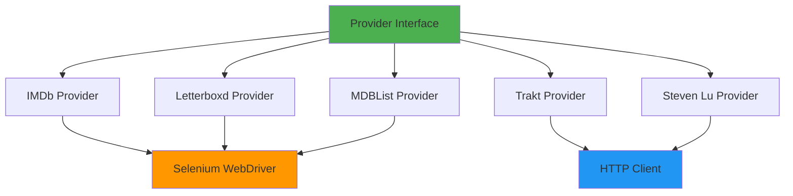

**Provider Interface**:
```python
from abc import ABC, abstractmethod
from typing import List, Dict, Any

class ListProvider(ABC):
    @abstractmethod
    async def fetch_items(self, list_id: str) -> List[Dict[str, Any]]:
        """Fetch media items from list source"""
        pass
    
    @abstractmethod
    def validate_list_id(self, list_id: str) -> bool:
        """Validate list ID format"""
        pass
    
    @abstractmethod
    def get_provider_name(self) -> str:
        """Get human-readable provider name"""
        pass
```

**Provider Types**:

| Provider | Method | Technology | Rate Limits |
|----------|--------|------------|-------------|
| **IMDb** | Web Scraping | Selenium + Chrome | Respectful delays |
| **Trakt** | API + Scraping | HTTP + Selenium | 1000 req/hour |
| **Letterboxd** | Web Scraping | Selenium + Chrome | Respectful delays |
| **MDBList** | Web Scraping | Selenium + Chrome | Respectful delays |
| **Steven Lu** | API | HTTP Client | No limits |

### 3. FastAPI Backend

**Purpose**: RESTful API service providing system control and data access.

**API Architecture**:
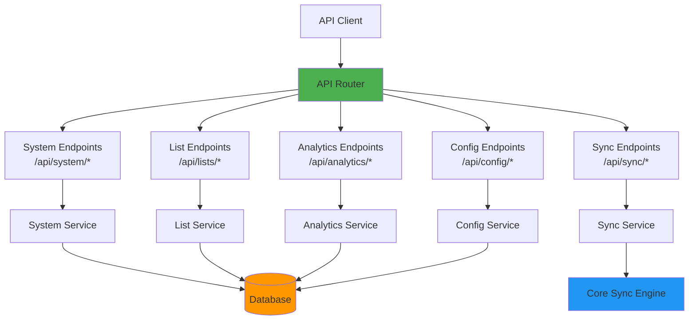

**API Features**:
- **RESTful Design**: Standard HTTP methods and status codes
- **Request Validation**: Pydantic models for input validation
- **Error Handling**: Comprehensive error responses
- **Documentation**: Auto-generated OpenAPI/Swagger docs
- **Rate Limiting**: Configurable request rate limits
- **CORS Support**: Cross-origin resource sharing

**Key Endpoints**:
```python
# System endpoints
GET /api/system/health
GET /api/system/status
GET /api/system/time

# List management
GET /api/lists
POST /api/lists
PUT /api/lists/{id}
DELETE /api/lists/{id}

# Sync operations
POST /api/sync/trigger
GET /api/sync/status
POST /api/sync/single

# Analytics
GET /api/analytics/overview
GET /api/analytics/media-additions
GET /api/analytics/source-distribution
```

### 4. Nuxt 3 Frontend

**Purpose**: Modern web interface for system management and monitoring.

**Frontend Architecture**:
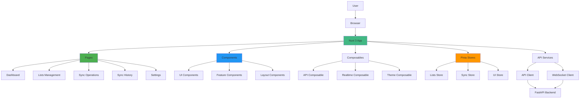

**Frontend Features**:
- **Reactive UI**: Real-time updates with Vue 3 reactivity
- **Responsive Design**: Mobile-first responsive layout
- **Theme Support**: Light/dark mode with system detection
- **State Management**: Centralized state with Pinia
- **Type Safety**: Full TypeScript support
- **Performance**: Code splitting and lazy loading

### 5. Database Layer

**Purpose**: Persistent storage for configuration, sync history, and analytics.

**Database Schema**:
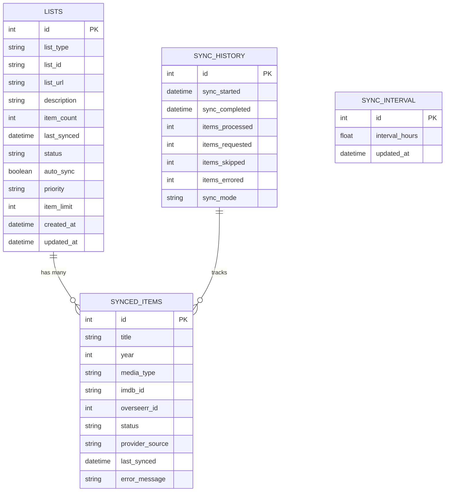

**Database Features**:
- **ACID Compliance**: Reliable transactions
- **WAL Mode**: Better concurrency and performance
- **Indexing**: Optimized queries with proper indexes
- **Migrations**: Automatic schema updates
- **Backup**: Regular backup and recovery

## 🔄 Data Flow Architecture

### Sync Operation Flow

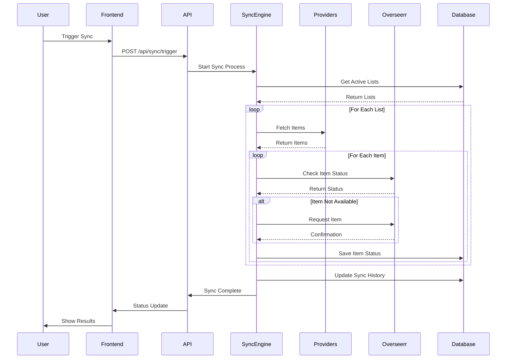

### List Processing Pipeline

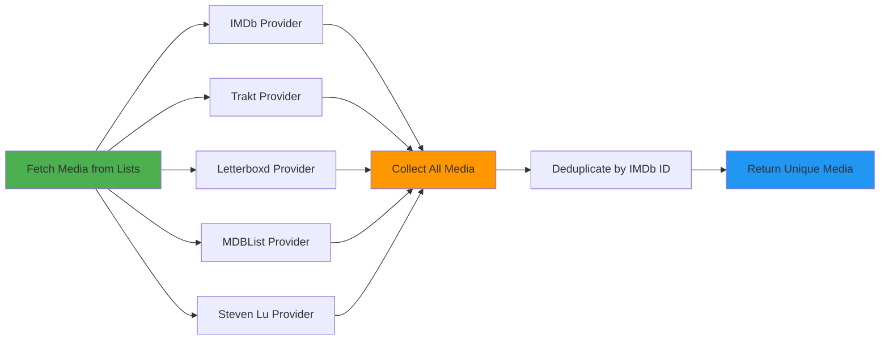

### Request Processing Flow

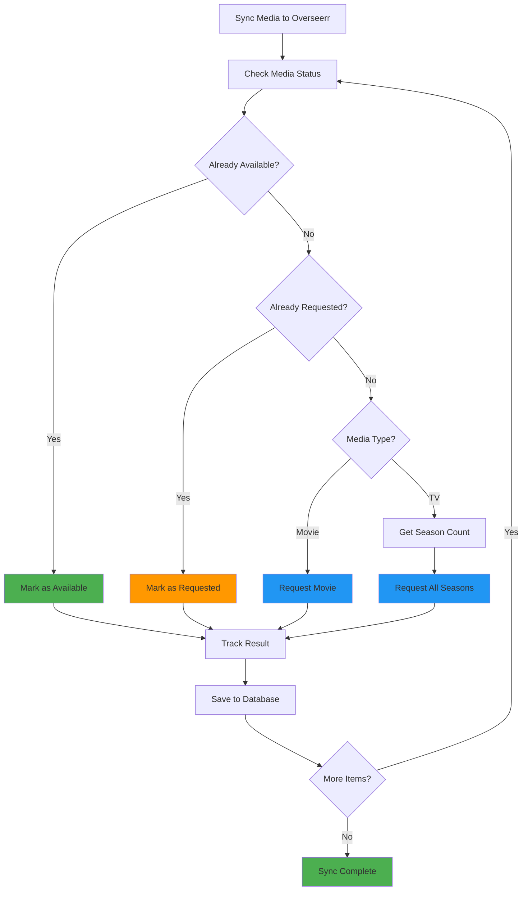

## 🐳 Deployment Architecture

### Container Architecture

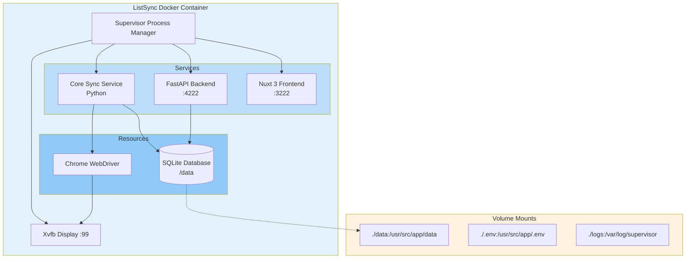

### Multi-Instance Deployment

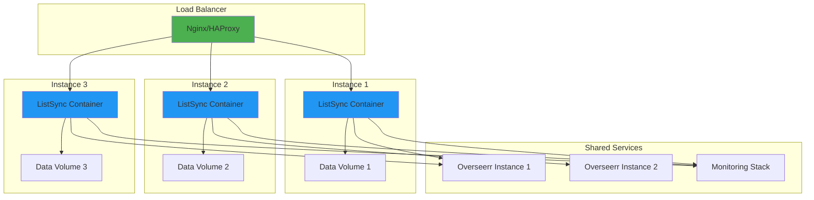

### Production Deployment Stack

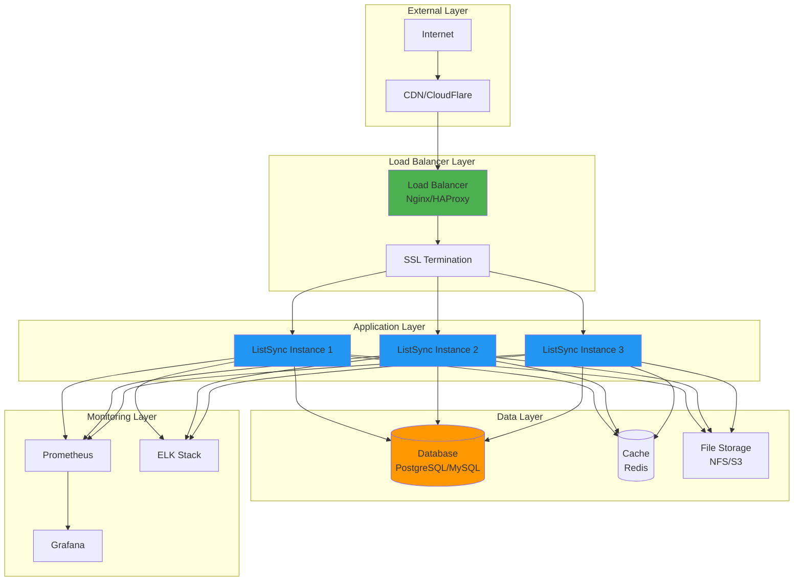

## 🔐 Security Architecture

### Security Layers

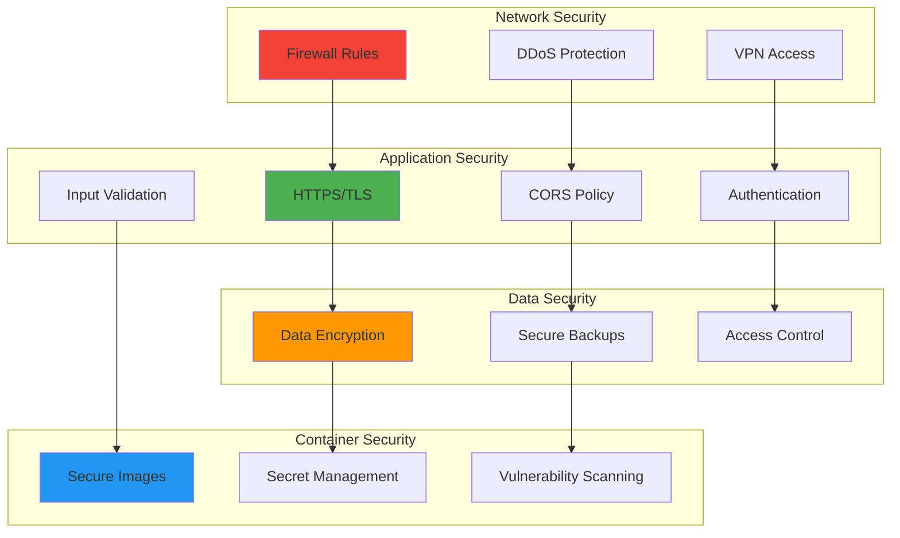

### Security Features

| Layer | Feature | Implementation |
|-------|---------|----------------|
| **Network** | Firewall | iptables/ufw rules |
| **Network** | VPN | WireGuard/OpenVPN |
| **Network** | DDoS | CloudFlare/AWS Shield |
| **Application** | HTTPS | Let's Encrypt/SSL certificates |
| **Application** | CORS | Configurable origin policies |
| **Application** | Auth | JWT tokens (future) |
| **Application** | Validation | Pydantic input validation |
| **Data** | Encryption | SQLite encryption |
| **Data** | Backup | Encrypted backups |
| **Data** | Access | File permissions |
| **Container** | Images | Security scanning |
| **Container** | Secrets | Docker secrets |
| **Container** | Scanning | Trivy/Clair |

## ⚡ Performance Architecture

### Performance Optimization Strategy

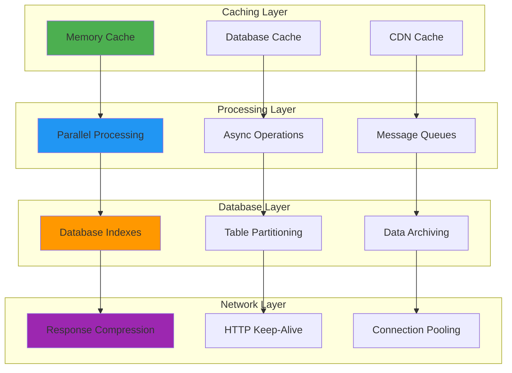

### Performance Metrics

| Component | Metric | Target | Monitoring |
|-----------|--------|--------|------------|
| **API Response** | Response time | < 200ms | Prometheus |
| **Database** | Query time | < 50ms | SQLite logs |
| **Sync Operations** | Items/minute | > 100 | Custom metrics |
| **Memory Usage** | RAM usage | < 1GB | Docker stats |
| **CPU Usage** | CPU usage | < 50% | System metrics |
| **Disk I/O** | I/O wait | < 5% | iostat |

### Caching Strategy

```python
# Multi-level caching implementation
class CacheManager:
    def __init__(self):
        self.memory_cache = {}  # L1: In-memory
        self.redis_cache = Redis()  # L2: Redis (future)
        self.database_cache = {}  # L3: Database
    
    async def get(self, key: str):
        # L1: Check memory cache
        if key in self.memory_cache:
            return self.memory_cache[key]
        
        # L2: Check Redis cache
        value = await self.redis_cache.get(key)
        if value:
            self.memory_cache[key] = value
            return value
        
        # L3: Check database cache
        value = self.database_cache.get(key)
        if value:
            self.memory_cache[key] = value
            return value
        
        return None
```

## 📊 Monitoring & Observability

### Monitoring Architecture

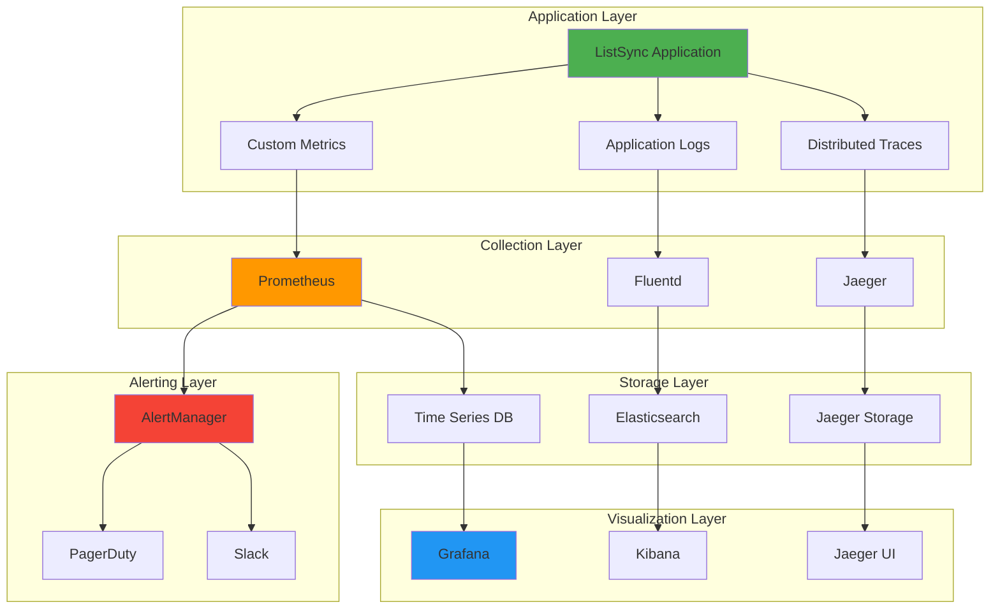

### Key Metrics

#### Application Metrics
```python
# Custom metrics for ListSync
from prometheus_client import Counter, Histogram, Gauge

# Sync metrics
sync_operations_total = Counter('sync_operations_total', 'Total sync operations', ['status'])
sync_duration_seconds = Histogram('sync_duration_seconds', 'Sync operation duration')
items_processed_total = Counter('items_processed_total', 'Items processed', ['provider', 'status'])

# System metrics
memory_usage_bytes = Gauge('memory_usage_bytes', 'Memory usage in bytes')
cpu_usage_percent = Gauge('cpu_usage_percent', 'CPU usage percentage')
database_size_bytes = Gauge('database_size_bytes', 'Database size in bytes')

# Provider metrics
provider_requests_total = Counter('provider_requests_total', 'Provider requests', ['provider', 'status'])
provider_duration_seconds = Histogram('provider_duration_seconds', 'Provider request duration', ['provider'])
```

#### Business Metrics
- **Sync Success Rate**: Percentage of successful sync operations
- **Items Processed**: Total items processed per provider
- **Request Success Rate**: Percentage of successful Overseerr requests
- **Average Processing Time**: Time per item processed
- **Error Rate**: Percentage of operations with errors

### Logging Strategy

```python
# Structured logging implementation
import structlog
import logging

# Configure structured logging
structlog.configure(
    processors=[
        structlog.stdlib.filter_by_level,
        structlog.stdlib.add_logger_name,
        structlog.stdlib.add_log_level,
        structlog.stdlib.PositionalArgumentsFormatter(),
        structlog.processors.TimeStamper(fmt="iso"),
        structlog.processors.StackInfoRenderer(),
        structlog.processors.format_exc_info,
        structlog.processors.UnicodeDecoder(),
        structlog.processors.JSONRenderer()
    ],
    context_class=dict,
    logger_factory=structlog.stdlib.LoggerFactory(),
    wrapper_class=structlog.stdlib.BoundLogger,
    cache_logger_on_first_use=True,
)

logger = structlog.get_logger()

# Usage examples
logger.info("Sync started", list_id="ls123456789", provider="imdb")
logger.error("Sync failed", error="Connection timeout", retry_count=3)
logger.debug("Item processed", title="The Shawshank Redemption", status="requested")
```

## 📈 Scalability Design

### Horizontal Scaling

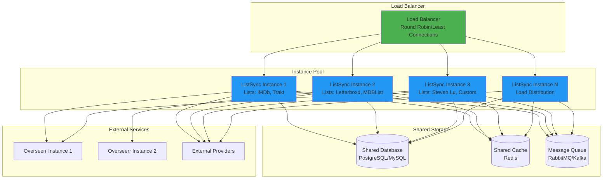

### Vertical Scaling

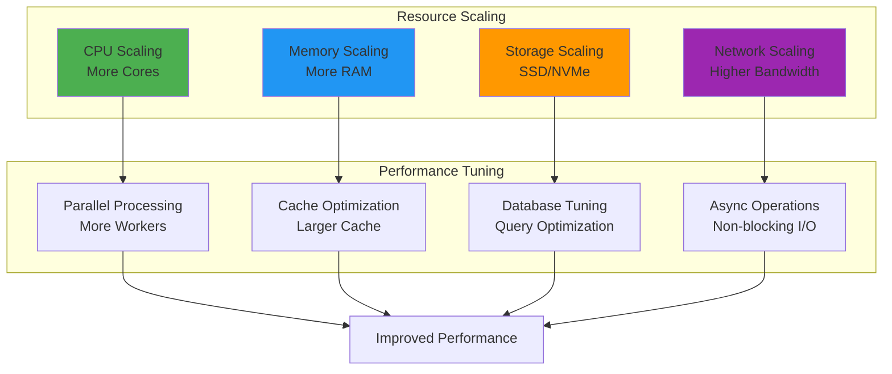

### Auto-Scaling Configuration

```yaml
# Kubernetes HPA configuration
apiVersion: autoscaling/v2
kind: HorizontalPodAutoscaler
metadata:
  name: listsync-hpa
spec:
  scaleTargetRef:
    apiVersion: apps/v1
    kind: Deployment
    name: listsync
  minReplicas: 2
  maxReplicas: 10
  metrics:
  - type: Resource
    resource:
      name: cpu
      target:
        type: Utilization
        averageUtilization: 70
  - type: Resource
    resource:
      name: memory
      target:
        type: Utilization
        averageUtilization: 80
```

## 🔗 Integration Points

### External Service Integration

```mermaid
graph TB
    subgraph "ListSync Core"
        SyncEngine[Sync Engine]
        API[API Layer]
        Frontend[Web Frontend]
    end
    
    subgraph "Media Services"
        Overseerr[Overseerr/Jellyseerr]
        Plex[Plex Media Server]
        Jellyfin[Jellyfin Media Server]
        Emby[Emby Media Server]
    end
    
    subgraph "List Providers"
        IMDb[IMDb]
        Trakt[Trakt.tv]
        Letterboxd[Letterboxd]
        MDBList[MDBList]
        StevenLu[Steven Lu]
    end
    
    subgraph "Notification Services"
        Discord[Discord]
        Slack[Slack]
        Email[Email/SMTP]
        Pushover[Pushover]
    end
    
    subgraph "Monitoring Services"
        Prometheus[Prometheus]
        Grafana[Grafana]
        ELK[ELK Stack]
    end
    
    SyncEngine --> Overseerr
    SyncEngine --> Plex
    SyncEngine --> Jellyfin
    SyncEngine --> Emby
    
    SyncEngine --> IMDb
    SyncEngine --> Trakt
    SyncEngine --> Letterboxd
    SyncEngine --> MDBList
    SyncEngine --> StevenLu
    
    SyncEngine --> Discord
    SyncEngine --> Slack
    SyncEngine --> Email
    SyncEngine --> Pushover
    
    API --> Prometheus
    API --> Grafana
    API --> ELK
    
    style SyncEngine fill:#4CAF50
    style Overseerr fill:#2196F3
    style IMDb fill:#FF9800
    style Discord fill:#9C27B0
    style Prometheus fill:#f44336
```

### API Integration Examples

#### Home Assistant Integration
```yaml
# configuration.yaml
shell_command:
  trigger_listsync: "curl -X POST http://listsync:4222/api/sync/trigger"
  
sensor:
  - platform: command_line
    name: "ListSync Status"
    command: 'curl -s http://listsync:4222/api/system/health | jq -r .sync_status'
    scan_interval: 300

automation:
  - alias: "Trigger ListSync on Plex Update"
    trigger:
      platform: state
      entity_id: sensor.plex_media_server
    action:
      service: shell_command.trigger_listsync
```

#### Plex Integration
```python
# plex-integration.py
from plexapi.server import PlexServer
import requests

def sync_plex_watchlist_to_overseerr():
    plex = PlexServer(PLEX_URL, PLEX_TOKEN)
    watchlist = plex.watchlist()
    
    # Format for ListSync
    media_items = []
    for item in watchlist:
        media_items.append({
            "title": item.title,
            "year": item.year,
            "media_type": "movie" if item.type == "movie" else "tv",
            "imdb_id": item.guid if "imdb://" in item.guid else None
        })
    
    # Trigger ListSync via API
    requests.post('http://listsync:4222/api/sync/trigger', json={
        'custom_list': media_items
    })
```

## 🚀 Future Architecture

### Planned Enhancements

#### Microservices Architecture
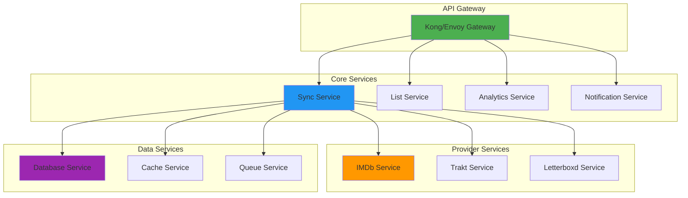

#### Event-Driven Architecture
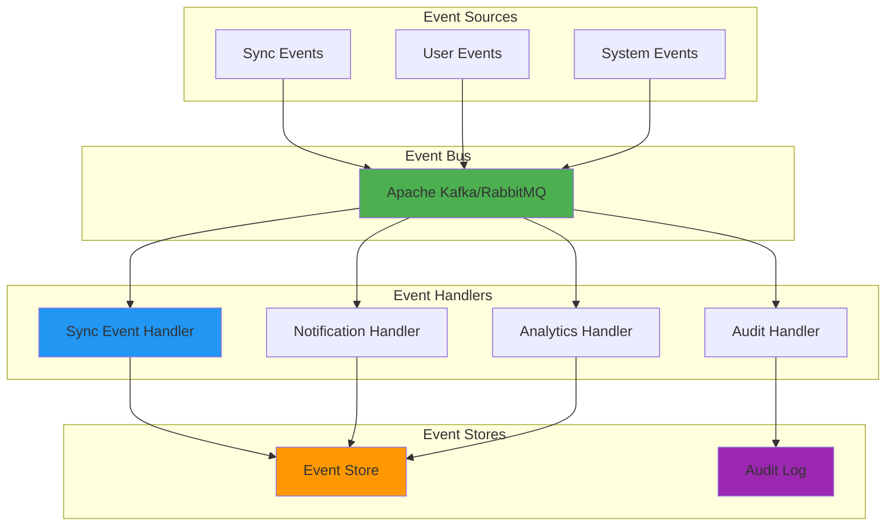

### Technology Roadmap

#### Short Term (3-6 months)
- **Enhanced Monitoring**: Prometheus + Grafana integration
- **Better Error Handling**: Structured error responses
- **Performance Optimization**: Caching and async improvements
- **Security Enhancements**: Authentication and authorization

#### Medium Term (6-12 months)
- **Microservices Migration**: Service decomposition
- **Event-Driven Architecture**: Async event processing
- **Multi-Tenant Support**: Isolated user environments
- **Advanced Analytics**: ML-powered insights

#### Long Term (12+ months)
- **Cloud-Native Deployment**: Kubernetes optimization
- **AI/ML Integration**: Smart recommendations
- **Global Distribution**: CDN and edge computing
- **Enterprise Features**: Advanced security and compliance

---

This comprehensive architecture guide provides a complete technical overview of ListSync's system design. For implementation details, see the [API Reference](api-reference.md) and [Contributing Guide](contributing.md).
