# Configuration Guide - Complete ListSync Configuration

This comprehensive configuration guide covers all settings, options, and advanced configurations for ListSync.

## 📋 Table of Contents

1. [Quick Start Configuration](#quick-start-configuration)
2. [Core Configuration](#core-configuration)
3. [List Provider Configuration](#list-provider-configuration)
4. [Advanced Settings](#advanced-settings)
5. [Security Configuration](#security-configuration)
6. [Network Configuration](#network-configuration)
7. [Performance Tuning](#performance-tuning)
8. [Configuration Examples](#configuration-examples)
9. [Troubleshooting Configuration](#troubleshooting-configuration)

## 🚀 Quick Start Configuration

### Minimal Working Setup


**Essential Configuration:**
```bash
# Copy the sample environment file
cp envsample.txt .env

# Edit with your details
OVERSEERR_URL=https://your-overseerr-url.com
OVERSEERR_API_KEY=your_api_key_here

# Add at least one list
IMDB_LISTS=top
```

**Getting Your API Key:**
1. Log into your Overseerr instance
2. Go to Settings → General → API Key
3. Copy the API key and add it to your `.env` file

## ⚙️ Core Configuration

### Overseerr Connection (Required)

| Variable | Description | Required | Default | Example |
|----------|-------------|----------|---------|---------|
| `OVERSEERR_URL` | Your Overseerr server URL | ✅ | - | `https://overseerr.example.com` |
| `OVERSEERR_API_KEY` | API key from Overseerr settings | ✅ | - | `abc123...` |
| `OVERSEERR_USER_ID` | User ID for making requests | ❌ | `1` | `1` |
| `OVERSEERR_4K` | Send requests as 4K to Overseerr | ❌ | `false` | `true` |

**URL Format Examples:**
```bash
# Correct formats
OVERSEERR_URL=http://192.168.1.100:5055
OVERSEERR_URL=https://overseerr.yourdomain.com
OVERSEERR_URL=http://overseerr:5055  # Docker container name

# Incorrect (missing protocol)
OVERSEERR_URL=overseerr.yourdomain.com  # ❌
```

### Sync Behavior Configuration

| Variable | Description | Required | Default | Example |
|----------|-------------|----------|---------|---------|
| `SYNC_INTERVAL` | Hours between automatic syncs | ❌ | `24` | `6` (6 hours) |
| `AUTOMATED_MODE` | Enable automatic syncing | ❌ | `true` | `false` |

**Sync Interval Examples:**
```bash
SYNC_INTERVAL=24    # Once per day
SYNC_INTERVAL=12    # Twice per day  
SYNC_INTERVAL=6     # Every 6 hours
SYNC_INTERVAL=1     # Every hour
SYNC_INTERVAL=0.5   # Every 30 minutes (minimum recommended)
SYNC_INTERVAL=0     # Manual sync only
```

**Automated Mode Settings:**
```bash
# Enable automated syncing
AUTOMATED_MODE=true

# Disable automated syncing (manual only)
AUTOMATED_MODE=false
```

## 📚 List Provider Configuration

### Configuration Workflow

```mermaid
flowchart TD
    Start[Configure List Providers] --> Choose[Choose Provider Type]
    
    Choose -->|IMDb| IMDB[IMDb Configuration<br/>- Charts<br/>- User Lists<br/>- Watchlists]
    Choose -->|Trakt| Trakt[Trakt Configuration<br/>- Regular Lists<br/>- Special Collections]
    Choose -->|Letterboxd| Letterboxd[Letterboxd Configuration<br/>- User Lists<br/>- Watchlists]
    Choose -->|MDBList| MDBList[MDBList Configuration<br/>- Collections]
    Choose -->|Steven Lu| StevenLu[Steven Lu Configuration<br/>- Popular Movies]
    
    IMDB --> IMDBFormat[Format Examples<br/>IMDB_LISTS=top,ls123,ur456]
    Trakt --> TraktFormat[Format Examples<br/>TRAKT_LISTS=123,456<br/>TRAKT_SPECIAL_LISTS=trending:movies]
    Letterboxd --> LetterboxdFormat[Format Examples<br/>LETTERBOXD_LISTS=user/list]
    MDBList --> MDBListFormat[Format Examples<br/>MDBLIST_LISTS=user/collection]
    StevenLu --> StevenLuFormat[Format Examples<br/>STEVENLU_LISTS=stevenlu]
    
    IMDBFormat --> Validate[Validate Configuration]
    TraktFormat --> Validate
    LetterboxdFormat --> Validate
    MDBListFormat --> Validate
    StevenLuFormat --> Validate
    
    Validate --> Valid{Valid?}
    Valid -->|No| Fix[Fix Format Issues]
    Valid -->|Yes| Test[Test List Access]
    
    Fix --> Validate
    Test --> Success[✅ Configuration Complete]
    
    style Start fill:#4CAF50
    style Success fill:#4CAF50
    style Validate fill:#FF9800
```



### IMDb Lists

#### Supported List Types

| Type | Format | Description | Example |
|------|--------|-------------|---------|
| **Charts** | `chart_name` | Built-in IMDb charts | `top`, `boxoffice` |
| **User Lists** | `ls` + ID | Public IMDb lists | `ls123456789` |
| **Watchlists** | `ur` + ID | User watchlists | `ur987654321` |
| **Full URLs** | Complete URL | Any IMDb list URL | `https://www.imdb.com/list/ls123456789` |

#### Configuration Examples
```bash
# Single chart
IMDB_LISTS=top

# Multiple charts
IMDB_LISTS=top,boxoffice,moviemeter,tvmeter

# User lists
IMDB_LISTS=ls123456789,ls987654321

# Mixed types
IMDB_LISTS=top,ls123456789,ur987654321

# Full URLs
IMDB_LISTS=https://www.imdb.com/list/ls123456789,https://www.imdb.com/chart/top
```

#### Available Charts
- `top` - IMDb Top 250 Movies
- `boxoffice` - Box Office
- `moviemeter` - Most Popular Movies
- `tvmeter` - Most Popular TV Shows

#### Advanced IMDb Options
```bash
# Item limits (optional)
IMDB_ITEM_LIMIT=100

# Custom user agent (optional)
IMDB_USER_AGENT="ListSync/1.0"
```

### Trakt Lists

#### Regular Lists
```bash
# Numeric IDs from Trakt URLs
TRAKT_LISTS=123456,789012,345678

# Full URLs also supported
TRAKT_LISTS=https://trakt.tv/lists/123456,https://trakt.tv/users/username/lists/watchlist
```

#### Special Collections
```bash
# Trending and popular content
TRAKT_SPECIAL_LISTS=trending:movies,popular:shows,anticipated:movies

# Set item limit for special lists
TRAKT_SPECIAL_ITEMS_LIMIT=50
```

#### Special List Categories

| Category | Movies | TV Shows |
|----------|--------|----------|
| **Trending** | `trending:movies` | `trending:shows` |
| **Popular** | `popular:movies` | `popular:shows` |
| **Anticipated** | `anticipated:movies` | `anticipated:shows` |
| **Watched** | `watched:movies` | `watched:shows` |
| **Favorited** | `favorited:movies` | `favorited:shows` |

#### Advanced Trakt Options
```bash
# API key for authenticated requests (optional)
TRAKT_API_KEY=your_trakt_api_key

# Client ID for Trakt API (optional)
TRAKT_CLIENT_ID=your_client_id

# Rate limiting (requests per minute)
TRAKT_RATE_LIMIT=60
```

### Letterboxd Lists

#### Configuration Format
```bash
# User lists
LETTERBOXD_LISTS=username/list-name,username/favorites

# Watchlists
LETTERBOXD_LISTS=username/watchlist,friend/watchlist

# Full URLs
LETTERBOXD_LISTS=https://letterboxd.com/username/list-name,https://letterboxd.com/username/watchlist
```

#### Advanced Letterboxd Options
```bash
# Pagination limit
LETTERBOXD_PAGE_LIMIT=10

# Custom user agent
LETTERBOXD_USER_AGENT="ListSync/1.0"
```

### MDBList Collections

#### Configuration Format
```bash
# User collections
MDBLIST_LISTS=username/collection-name,curator/best-movies

# Full URLs
MDBLIST_LISTS=https://mdblist.com/lists/username/collection-name
```

#### Advanced MDBList Options
```bash
# API key for authenticated requests (optional)
MDBLIST_API_KEY=your_mdblist_api_key

# Rate limiting
MDBLIST_RATE_LIMIT=30
```

### Steven Lu Lists

#### Configuration
```bash
# Only one list available
STEVENLU_LISTS=stevenlu
```

**Note:** Steven Lu provides a curated list of popular movies via JSON API. No additional configuration options are available.

## 🔧 Advanced Settings

### Notification Configuration

#### Discord Notifications
```bash
# Discord webhook for sync notifications
DISCORD_WEBHOOK_URL=https://discord.com/api/webhooks/123456789/abcdef...

# Custom Discord settings
DISCORD_USERNAME=ListSync
DISCORD_AVATAR_URL=https://example.com/avatar.png
DISCORD_COLOR=0x00ff00
```

**Setting up Discord webhook:**
1. In your Discord server, go to Server Settings → Integrations → Webhooks
2. Create a new webhook for the channel you want notifications in
3. Copy the webhook URL to `DISCORD_WEBHOOK_URL`

#### Email Notifications (Advanced)
```bash
# Enable email notifications
EMAIL_NOTIFICATIONS=true

# SMTP configuration
SMTP_SERVER=smtp.gmail.com
SMTP_PORT=587
SMTP_USERNAME=your-email@gmail.com
SMTP_PASSWORD=your-app-password
SMTP_FROM=your-email@gmail.com
SMTP_TO=admin@example.com

# Email settings
EMAIL_SUBJECT_PREFIX=[ListSync]
EMAIL_HTML=true
```

#### Pushover Notifications
```bash
# Pushover configuration
PUSHOVER_ENABLED=true
PUSHOVER_TOKEN=your_app_token
PUSHOVER_USER=your_user_key
PUSHOVER_PRIORITY=0
```

### Timezone Configuration
```bash
# Set timezone for scheduling and logs
TZ=GMT
TZ=UTC
TZ=America/New_York
TZ=Europe/London
TZ=Asia/Tokyo
```

**Timezone Examples:**
- `GMT` - Greenwich Mean Time
- `UTC` - Coordinated Universal Time
- `America/New_York` - Eastern Time
- `Europe/London` - British Time
- `Asia/Tokyo` - Japan Time

### Performance Tuning

#### Memory and CPU Settings
```bash
# Maximum memory usage (MB)
MAX_MEMORY_MB=1024

# Maximum CPU usage (%)
MAX_CPU_PERCENT=80

# Worker thread count
MAX_WORKERS=4

# Selenium pool size
SELENIUM_POOL_SIZE=2
```

#### Network Settings
```bash
# HTTP timeout (seconds)
HTTP_TIMEOUT=30

# Retry attempts
RETRY_ATTEMPTS=3

# Retry delay (seconds)
RETRY_DELAY=5

# Connection pool size
CONNECTION_POOL_SIZE=10
```

#### Database Settings
```bash
# Database cache size (pages)
DB_CACHE_SIZE=1000

# Database timeout (seconds)
DB_TIMEOUT=30

# Enable WAL mode
DB_WAL_MODE=true

# Vacuum interval (hours)
DB_VACUUM_INTERVAL=24
```

### Docker-Specific Settings
```bash
# Docker-specific settings (automatically configured)
RUNNING_IN_DOCKER=true
NO_SANDBOX=1
DISPLAY=:99

# Chrome settings for Docker
CHROME_HEADLESS=true
CHROME_NO_SANDBOX=true
CHROME_DISABLE_GPU=true
```

## 🔐 Security Configuration

### API Security

#### CORS Configuration
```bash
# CORS settings for web interface
CORS_ALLOWED_ORIGINS=http://localhost:3222,https://yourdomain.com
CORS_ALLOWED_METHODS=GET,POST,PUT,DELETE,OPTIONS
CORS_ALLOWED_HEADERS=Content-Type,Authorization,X-Requested-With
CORS_ALLOW_CREDENTIALS=true
```

#### Rate Limiting
```bash
# API rate limiting (requests per minute)
API_RATE_LIMIT=1000

# Sync rate limiting (syncs per hour)
SYNC_RATE_LIMIT=10

# List fetch rate limiting (fetches per minute)
FETCH_RATE_LIMIT=60
```

### Credential Storage

#### Environment Variables (Recommended)
```bash
# Store sensitive data in environment variables
export OVERSEERR_URL="https://overseerr.example.com"
export OVERSEERR_API_KEY="your-secret-api-key"
export DISCORD_WEBHOOK_URL="https://discord.com/api/webhooks/..."
```

#### Encrypted File Storage
```bash
# Enable encrypted configuration storage
ENCRYPTED_CONFIG=true
CONFIG_PASSWORD=your-encryption-password
```

#### Docker Secrets (Advanced)
```yaml
# docker-compose.yml
services:
  listsync-full:
    secrets:
      - overseerr_url
      - overseerr_api_key
      - discord_webhook

secrets:
  overseerr_url:
    file: ./secrets/overseerr_url.txt
  overseerr_api_key:
    file: ./secrets/overseerr_api_key.txt
  discord_webhook:
    file: ./secrets/discord_webhook.txt
```

### Network Security

#### Firewall Configuration
```bash
# Only allow necessary ports
# 3222 - Web dashboard (internal only)
# 4222 - API backend (internal only)

# Example iptables rules
iptables -A INPUT -p tcp --dport 3222 -s 192.168.1.0/24 -j ACCEPT
iptables -A INPUT -p tcp --dport 4222 -s 192.168.1.0/24 -j ACCEPT
iptables -A INPUT -p tcp --dport 3222 -j DROP
iptables -A INPUT -p tcp --dport 4222 -j DROP
```

#### SSL/TLS Configuration
```bash
# Enable HTTPS for web interface
HTTPS_ENABLED=true
SSL_CERT_PATH=/path/to/cert.pem
SSL_KEY_PATH=/path/to/key.pem

# API HTTPS settings
API_HTTPS_ENABLED=true
API_SSL_CERT_PATH=/path/to/api-cert.pem
API_SSL_KEY_PATH=/path/to/api-key.pem
```

## 🌐 Network Configuration

### Docker Networking

#### Default Network Configuration
```yaml
# docker-compose.yml
services:
  listsync-full:
    ports:
      - "3222:3222"  # Web dashboard
      - "4222:4222"  # API backend
    networks:
      - listsync_network

networks:
  listsync_network:
    driver: bridge
```

#### Custom Network Configuration
```yaml
# Custom network with specific settings
networks:
  listsync_network:
    driver: bridge
    ipam:
      config:
        - subnet: 172.20.0.0/16
    driver_opts:
      com.docker.network.bridge.name: listsync-br
```

### Port Configuration

#### Change Default Ports
```yaml
# docker-compose.yml
services:
  listsync-full:
    ports:
      - "8080:3222"  # Web dashboard on port 8080
      - "8081:4222"  # API on port 8081
```

#### Environment Variable Override
```bash
# Override ports via environment
FRONTEND_PORT=8080
API_PORT=8081
```

### Proxy Configuration

#### Reverse Proxy Setup
```bash
# Nginx upstream configuration
upstream listsync_frontend {
    server localhost:3222;
}

upstream listsync_api {
    server localhost:4222;
}

# Nginx server block
server {
    listen 80;
    server_name listsync.example.com;
    
    location / {
        proxy_pass http://listsync_frontend;
        proxy_set_header Host $host;
        proxy_set_header X-Real-IP $remote_addr;
    }
    
    location /api/ {
        proxy_pass http://listsync_api;
        proxy_set_header Host $host;
        proxy_set_header X-Real-IP $remote_addr;
    }
}
```

## ⚡ Performance Tuning

### Sync Performance Optimization

#### Parallel Processing
```bash
# Number of parallel workers
MAX_WORKERS=4

# Parallel list processing
PARALLEL_LISTS=true

# Parallel item processing
PARALLEL_ITEMS=true
```

#### Caching Configuration
```bash
# Enable response caching
CACHE_ENABLED=true
CACHE_TTL=3600  # 1 hour

# Enable list caching
LIST_CACHE_ENABLED=true
LIST_CACHE_TTL=1800  # 30 minutes

# Enable search result caching
SEARCH_CACHE_ENABLED=true
SEARCH_CACHE_TTL=900  # 15 minutes
```

#### Database Optimization
```bash
# Database performance settings
DB_JOURNAL_MODE=WAL
DB_SYNCHRONOUS=NORMAL
DB_CACHE_SIZE=10000
DB_TEMP_STORE=MEMORY

# Enable database indexing
DB_INDEX_ENABLED=true

# Database vacuum settings
DB_AUTO_VACUUM=INCREMENTAL
DB_VACUUM_INTERVAL=24
```

### Memory Management

#### Memory Limits
```bash
# Maximum memory usage
MAX_MEMORY_MB=2048

# Memory cleanup interval (minutes)
MEMORY_CLEANUP_INTERVAL=30

# Garbage collection settings
GC_THRESHOLD=1000
GC_FREQUENCY=5
```

#### Resource Monitoring
```bash
# Enable resource monitoring
RESOURCE_MONITORING=true

# Memory warning threshold (%)
MEMORY_WARNING_THRESHOLD=80

# CPU warning threshold (%)
CPU_WARNING_THRESHOLD=80
```

## 📝 Configuration Examples

### Basic Home Server Setup
```bash
# Basic configuration for home use
OVERSEERR_URL=http://192.168.1.100:5055
OVERSEERR_API_KEY=your_api_key_here
OVERSEERR_USER_ID=1

# Sync twice daily
SYNC_INTERVAL=12
AUTOMATED_MODE=true

# Popular content lists
IMDB_LISTS=top,boxoffice
TRAKT_SPECIAL_LISTS=trending:movies,popular:shows
TRAKT_SPECIAL_ITEMS_LIMIT=25

# Personal lists
LETTERBOXD_LISTS=yourusername/watchlist

# Timezone
TZ=America/New_York
```

### Power User Setup
```bash
# Advanced configuration
OVERSEERR_URL=https://overseerr.yourdomain.com
OVERSEERR_API_KEY=your_api_key_here
OVERSEERR_USER_ID=1
OVERSEERR_4K=true

# Frequent syncing
SYNC_INTERVAL=2
AUTOMATED_MODE=true

# Multiple list sources
IMDB_LISTS=top,boxoffice,moviemeter,ls123456789,ur987654321
TRAKT_LISTS=123456,789012
TRAKT_SPECIAL_LISTS=trending:movies,popular:movies,trending:shows,popular:shows,anticipated:movies
TRAKT_SPECIAL_ITEMS_LIMIT=100
LETTERBOXD_LISTS=username/watchlist,username/favorites,friend/recommendations
MDBLIST_LISTS=curator/best-movies,another/sci-fi-collection
STEVENLU_LISTS=stevenlu

# Notifications
DISCORD_WEBHOOK_URL=https://discord.com/api/webhooks/...
TZ=Europe/London

# Performance tuning
MAX_WORKERS=8
CACHE_ENABLED=true
PARALLEL_LISTS=true

# Custom domains
FRONTEND_DOMAIN=https://listsync.yourdomain.com
BACKEND_DOMAIN=https://listsync-api.yourdomain.com
NEXT_PUBLIC_API_URL=https://listsync-api.yourdomain.com/api
CORS_ALLOWED_ORIGINS=https://listsync.yourdomain.com
```

### Enterprise Setup
```bash
# Enterprise configuration
OVERSEERR_URL=https://overseerr.company.com
OVERSEERR_API_KEY=enterprise_api_key
OVERSEERR_USER_ID=1
OVERSEERR_4K=true

# High-frequency syncing
SYNC_INTERVAL=0.5
AUTOMATED_MODE=true

# Comprehensive list coverage
IMDB_LISTS=top,boxoffice,moviemeter,tvmeter,ls123456789,ls987654321,ur111222333
TRAKT_LISTS=123456,789012,345678,901234
TRAKT_SPECIAL_LISTS=trending:movies,trending:shows,popular:movies,popular:shows,anticipated:movies,anticipated:shows
TRAKT_SPECIAL_ITEMS_LIMIT=200
LETTERBOXD_LISTS=curator1/watchlist,curator2/favorites,curator3/recommendations
MDBLIST_LISTS=company/featured,company/trending,company/classics
STEVENLU_LISTS=stevenlu

# Advanced notifications
DISCORD_WEBHOOK_URL=https://discord.com/api/webhooks/...
EMAIL_NOTIFICATIONS=true
SMTP_SERVER=smtp.company.com
SMTP_USERNAME=listsync@company.com
SMTP_PASSWORD=email_password
SMTP_TO=admin@company.com

# Security
HTTPS_ENABLED=true
SSL_CERT_PATH=/etc/ssl/certs/listsync.crt
SSL_KEY_PATH=/etc/ssl/private/listsync.key
CORS_ALLOWED_ORIGINS=https://listsync.company.com

# Performance
MAX_WORKERS=16
CACHE_ENABLED=true
PARALLEL_LISTS=true
PARALLEL_ITEMS=true
DB_CACHE_SIZE=50000
MEMORY_CLEANUP_INTERVAL=15

# Monitoring
RESOURCE_MONITORING=true
MEMORY_WARNING_THRESHOLD=70
CPU_WARNING_THRESHOLD=70
```

### Testing/Development Setup
```bash
# Development configuration
OVERSEERR_URL=http://localhost:5055
OVERSEERR_API_KEY=your_dev_api_key

# Minimal sync for testing
SYNC_INTERVAL=0.5
AUTOMATED_MODE=false

# Small test lists
IMDB_LISTS=top
TRAKT_SPECIAL_LISTS=trending:movies
TRAKT_SPECIAL_ITEMS_LIMIT=10

# Debug settings
DEBUG=true
LOG_LEVEL=DEBUG
VERBOSE_LOGGING=true

# Development ports
FRONTEND_PORT=3222
API_PORT=4222
```

## 🔧 Troubleshooting Configuration

### Configuration Validation

#### Validation Workflow

```mermaid
flowchart TD
    Start[Validate Configuration] --> CheckFormat[Check Format]
    CheckFormat --> CheckRequired[Check Required Fields]
    CheckRequired --> CheckValues[Check Values]
    CheckValues --> CheckConnections[Test Connections]
    CheckConnections --> Valid{All Valid?}
    
    Valid -->|Yes| Success[✅ Configuration Valid]
    Valid -->|No| FixIssues[Fix Issues]
    FixIssues --> CheckFormat
    
    style Start fill:#4CAF50
    style Success fill:#4CAF50
    style FixIssues fill:#FF9800
```


#### Common Validation Errors
```bash
# Missing required variables
Error: OVERSEERR_URL is required
Error: OVERSEERR_API_KEY is required

# Invalid values
Error: SYNC_INTERVAL must be a positive number
Error: Invalid IMDb list format: invalid_list_id
Error: OVERSEERR_URL must include protocol (http:// or https://)

# Connection errors
Error: Cannot connect to Overseerr at http://invalid-url
Error: Invalid API key for Overseerr
Error: List not accessible: https://imdb.com/list/invalid
```

### Testing Configuration

#### Pre-Deployment Testing
```bash
# Test API connection
curl -H "X-Api-Key: your_api_key" http://your-overseerr-url/api/v1/status

# Validate list URLs
curl -I https://www.imdb.com/chart/top
curl -I https://www.imdb.com/list/ls123456789

# Test Docker networking
docker exec listsync-full curl http://overseerr:5055/api/v1/status
```

#### Configuration Testing Tools
```bash
# Test configuration without starting services
python -m list_sync --validate-config

# Test specific provider
python -m list_sync --test-provider imdb --list-id top

# Test Overseerr connection
python -m list_sync --test-overseerr
```

### Environment File Management

#### File Location Priority
ListSync looks for environment files in this order:
1. `.env` (recommended)
2. Environment variables set by Docker/system
3. Interactive setup (manual installation only)

#### Environment File Examples
```bash
# .env file structure
# Core configuration
OVERSEERR_URL=https://overseerr.example.com
OVERSEERR_API_KEY=your_api_key_here
OVERSEERR_USER_ID=1
OVERSEERR_4K=false

# Sync configuration
SYNC_INTERVAL=24
AUTOMATED_MODE=true

# List providers
IMDB_LISTS=top,ls123456789
TRAKT_LISTS=123456,789012
TRAKT_SPECIAL_LISTS=trending:movies,popular:shows
LETTERBOXD_LISTS=username/watchlist
MDBLIST_LISTS=username/collection
STEVENLU_LISTS=stevenlu

# Notifications
DISCORD_WEBHOOK_URL=https://discord.com/api/webhooks/...

# Advanced settings
MAX_WORKERS=4
CACHE_ENABLED=true
TZ=UTC
```

### Common Configuration Issues

#### List Access Problems
- Ensure lists are public, not private
- Verify list URLs are correct and accessible
- Check for typos in list IDs
- Test list URLs in browser

#### Network Issues
- Verify Overseerr URL is accessible from ListSync container
- Check firewall settings for Docker networking
- Ensure CORS settings include your domain
- Test network connectivity

#### Sync Issues
- Start with longer sync intervals (6+ hours) for testing
- Use smaller lists initially to test functionality
- Enable debug logging for detailed error information
- Check resource usage and limits

### Configuration Best Practices

#### 1. Start Simple
- Begin with one or two lists to test functionality
- Use basic configuration initially
- Add complexity gradually

#### 2. Use Appropriate Intervals
- Don't sync more frequently than necessary
- Consider your system resources
- Monitor performance impact

#### 3. Monitor Performance
- Watch for rate limiting or resource issues
- Adjust settings based on system performance
- Use monitoring tools to track metrics

#### 4. Backup Configuration
- Keep a backup of your `.env` file
- Document any custom configurations
- Version control your configuration files

#### 5. Test Changes
- Test configuration changes in development first
- Use dry-run mode to test without making changes
- Validate configuration before deploying

#### 6. Security
- Keep API keys secure and don't share them publicly
- Use environment variables for sensitive data
- Regularly rotate API keys
- Monitor access logs

---

This comprehensive configuration guide covers all aspects of ListSync configuration. For additional help, see our [Troubleshooting Guide](troubleshooting.md) or [User Guide](user-guide.md).
