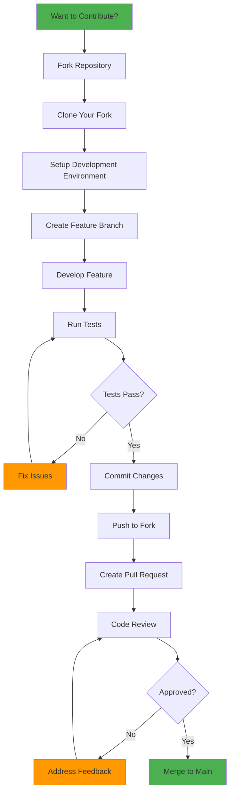
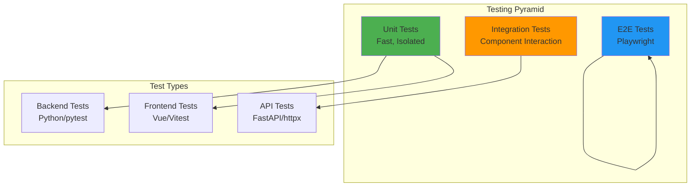
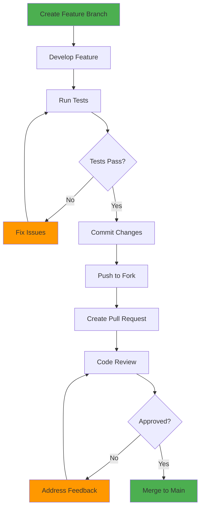
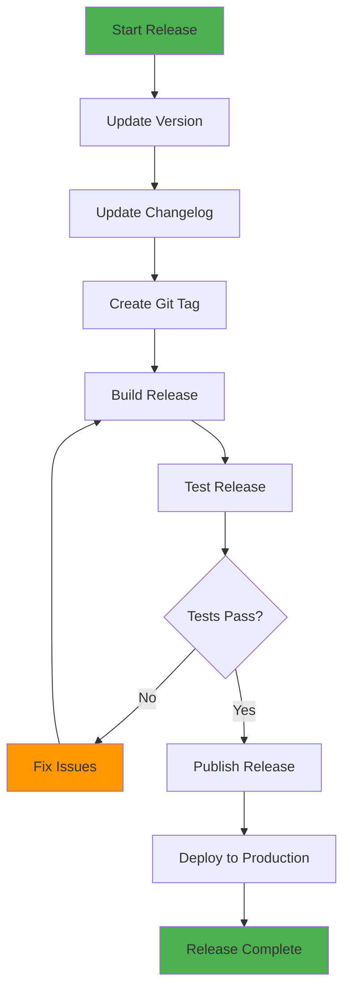

# Contributing Guide - ListSync Development

This comprehensive guide covers how to contribute to ListSync, including development setup, coding standards, testing procedures, and the contribution workflow.

## 📋 Table of Contents

1. [Getting Started](#getting-started)
2. [Development Setup](#development-setup)
3. [Project Structure](#project-structure)
4. [Coding Standards](#coding-standards)
5. [Testing Guidelines](#testing-guidelines)
6. [Documentation Standards](#documentation-standards)
7. [Pull Request Process](#pull-request-process)
8. [Release Process](#release-process)
9. [Community Guidelines](#community-guidelines)

## 🚀 Getting Started

### Prerequisites

Before contributing to ListSync, ensure you have:

- **Git** for version control
- **Python 3.9+** for backend development
- **Node.js 18+** for frontend development
- **Docker & Docker Compose** for containerized development
- **Chrome/Chromium** for Selenium testing
- **Code Editor** (VS Code recommended)

### Development Workflow



## 🛠️ Development Setup

### Quick Start

```bash
# 1. Fork and clone the repository
git clone https://github.com/YOUR_USERNAME/list-sync.git
cd list-sync

# 2. Setup development environment
./scripts/setup-dev.sh

# 3. Start development services
docker-compose -f docker-compose.local.yml up -d

# 4. Verify setup
curl http://localhost:4222/api/system/health
```

### Manual Setup

#### Backend Setup
```bash
# 1. Create Python virtual environment
python3 -m venv venv
source venv/bin/activate  # On Windows: venv\Scripts\activate

# 2. Install dependencies
pip install -r requirements.txt
pip install -r api_requirements.txt

# 3. Install development dependencies
pip install -r requirements-dev.txt

# 4. Setup pre-commit hooks
pre-commit install

# 5. Initialize database
python -m list_sync.database

# 6. Start backend services
python -m list_sync  # Core sync service
python -m api_server  # API server
```

#### Frontend Setup
```bash
# 1. Navigate to frontend directory
cd listsync-nuxt

# 2. Install dependencies
npm install

# 3. Start development server
npm run dev

# 4. Build for production (optional)
npm run build
```

### Docker Development

#### Local Development with Docker
```bash
# 1. Build development image
docker-compose -f docker-compose.local.yml build

# 2. Start development environment
docker-compose -f docker-compose.local.yml up -d

# 3. View logs
docker-compose -f docker-compose.local.yml logs -f

# 4. Execute commands in container
docker-compose -f docker-compose.local.yml exec listsync-full bash
```

#### Development Configuration
```bash
# .env.development
OVERSEERR_URL=http://localhost:5055
OVERSEERR_API_KEY=your_dev_api_key
IMDB_LISTS=top
SYNC_INTERVAL=0.5
AUTOMATED_MODE=false
DEBUG=true
LOG_LEVEL=DEBUG
```

## 📁 Project Structure

### Repository Layout

```
list-sync/
├── list_sync/                 # Core Python package
│   ├── __init__.py
│   ├── main.py               # Main sync engine
│   ├── config.py             # Configuration management
│   ├── database.py           # Database operations
│   ├── api/                  # API package
│   │   ├── __init__.py
│   │   └── overseerr.py      # Overseerr API client
│   ├── providers/            # List provider implementations
│   │   ├── __init__.py
│   │   ├── imdb.py
│   │   ├── trakt.py
│   │   ├── letterboxd.py
│   │   ├── mdblist.py
│   │   └── stevenlu.py
│   ├── notifications/        # Notification services
│   │   ├── __init__.py
│   │   └── discord.py
│   ├── ui/                   # CLI interface
│   │   ├── __init__.py
│   │   ├── cli.py
│   │   └── display.py
│   └── utils/                # Utility functions
│       ├── __init__.py
│       ├── helpers.py
│       ├── logger.py
│       └── timezone_utils.py
├── listsync-nuxt/            # Frontend application
│   ├── app/                  # Nuxt 3 app directory
│   ├── components/           # Vue components
│   ├── pages/                # Application pages
│   ├── composables/          # Vue composables
│   ├── stores/               # Pinia stores
│   ├── services/             # API services
│   ├── types/                # TypeScript types
│   └── utils/                # Utility functions
├── api_server.py             # FastAPI server
├── requirements.txt          # Python dependencies
├── api_requirements.txt      # API-specific dependencies
├── requirements-dev.txt      # Development dependencies
├── pyproject.toml            # Python project configuration
├── docker-compose.yml        # Production Docker setup
├── docker-compose.local.yml  # Development Docker setup
├── docker-compose.core.yml   # Core-only Docker setup
├── Dockerfile                # Main Docker image
├── Dockerfile.core           # Core-only Docker image
├── .env.example              # Environment template
├── .gitignore                # Git ignore rules
├── .pre-commit-config.yaml   # Pre-commit hooks
├── README.md                 # Project overview
└── docs/                     # Documentation
    ├── README.md
    ├── user-guide.md
    ├── api-reference.md
    ├── installation.md
    ├── configuration.md
    ├── troubleshooting.md
    ├── architecture.md
    └── contributing.md
```

### Code Organization

#### Backend Structure
```python
# list_sync/main.py - Main sync engine
class SyncEngine:
    """Central sync orchestration service"""
    
    def __init__(self):
        self.providers = ProviderRegistry()
        self.overseerr = OverseerrClient()
        self.database = DatabaseManager()
    
    async def sync_all_lists(self):
        """Orchestrate complete sync process"""
        pass

# list_sync/providers/imdb.py - IMDb provider
class IMDbProvider(ListProvider):
    """IMDb list provider implementation"""
    
    async def fetch_items(self, list_id: str) -> List[Dict[str, Any]]:
        """Fetch items from IMDb list"""
        pass

# list_sync/api/overseerr.py - Overseerr client
class OverseerrClient:
    """Overseerr API client"""
    
    async def search_media(self, title: str, media_type: str, year: int) -> Dict[str, Any]:
        """Search for media in Overseerr"""
        pass
```

#### Frontend Structure
```typescript
// listsync-nuxt/composables/useApi.ts - API composable
export const useApi = () => {
  const apiClient = new ApiClient()
  
  const getSystemHealth = async () => {
    return await apiClient.get('/api/system/health')
  }
  
  return {
    getSystemHealth,
    // ... other API methods
  }
}

// listsync-nuxt/stores/lists.ts - Lists store
export const useListsStore = defineStore('lists', () => {
  const lists = ref<List[]>([])
  
  const fetchLists = async () => {
    const response = await api.get('/api/lists')
    lists.value = response.data.lists
  }
  
  return {
    lists,
    fetchLists,
    // ... other list methods
  }
})
```

## 📝 Coding Standards

### Python Standards

#### Code Style
- **PEP 8**: Follow Python PEP 8 style guide
- **Black**: Use Black for code formatting
- **isort**: Use isort for import sorting
- **Line Length**: Maximum 88 characters (Black default)
- **Type Hints**: Use type hints for all functions and methods

#### Example Python Code
```python
from typing import List, Dict, Any, Optional
import logging
from dataclasses import dataclass

logger = logging.getLogger(__name__)

@dataclass
class MediaItem:
    """Represents a media item from a list provider."""
    title: str
    year: Optional[int]
    media_type: str
    imdb_id: Optional[str]
    
    def __post_init__(self):
        """Validate media item data after initialization."""
        if not self.title:
            raise ValueError("Title is required")
        if self.media_type not in ["movie", "tv"]:
            raise ValueError("Media type must be 'movie' or 'tv'")

class ListProvider(ABC):
    """Abstract base class for list providers."""
    
    @abstractmethod
    async def fetch_items(self, list_id: str) -> List[MediaItem]:
        """
        Fetch media items from the list provider.
        
        Args:
            list_id: The identifier for the list to fetch
            
        Returns:
            List of media items from the provider
            
        Raises:
            ValueError: If list_id is invalid
            ConnectionError: If unable to connect to provider
        """
        pass
    
    @abstractmethod
    def validate_list_id(self, list_id: str) -> bool:
        """Validate that the list_id is in the correct format."""
        pass
```

#### Python Best Practices
- **Error Handling**: Use specific exception types
- **Logging**: Use structured logging with appropriate levels
- **Documentation**: Include docstrings for all public methods
- **Testing**: Write unit tests for all new functionality
- **Performance**: Use async/await for I/O operations

### TypeScript/Vue Standards

#### Code Style
- **ESLint**: Use ESLint with Vue 3 rules
- **Prettier**: Use Prettier for code formatting
- **TypeScript**: Use strict TypeScript configuration
- **Vue 3**: Use Composition API with `<script setup>`

#### Example TypeScript/Vue Code
```typescript
// types/index.ts
export interface List {
  id: number
  list_type: string
  list_id: string
  list_url: string
  description: string
  item_count: number
  last_synced: string | null
  status: 'active' | 'inactive' | 'pending'
  auto_sync: boolean
  priority: 'low' | 'normal' | 'high'
  created_at: string
  updated_at: string
}

export interface SyncResult {
  sync_id: string
  started_at: string
  completed_at: string | null
  duration_seconds: number | null
  status: 'running' | 'completed' | 'failed'
  items_processed: number
  items_requested: number
  items_available: number
  items_failed: number
  items_skipped: number
  lists_synced: number
  error_message: string | null
}
```

```vue
<!-- components/lists/ListCard.vue -->
<template>
  <div class="list-card" :class="cardClasses">
    <div class="list-header">
      <h3 class="list-title">{{ list.description }}</h3>
      <div class="list-meta">
        <span class="list-type">{{ list.list_type }}</span>
        <span class="item-count">{{ list.item_count }} items</span>
      </div>
    </div>
    
    <div class="list-actions">
      <button 
        @click="handleSync" 
        :disabled="isSyncing"
        class="btn btn-primary"
      >
        {{ isSyncing ? 'Syncing...' : 'Sync Now' }}
      </button>
      
      <button 
        @click="handleEdit" 
        class="btn btn-secondary"
      >
        Edit
      </button>
    </div>
  </div>
</template>

<script setup lang="ts">
import { computed, ref } from 'vue'
import type { List } from '~/types'

interface Props {
  list: List
}

interface Emits {
  (e: 'sync', listId: number): void
  (e: 'edit', listId: number): void
}

const props = defineProps<Props>()
const emit = defineEmits<Emits>()

const isSyncing = ref(false)

const cardClasses = computed(() => ({
  'list-card--active': props.list.status === 'active',
  'list-card--inactive': props.list.status === 'inactive',
  'list-card--pending': props.list.status === 'pending'
}))

const handleSync = async () => {
  isSyncing.value = true
  try {
    emit('sync', props.list.id)
  } finally {
    isSyncing.value = false
  }
}

const handleEdit = () => {
  emit('edit', props.list.id)
}
</script>

<style scoped>
.list-card {
  @apply bg-white rounded-lg shadow-md p-6 border border-gray-200;
}

.list-card--active {
  @apply border-green-500;
}

.list-card--inactive {
  @apply border-gray-300 opacity-75;
}

.list-card--pending {
  @apply border-yellow-500;
}

.list-header {
  @apply mb-4;
}

.list-title {
  @apply text-lg font-semibold text-gray-900 mb-2;
}

.list-meta {
  @apply flex gap-4 text-sm text-gray-600;
}

.list-actions {
  @apply flex gap-2;
}
</style>
```

### API Standards

#### REST API Design
- **HTTP Methods**: Use appropriate HTTP methods (GET, POST, PUT, DELETE)
- **Status Codes**: Return appropriate HTTP status codes
- **Response Format**: Consistent JSON response format
- **Error Handling**: Structured error responses
- **Documentation**: OpenAPI/Swagger documentation

#### Example API Endpoint
```python
from fastapi import APIRouter, HTTPException, Depends
from pydantic import BaseModel
from typing import List, Optional

router = APIRouter(prefix="/api/lists", tags=["lists"])

class ListCreate(BaseModel):
    list_type: str
    list_id: str
    list_url: Optional[str] = None
    description: Optional[str] = None
    auto_sync: bool = True
    priority: str = "normal"
    item_limit: Optional[int] = None

class ListResponse(BaseModel):
    id: int
    list_type: str
    list_id: str
    list_url: str
    description: str
    item_count: int
    last_synced: Optional[str]
    status: str
    auto_sync: bool
    priority: str
    created_at: str
    updated_at: str

@router.post("/", response_model=ListResponse)
async def create_list(
    list_data: ListCreate,
    db: Database = Depends(get_database)
) -> ListResponse:
    """
    Create a new list configuration.
    
    Args:
        list_data: List configuration data
        db: Database dependency
        
    Returns:
        Created list configuration
        
    Raises:
        HTTPException: If list creation fails
    """
    try:
        # Validate list ID format
        provider = get_provider(list_data.list_type)
        if not provider.validate_list_id(list_data.list_id):
            raise HTTPException(
                status_code=400,
                detail=f"Invalid {list_data.list_type} list ID format"
            )
        
        # Create list in database
        list_id = await db.create_list(list_data.dict())
        
        # Fetch created list
        created_list = await db.get_list(list_id)
        
        return ListResponse(**created_list)
        
    except ValueError as e:
        raise HTTPException(status_code=400, detail=str(e))
    except Exception as e:
        logger.error(f"Failed to create list: {e}")
        raise HTTPException(status_code=500, detail="Internal server error")
```

## 🧪 Testing Guidelines

### Testing Strategy



### Backend Testing

#### Unit Tests
```python
# tests/test_providers/test_imdb.py
import pytest
from unittest.mock import Mock, patch
from list_sync.providers.imdb import IMDbProvider

class TestIMDbProvider:
    """Test cases for IMDb provider."""
    
    @pytest.fixture
    def provider(self):
        """Create IMDb provider instance."""
        return IMDbProvider()
    
    def test_validate_list_id_chart(self, provider):
        """Test chart list ID validation."""
        assert provider.validate_list_id("top") is True
        assert provider.validate_list_id("boxoffice") is True
        assert provider.validate_list_id("moviemeter") is True
        assert provider.validate_list_id("tvmeter") is True
    
    def test_validate_list_id_user_list(self, provider):
        """Test user list ID validation."""
        assert provider.validate_list_id("ls123456789") is True
        assert provider.validate_list_id("ls987654321") is True
        assert provider.validate_list_id("ls000000001") is True
    
    def test_validate_list_id_invalid(self, provider):
        """Test invalid list ID validation."""
        assert provider.validate_list_id("invalid") is False
        assert provider.validate_list_id("ls") is False
        assert provider.validate_list_id("") is False
        assert provider.validate_list_id(None) is False
    
    @pytest.mark.asyncio
    async def test_fetch_items_chart(self, provider):
        """Test fetching items from chart."""
        with patch('list_sync.providers.imdb.SB') as mock_sb:
            # Mock SeleniumBase response
            mock_sb.return_value.__enter__.return_value.find_elements.return_value = [
                Mock(text="The Shawshank Redemption", get_attribute=Mock(return_value="1994")),
                Mock(text="The Godfather", get_attribute=Mock(return_value="1972"))
            ]
            
            items = await provider.fetch_items("top")
            
            assert len(items) == 2
            assert items[0]["title"] == "The Shawshank Redemption"
            assert items[0]["year"] == 1994
            assert items[0]["media_type"] == "movie"
    
    @pytest.mark.asyncio
    async def test_fetch_items_error_handling(self, provider):
        """Test error handling during fetch."""
        with patch('list_sync.providers.imdb.SB') as mock_sb:
            mock_sb.return_value.__enter__.return_value.open.side_effect = Exception("Connection error")
            
            with pytest.raises(ConnectionError):
                await provider.fetch_items("top")
```

#### Integration Tests
```python
# tests/test_integration/test_sync_engine.py
import pytest
from unittest.mock import Mock, patch
from list_sync.main import SyncEngine
from list_sync.database import DatabaseManager

class TestSyncEngineIntegration:
    """Integration tests for sync engine."""
    
    @pytest.fixture
    async def sync_engine(self):
        """Create sync engine with mocked dependencies."""
        engine = SyncEngine()
        engine.database = Mock(spec=DatabaseManager)
        engine.overseerr = Mock()
        return engine
    
    @pytest.mark.asyncio
    async def test_sync_single_list_integration(self, sync_engine):
        """Test complete sync process for single list."""
        # Setup mocks
        mock_list = {
            "id": 1,
            "list_type": "imdb",
            "list_id": "top",
            "auto_sync": True
        }
        
        sync_engine.database.get_active_lists.return_value = [mock_list]
        
        with patch('list_sync.main.ProviderRegistry') as mock_registry:
            mock_provider = Mock()
            mock_provider.fetch_items.return_value = [
                {"title": "Test Movie", "year": 2023, "media_type": "movie", "imdb_id": "tt1234567"}
            ]
            mock_registry.return_value.get.return_value = mock_provider
            
            # Mock Overseerr responses
            sync_engine.overseerr.search_media.return_value = {"id": 12345, "status": "available"}
            sync_engine.overseerr.request_media.return_value = {"success": True}
            
            # Run sync
            await sync_engine.sync_single_list(mock_list)
            
            # Verify interactions
            mock_provider.fetch_items.assert_called_once_with("top")
            sync_engine.overseerr.search_media.assert_called_once()
            sync_engine.database.save_sync_result.assert_called()
```

### Frontend Testing

#### Component Tests
```typescript
// tests/components/ListCard.test.ts
import { describe, it, expect, vi } from 'vitest'
import { mount } from '@vue/test-utils'
import ListCard from '~/components/lists/ListCard.vue'
import type { List } from '~/types'

const mockList: List = {
  id: 1,
  list_type: 'imdb',
  list_id: 'top',
  list_url: 'https://www.imdb.com/chart/top',
  description: 'IMDb Top 250 Movies',
  item_count: 250,
  last_synced: '2024-01-15T10:30:00Z',
  status: 'active',
  auto_sync: true,
  priority: 'normal',
  created_at: '2024-01-15T09:00:00Z',
  updated_at: '2024-01-15T10:30:00Z'
}

describe('ListCard', () => {
  it('renders list information correctly', () => {
    const wrapper = mount(ListCard, {
      props: { list: mockList }
    })
    
    expect(wrapper.find('.list-title').text()).toBe('IMDb Top 250 Movies')
    expect(wrapper.find('.list-type').text()).toBe('imdb')
    expect(wrapper.find('.item-count').text()).toBe('250 items')
  })
  
  it('emits sync event when sync button is clicked', async () => {
    const wrapper = mount(ListCard, {
      props: { list: mockList }
    })
    
    const syncButton = wrapper.find('[data-testid="sync-button"]')
    await syncButton.trigger('click')
    
    expect(wrapper.emitted('sync')).toBeTruthy()
    expect(wrapper.emitted('sync')?.[0]).toEqual([1])
  })
  
  it('emits edit event when edit button is clicked', async () => {
    const wrapper = mount(ListCard, {
      props: { list: mockList }
    })
    
    const editButton = wrapper.find('[data-testid="edit-button"]')
    await editButton.trigger('click')
    
    expect(wrapper.emitted('edit')).toBeTruthy()
    expect(wrapper.emitted('edit')?.[0]).toEqual([1])
  })
  
  it('applies correct CSS classes based on status', () => {
    const wrapper = mount(ListCard, {
      props: { list: { ...mockList, status: 'inactive' } }
    })
    
    expect(wrapper.find('.list-card').classes()).toContain('list-card--inactive')
  })
})
```

#### Store Tests
```typescript
// tests/stores/lists.test.ts
import { describe, it, expect, beforeEach, vi } from 'vitest'
import { setActivePinia, createPinia } from 'pinia'
import { useListsStore } from '~/stores/lists'
import type { List } from '~/types'

// Mock API client
vi.mock('~/composables/useApi', () => ({
  useApi: () => ({
    get: vi.fn(),
    post: vi.fn(),
    put: vi.fn(),
    delete: vi.fn()
  })
}))

describe('Lists Store', () => {
  beforeEach(() => {
    setActivePinia(createPinia())
  })
  
  it('initializes with empty lists', () => {
    const store = useListsStore()
    expect(store.lists).toEqual([])
  })
  
  it('fetches lists from API', async () => {
    const mockLists: List[] = [
      {
        id: 1,
        list_type: 'imdb',
        list_id: 'top',
        list_url: 'https://www.imdb.com/chart/top',
        description: 'IMDb Top 250',
        item_count: 250,
        last_synced: null,
        status: 'active',
        auto_sync: true,
        priority: 'normal',
        created_at: '2024-01-15T09:00:00Z',
        updated_at: '2024-01-15T09:00:00Z'
      }
    ]
    
    const store = useListsStore()
    const { useApi } = await import('~/composables/useApi')
    const api = useApi()
    
    vi.mocked(api.get).mockResolvedValue({
      data: { lists: mockLists }
    })
    
    await store.fetchLists()
    
    expect(store.lists).toEqual(mockLists)
    expect(api.get).toHaveBeenCalledWith('/api/lists')
  })
})
```

### API Testing

#### API Endpoint Tests
```python
# tests/test_api/test_lists.py
import pytest
from fastapi.testclient import TestClient
from unittest.mock import Mock, patch
from api_server import app

client = TestClient(app)

class TestListsAPI:
    """Test cases for lists API endpoints."""
    
    def test_get_lists_empty(self):
        """Test getting lists when none exist."""
        with patch('api_server.get_database') as mock_db:
            mock_db.return_value.get_lists.return_value = []
            
            response = client.get("/api/lists")
            
            assert response.status_code == 200
            assert response.json() == {"lists": [], "pagination": {"page": 1, "limit": 50, "total_items": 0, "total_pages": 0, "has_next": False, "has_prev": False}}
    
    def test_create_list_success(self):
        """Test successful list creation."""
        list_data = {
            "list_type": "imdb",
            "list_id": "top",
            "description": "IMDb Top 250 Movies",
            "auto_sync": True
        }
        
        with patch('api_server.get_database') as mock_db:
            mock_db.return_value.create_list.return_value = 1
            mock_db.return_value.get_list.return_value = {
                "id": 1,
                "list_type": "imdb",
                "list_id": "top",
                "list_url": "https://www.imdb.com/chart/top",
                "description": "IMDb Top 250 Movies",
                "item_count": 0,
                "last_synced": None,
                "status": "pending",
                "auto_sync": True,
                "priority": "normal",
                "created_at": "2024-01-15T09:00:00Z",
                "updated_at": "2024-01-15T09:00:00Z"
            }
            
            response = client.post("/api/lists", json=list_data)
            
            assert response.status_code == 201
            assert response.json()["id"] == 1
            assert response.json()["list_type"] == "imdb"
    
    def test_create_list_invalid_format(self):
        """Test list creation with invalid format."""
        list_data = {
            "list_type": "imdb",
            "list_id": "invalid",
            "description": "Invalid List"
        }
        
        response = client.post("/api/lists", json=list_data)
        
        assert response.status_code == 400
        assert "Invalid imdb list ID format" in response.json()["detail"]
    
    def test_delete_list_success(self):
        """Test successful list deletion."""
        with patch('api_server.get_database') as mock_db:
            mock_db.return_value.delete_list.return_value = True
            
            response = client.delete("/api/lists/1")
            
            assert response.status_code == 200
            assert response.json()["success"] is True
            mock_db.return_value.delete_list.assert_called_once_with(1)
    
    def test_delete_list_not_found(self):
        """Test deleting non-existent list."""
        with patch('api_server.get_database') as mock_db:
            mock_db.return_value.delete_list.return_value = False
            
            response = client.delete("/api/lists/999")
            
            assert response.status_code == 404
            assert "List not found" in response.json()["detail"]
```

### Running Tests

#### Backend Tests
```bash
# Run all tests
pytest

# Run specific test file
pytest tests/test_providers/test_imdb.py

# Run with coverage
pytest --cov=list_sync --cov-report=html

# Run with verbose output
pytest -v

# Run specific test
pytest tests/test_providers/test_imdb.py::TestIMDbProvider::test_validate_list_id_chart
```

#### Frontend Tests
```bash
# Run all tests
npm test

# Run with coverage
npm run test:coverage

# Run in watch mode
npm run test:watch

# Run specific test file
npm test ListCard.test.ts
```

#### E2E Tests
```bash
# Run E2E tests
npm run test:e2e

# Run E2E tests in headed mode
npm run test:e2e:headed

# Run specific E2E test
npm run test:e2e -- --grep "List Management"
```

## 📚 Documentation Standards

### Code Documentation

#### Python Docstrings
```python
def fetch_imdb_list(list_id: str) -> List[Dict[str, Any]]:
    """
    Fetch media items from an IMDb list.
    
    This function retrieves media items from various types of IMDb lists,
    including charts, user lists, and watchlists. It uses Selenium WebDriver
    to scrape the IMDb website and extract media information.
    
    Args:
        list_id (str): The IMDb list identifier. Can be:
            - Chart name (e.g., 'top', 'boxoffice', 'moviemeter', 'tvmeter')
            - User list ID (e.g., 'ls123456789')
            - User watchlist ID (e.g., 'ur987654321')
            - Full URL (e.g., 'https://www.imdb.com/list/ls123456789')
    
    Returns:
        List[Dict[str, Any]]: List of media items, each containing:
            - title (str): Media title
            - year (int): Release year
            - media_type (str): 'movie' or 'tv'
            - imdb_id (str): IMDb identifier (e.g., 'tt0111161')
            - description (str): Media description (if available)
            - rating (float): IMDb rating (if available)
    
    Raises:
        ValueError: If list_id format is invalid
        ConnectionError: If unable to connect to IMDb
        TimeoutError: If page load times out
        Exception: For other unexpected errors
    
    Example:
        >>> items = fetch_imdb_list('top')
        >>> print(f"Found {len(items)} items")
        >>> for item in items[:3]:
        ...     print(f"{item['title']} ({item['year']})")
        The Shawshank Redemption (1994)
        The Godfather (1972)
        The Dark Knight (2008)
    
    Note:
        This function requires Chrome/Chromium to be installed and accessible.
        It uses headless mode by default but can be configured for debugging.
        
        Rate limiting is implemented to be respectful to IMDb's servers.
        Consider using appropriate delays between requests for large lists.
    """
    pass
```

#### TypeScript Documentation
```typescript
/**
 * Fetches media items from an IMDb list.
 * 
 * This function retrieves media items from various types of IMDb lists,
 * including charts, user lists, and watchlists. It makes HTTP requests
 * to the ListSync API backend which handles the actual list fetching.
 * 
 * @param listId - The IMDb list identifier. Can be:
 *   - Chart name (e.g., 'top', 'boxoffice', 'moviemeter', 'tvmeter')
 *   - User list ID (e.g., 'ls123456789')
 *   - User watchlist ID (e.g., 'ur987654321')
 *   - Full URL (e.g., 'https://www.imdb.com/list/ls123456789')
 * 
 * @returns Promise resolving to list of media items
 * 
 * @throws {ApiError} When API request fails
 * @throws {ValidationError} When list ID format is invalid
 * 
 * @example
 * ```typescript
 * const items = await fetchIMDbList('top')
 * console.log(`Found ${items.length} items`)
 * items.slice(0, 3).forEach(item => {
 *   console.log(`${item.title} (${item.year})`)
 * })
 * ```
 * 
 * @since 1.0.0
 */
export async function fetchIMDbList(listId: string): Promise<MediaItem[]> {
  // Implementation
}
```

### README Documentation

#### Project README Structure
```markdown
# ListSync

[Brief description of what ListSync does]

## Features

- [Feature 1]
- [Feature 2]
- [Feature 3]

## Quick Start

[Quick start instructions]

## Installation

[Detailed installation instructions]

## Usage

[Usage examples]

## Configuration

[Configuration options]

## API Reference

[Link to API documentation]

## Contributing

[Link to contributing guide]

## License

[License information]
```

### API Documentation

#### OpenAPI/Swagger Documentation
```python
from fastapi import FastAPI, HTTPException
from pydantic import BaseModel, Field
from typing import List, Optional

app = FastAPI(
    title="ListSync API",
    description="RESTful API for ListSync media list synchronization",
    version="1.0.0",
    contact={
        "name": "ListSync Team",
        "url": "https://github.com/Woahai321/list-sync",
        "email": "support@listsync.dev"
    },
    license_info={
        "name": "MIT License",
        "url": "https://opensource.org/licenses/MIT"
    }
)

class ListCreate(BaseModel):
    """Request model for creating a new list."""
    list_type: str = Field(..., description="Type of list provider", example="imdb")
    list_id: str = Field(..., description="List identifier", example="top")
    list_url: Optional[str] = Field(None, description="Full list URL", example="https://www.imdb.com/chart/top")
    description: Optional[str] = Field(None, description="Human-readable description", example="IMDb Top 250 Movies")
    auto_sync: bool = Field(True, description="Enable automatic syncing")
    priority: str = Field("normal", description="Sync priority", example="normal")
    item_limit: Optional[int] = Field(None, description="Maximum items to sync")

class ListResponse(BaseModel):
    """Response model for list information."""
    id: int = Field(..., description="Unique list identifier")
    list_type: str = Field(..., description="Type of list provider")
    list_id: str = Field(..., description="List identifier")
    list_url: str = Field(..., description="Full list URL")
    description: str = Field(..., description="Human-readable description")
    item_count: int = Field(..., description="Number of items in list")
    last_synced: Optional[str] = Field(None, description="Last sync timestamp")
    status: str = Field(..., description="List status")
    auto_sync: bool = Field(..., description="Automatic sync enabled")
    priority: str = Field(..., description="Sync priority")
    created_at: str = Field(..., description="Creation timestamp")
    updated_at: str = Field(..., description="Last update timestamp")

@app.post(
    "/api/lists",
    response_model=ListResponse,
    status_code=201,
    summary="Create a new list",
    description="Add a new list configuration to the system for synchronization.",
    responses={
        201: {"description": "List created successfully"},
        400: {"description": "Invalid request data"},
        422: {"description": "Validation error"},
        500: {"description": "Internal server error"}
    }
)
async def create_list(list_data: ListCreate):
    """
    Create a new list configuration.
    
    This endpoint allows you to add a new list to the synchronization system.
    The list will be fetched and processed according to the specified configuration.
    
    **Supported List Types:**
    - `imdb`: IMDb charts and user lists
    - `trakt`: Trakt lists and special collections
    - `letterboxd`: Letterboxd user lists and watchlists
    - `mdblist`: MDBList collections
    - `stevenlu`: Steven Lu popular movies
    
    **List ID Formats:**
    - IMDb: `top`, `ls123456789`, `ur987654321`
    - Trakt: `123456`, `trending:movies`, `popular:shows`
    - Letterboxd: `username/list-name`, `username/watchlist`
    - MDBList: `username/collection-name`
    - Steven Lu: `stevenlu`
    """
    pass
```

## 🔄 Pull Request Process

### PR Workflow



### PR Guidelines

#### Before Creating a PR
1. **Fork the repository** and create a feature branch
2. **Write tests** for your changes
3. **Run all tests** and ensure they pass
4. **Update documentation** if needed
5. **Follow coding standards** and style guidelines
6. **Commit with clear messages** following conventional commits

#### PR Template
```markdown
## Description
Brief description of the changes made.

## Type of Change
- [ ] Bug fix (non-breaking change which fixes an issue)
- [ ] New feature (non-breaking change which adds functionality)
- [ ] Breaking change (fix or feature that would cause existing functionality to not work as expected)
- [ ] Documentation update
- [ ] Performance improvement
- [ ] Code refactoring

## Testing
- [ ] Unit tests added/updated
- [ ] Integration tests added/updated
- [ ] E2E tests added/updated
- [ ] Manual testing completed

## Checklist
- [ ] Code follows project style guidelines
- [ ] Self-review completed
- [ ] Documentation updated
- [ ] Tests added/updated
- [ ] No breaking changes (or documented if intentional)

## Screenshots (if applicable)
[Add screenshots for UI changes]

## Additional Notes
[Any additional information about the changes]
```

#### PR Review Process
1. **Automated Checks**: CI/CD pipeline runs tests and checks
2. **Code Review**: At least one maintainer reviews the code
3. **Feedback**: Address any feedback or requested changes
4. **Approval**: Maintainer approves the PR
5. **Merge**: PR is merged to main branch

### Commit Message Guidelines

#### Conventional Commits
```bash
# Format: type(scope): description
# Types: feat, fix, docs, style, refactor, test, chore

# Examples:
feat(api): add list management endpoints
fix(providers): handle IMDb rate limiting
docs(readme): update installation instructions
style(python): format code with black
refactor(sync): improve error handling
test(providers): add IMDb provider tests
chore(deps): update dependencies
```

#### Commit Message Examples
```bash
# Good commit messages
feat(api): add POST /api/lists endpoint for creating lists
fix(imdb): handle empty list responses gracefully
docs(api): add OpenAPI documentation for list endpoints
test(providers): add unit tests for IMDb provider
refactor(sync): extract common sync logic into base class

# Bad commit messages
fix stuff
update
WIP
asdf
```

## 🚀 Release Process

### Release Workflow



### Version Management

#### Semantic Versioning
- **MAJOR**: Breaking changes
- **MINOR**: New features (backward compatible)
- **PATCH**: Bug fixes (backward compatible)

#### Version Bumping
```bash
# Patch version (1.0.0 -> 1.0.1)
npm version patch

# Minor version (1.0.0 -> 1.1.0)
npm version minor

# Major version (1.0.0 -> 2.0.0)
npm version major
```

### Release Checklist

#### Pre-Release
- [ ] All tests passing
- [ ] Documentation updated
- [ ] Changelog updated
- [ ] Version bumped
- [ ] Release notes prepared

#### Release
- [ ] Git tag created
- [ ] Docker images built
- [ ] Release published on GitHub
- [ ] Docker images pushed to registry

#### Post-Release
- [ ] Announcement posted
- [ ] Documentation deployed
- [ ] Monitoring alerts configured
- [ ] User feedback collected

## 👥 Community Guidelines

### Code of Conduct

#### Our Pledge
We are committed to providing a welcoming and inclusive environment for all contributors, regardless of:
- Age, body size, disability, ethnicity, gender identity and expression
- Level of experience, nationality, personal appearance, race, religion
- Sexual identity and orientation, socioeconomic status, or any other characteristic

#### Expected Behavior
- **Be respectful** and inclusive in all interactions
- **Be constructive** when providing feedback
- **Be patient** with newcomers and those learning
- **Be collaborative** and help others succeed
- **Be professional** in all communications

#### Unacceptable Behavior
- Harassment, trolling, or personal attacks
- Discriminatory language or behavior
- Spam or off-topic discussions
- Sharing private information without permission
- Any other unprofessional conduct

### Getting Help

#### Community Support
- **GitHub Discussions**: General questions and community help
- **GitHub Issues**: Bug reports and feature requests
- **Discord**: Real-time chat and support
- **Documentation**: Comprehensive guides and references

#### Maintainer Contact
- **GitHub**: @Woahai321
- **Email**: maintainers@listsync.dev
- **Discord**: ListSync Community Server

### Recognition

#### Contributors
We recognize and appreciate all contributors:
- **Code Contributors**: Feature development and bug fixes
- **Documentation Contributors**: Guides, tutorials, and examples
- **Community Contributors**: Support, feedback, and advocacy
- **Testing Contributors**: Bug reports and testing assistance

#### Recognition Methods
- **Contributors List**: Listed in README and documentation
- **Release Notes**: Acknowledged in release announcements
- **Community Highlights**: Featured in community updates
- **Special Recognition**: For significant contributions

---

This comprehensive contributing guide provides everything needed to contribute to ListSync effectively. For additional help, join our community discussions or reach out to the maintainers.
