# Installation Guide - Complete ListSync Setup

This comprehensive installation guide covers all deployment methods for ListSync, from quick Docker setup to advanced manual installations.

## 📋 Table of Contents

1. [Prerequisites](#prerequisites)
2. [Quick Start (Docker)](#quick-start-docker)
3. [Docker Installation (Recommended)](#docker-installation-recommended)
4. [Manual Installation](#manual-installation)
5. [Advanced Deployments](#advanced-deployments)
6. [Post-Installation Setup](#post-installation-setup)
7. [Verification & Testing](#verification--testing)
8. [Updating & Maintenance](#updating--maintenance)
9. [Troubleshooting](#troubleshooting)

## 🔧 Prerequisites

### System Requirements

#### Minimum Requirements
- **RAM**: 2GB (4GB recommended)
- **Storage**: 1GB free space (2GB recommended)
- **CPU**: 1 core (2 cores recommended)
- **Network**: Stable internet connection
- **OS**: Linux, macOS, or Windows with WSL2

#### For Docker Installation
- **Docker**: Version 20.10 or higher
- **Docker Compose**: Version 2.0 or higher
- **Git**: For cloning the repository

#### For Manual Installation
- **Python**: Version 3.9 or higher
- **Node.js**: Version 18 or higher (for web interface)
- **Chrome/Chromium**: For Selenium web scraping
- **Git**: For cloning the repository

### Overseerr Requirements
- **Overseerr Instance**: Running and accessible
- **API Key**: Obtained from Overseerr settings
- **User ID**: For making requests (usually 1)
- **Network Access**: ListSync must be able to reach Overseerr

### Network Requirements
- **Port 3222**: Web dashboard (configurable)
- **Port 4222**: API backend (configurable)
- **Outbound Access**: To IMDb, Trakt, Letterboxd, MDBList, Steven Lu

## 🚀 Quick Start (Docker)

### 30-Second Setup

```mermaid
flowchart LR
    Start[Start Setup] --> Clone[Clone Repository]
    Clone --> Config[Configure .env]
    Config --> Deploy[Deploy with Docker]
    Deploy --> Test[Test Installation]
    Test --> Success[✅ Ready!]
    
    style Start fill:#4CAF50
    style Success fill:#4CAF50
    style Deploy fill:#2196F3
```



**Step-by-Step:**
```bash
# 1. Clone and configure
git clone https://github.com/Woahai321/list-sync.git
cd list-sync
cp envsample.txt .env

# 2. Edit .env with your details
nano .env
# Add: OVERSEERR_URL=https://your-overseerr-url.com
# Add: OVERSEERR_API_KEY=your_api_key_here
# Add: IMDB_LISTS=top

# 3. Deploy
docker-compose up -d

# 4. Test (wait ~30 seconds)
curl http://localhost:4222/api/system/health

# 5. Access dashboard
open http://localhost:3222
```

## 🐳 Docker Installation (Recommended)

### Deployment Decision Guide

```mermaid
flowchart TD
    Start[Choose Deployment Method] --> UseCase{What's your goal?}
    
    UseCase -->|Production use| Prod[Production Setup]
    UseCase -->|Development| Dev[Development Setup]
    UseCase -->|Just testing| Test[Quick Test]
    UseCase -->|Advanced features| Advanced[Advanced Setup]
    
    Prod --> NeedDashboard{Need web dashboard?}
    NeedDashboard -->|Yes| FullDocker[Full Stack<br/>docker-compose.yml<br/>✓ Dashboard :3222<br/>✓ API :4222<br/>✓ Core Sync]
    NeedDashboard -->|No| CoreDocker[Core Only<br/>docker-compose.core.yml<br/>✓ API :4222<br/>✓ Core Sync]
    
    Dev --> LocalOrDocker{Docker or native?}
    LocalOrDocker -->|Docker| DevDocker[Local Build<br/>docker-compose.local.yml<br/>Build from source]
    LocalOrDocker -->|Native| ManualSetup[Manual Installation<br/>Python + Node.js<br/>Full control]
    
    Test --> QuickDocker[Core Deployment<br/>Fastest setup<br/>API access only]
    
    Advanced --> MultiInstance[Multi-Instance<br/>Multiple configurations<br/>Load balancing]
    
    FullDocker --> DeployFull[docker-compose up -d]
    CoreDocker --> DeployCore[docker-compose -f<br/>docker-compose.core.yml up -d]
    DevDocker --> DeployDev[docker-compose -f<br/>docker-compose.local.yml up -d]
    QuickDocker --> DeployCore
    ManualSetup --> ManualSteps[Follow manual<br/>installation steps]
    MultiInstance --> DeployMulti[Custom docker-compose<br/>Multiple services]
    
    DeployFull --> Success[✅ Deployment complete]
    DeployCore --> Success
    DeployDev --> Success
    DeployMulti --> Success
    ManualSteps --> Success
    
    Success --> Access{Can access?}
    Access -->|Yes| TestIt[Test sync operation]
    Access -->|No| TroubleshootInstall[See Troubleshooting]
    TestIt --> Working{Works?}
    Working -->|Yes| Done[Ready to use!]
    Working -->|No| TroubleshootInstall
    
    style Start fill:#4CAF50
    style Done fill:#4CAF50
    style FullDocker fill:#2196F3
    style CoreDocker fill:#2196F3
    style TroubleshootInstall fill:#FF9800
```



### Production Deployment

#### Full Stack (Recommended)
Uses the pre-built image with web dashboard:

```bash
# 1. Clone repository
git clone https://github.com/Woahai321/list-sync.git
cd list-sync

# 2. Configure environment
cp envsample.txt .env
nano .env  # Edit with your settings

# 3. Deploy
docker-compose up -d

# 4. Verify deployment
docker-compose ps
curl http://localhost:4222/api/system/health
```

**Configuration Example:**
```bash
# .env file
OVERSEERR_URL=https://overseerr.example.com
OVERSEERR_API_KEY=your_api_key_here
OVERSEERR_USER_ID=1
OVERSEERR_4K=false

SYNC_INTERVAL=24
AUTOMATED_MODE=true

IMDB_LISTS=top,ls123456789
TRAKT_SPECIAL_LISTS=trending:movies,popular:shows
LETTERBOXD_LISTS=username/watchlist

DISCORD_WEBHOOK_URL=https://discord.com/api/webhooks/...
```

#### Core Only (API + Sync)
For headless deployments or when you don't need the web dashboard:

```bash
# Deploy core services only
docker-compose -f docker-compose.core.yml up -d

# Access API directly
curl http://localhost:4222/api/system/health
```

### Development Deployment

#### Local Build
Build from source for development:

```bash
# Build development image
docker-compose -f docker-compose.local.yml build

# Start development environment
docker-compose -f docker-compose.local.yml up -d

# View logs
docker-compose -f docker-compose.local.yml logs -f
```

### Docker Configuration

#### Environment Variables
All configuration is done through environment variables in your `.env` file:

```bash
# Required
OVERSEERR_URL=https://your-overseerr-url.com
OVERSEERR_API_KEY=your_api_key_here

# Optional
OVERSEERR_USER_ID=1
OVERSEERR_4K=false
SYNC_INTERVAL=24
AUTOMATED_MODE=true

# List providers
IMDB_LISTS=top,ls123456789
TRAKT_LISTS=123456,789012
TRAKT_SPECIAL_LISTS=trending:movies,popular:shows
LETTERBOXD_LISTS=username/watchlist
MDBLIST_LISTS=username/collection
STEVENLU_LISTS=stevenlu

# Notifications
DISCORD_WEBHOOK_URL=https://discord.com/api/webhooks/...
```

#### Volume Mapping
Default Docker setup includes these volume mappings:

```yaml
volumes:
  - ./data:/usr/src/app/data          # Data persistence
  - ./.env:/usr/src/app/.env          # Configuration
  - ./logs:/var/log/supervisor        # Logs (optional)
```

#### Port Configuration
Default ports:
- **3222**: Web Dashboard (Nuxt 3 frontend)
- **4222**: API Backend (FastAPI)

To change ports, modify the `docker-compose.yml`:

```yaml
services:
  listsync-full:
    ports:
      - "8080:3222"  # Web dashboard on port 8080
      - "8081:4222"  # API on port 8081
```

## 💻 Manual Installation

### System Preparation

#### Ubuntu/Debian
```bash
# Update package list
sudo apt update

# Install Python and dependencies
sudo apt install python3 python3-pip python3-venv git

# Install Node.js (for web interface)
curl -fsSL https://deb.nodesource.com/setup_18.x | sudo -E bash -
sudo apt install nodejs

# Install Chrome (for Selenium)
wget -q -O - https://dl.google.com/linux/linux_signing_key.pub | sudo apt-key add -
sudo sh -c 'echo "deb [arch=amd64] http://dl.google.com/linux/chrome/deb/ stable main" >> /etc/apt/sources.list.d/google-chrome.list'
sudo apt update
sudo apt install google-chrome-stable

# Install Chrome dependencies
sudo apt install libxss1 libappindicator1 libindicator7
```

#### CentOS/RHEL/Fedora
```bash
# Install Python and dependencies
sudo dnf install python3 python3-pip git nodejs npm

# Install Chrome
sudo dnf install google-chrome-stable
```

#### macOS
```bash
# Install Homebrew if not installed
/bin/bash -c "$(curl -fsSL https://raw.githubusercontent.com/Homebrew/install/HEAD/install.sh)"

# Install dependencies
brew install python3 node git
brew install --cask google-chrome
```

#### Windows (WSL2)
```bash
# Install Ubuntu in WSL2, then follow Ubuntu instructions above
# Or use Docker Desktop for Windows
```

### Backend Installation

#### Python Environment Setup
```bash
# 1. Clone repository
git clone https://github.com/Woahai321/list-sync.git
cd list-sync

# 2. Create Python virtual environment
python3 -m venv venv
source venv/bin/activate  # On Windows: venv\Scripts\activate

# 3. Install Python dependencies
pip install -r requirements.txt

# 4. Install additional API dependencies
pip install -r api_requirements.txt
```

#### Database Setup
```bash
# Database will be automatically initialized on first run
python -m list_sync.database

# Or run the main application to initialize
python -m list_sync
```

#### Configuration
```bash
# Copy example environment file
cp envsample.txt .env

# Edit configuration
nano .env
# Add your Overseerr URL, API key, and list configurations
```

### Frontend Installation

#### Node.js Setup
```bash
# Navigate to frontend directory
cd listsync-nuxt

# Install Node.js dependencies
npm install

# Build frontend
npm run build

# Start development server (optional)
npm run dev
```

#### Production Build
```bash
# Build for production
npm run build

# Start production server
npm start
```

### Service Setup

#### Using Systemd (Linux)

**Backend Service** (`/etc/systemd/system/listsync-backend.service`):
```ini
[Unit]
Description=ListSync Backend Service
After=network.target

[Service]
Type=simple
User=your-username
WorkingDirectory=/path/to/list-sync
Environment=PATH=/path/to/list-sync/venv/bin
ExecStart=/path/to/list-sync/venv/bin/python -m list_sync
Restart=always
RestartSec=10

[Install]
WantedBy=multi-user.target
```

**Frontend Service** (`/etc/systemd/system/listsync-frontend.service`):
```ini
[Unit]
Description=ListSync Frontend Service
After=network.target

[Service]
Type=simple
User=your-username
WorkingDirectory=/path/to/list-sync/listsync-nuxt
ExecStart=/usr/bin/npm start
Restart=always
RestartSec=10
Environment=NODE_ENV=production

[Install]
WantedBy=multi-user.target
```

**Enable and start services:**
```bash
sudo systemctl enable listsync-backend listsync-frontend
sudo systemctl start listsync-backend listsync-frontend
sudo systemctl status listsync-backend listsync-frontend
```

#### Using PM2 (Node.js Process Manager)
```bash
# Install PM2
npm install -g pm2

# Start backend
pm2 start "python -m list_sync" --name listsync-backend --cwd /path/to/list-sync

# Start frontend
pm2 start npm --name listsync-frontend --cwd /path/to/list-sync/listsync-nuxt -- start

# Save PM2 configuration
pm2 save
pm2 startup
```

## 🚀 Advanced Deployments

### Multi-Instance Deployments

#### Multiple Overseerr Instances
```yaml
# docker-compose-multi.yml
version: "3.8"

services:
  listsync-main:
    image: ghcr.io/woahai321/list-sync:main
    container_name: listsync-main
    environment:
      - OVERSEERR_URL=https://overseerr.example.com
      - OVERSEERR_API_KEY=${MAIN_API_KEY}
      - AUTOMATED_MODE=true
      - SYNC_INTERVAL=24
      - IMDB_LISTS=ls123456789,top
    volumes:
      - ./data-main:/usr/src/app/data
    restart: unless-stopped

  listsync-4k:
    image: ghcr.io/woahai321/list-sync:main
    container_name: listsync-4k
    environment:
      - OVERSEERR_URL=https://overseerr-4k.example.com
      - OVERSEERR_API_KEY=${4K_API_KEY}
      - AUTOMATED_MODE=true
      - SYNC_INTERVAL=12
      - OVERSEERR_4K=true
      - IMDB_LISTS=top,boxoffice
      - TRAKT_SPECIAL_LISTS=trending:movies
    volumes:
      - ./data-4k:/usr/src/app/data
    restart: unless-stopped
```

#### Geographic Distribution
```yaml
# docker-compose-regions.yml
version: "3.8"

services:
  listsync-us:
    image: ghcr.io/woahai321/list-sync:main
    environment:
      - OVERSEERR_URL=https://us-overseerr.example.com
      - OVERSEERR_API_KEY=${US_API_KEY}
      - IMDB_LISTS=boxoffice,moviemeter
      - TRAKT_SPECIAL_LISTS=trending:movies,boxoffice:movies
      - SYNC_INTERVAL=6
    volumes:
      - ./data-us:/usr/src/app/data

  listsync-eu:
    image: ghcr.io/woahai321/list-sync:main
    environment:
      - OVERSEERR_URL=https://eu-overseerr.example.com
      - OVERSEERR_API_KEY=${EU_API_KEY}
      - LETTERBOXD_LISTS=${EU_LETTERBOXD_LISTS}
      - MDBLIST_LISTS=${EU_MDBLIST}
      - SYNC_INTERVAL=12
    volumes:
      - ./data-eu:/usr/src/app/data
```

### Load Balancing
```yaml
# docker-compose-load-balance.yml
version: "3.8"

services:
  listsync-imdb:
    image: ghcr.io/woahai321/list-sync:main
    environment:
      - OVERSEERR_URL=${OVERSEERR_URL}
      - OVERSEERR_API_KEY=${API_KEY}
      - IMDB_LISTS=${ALL_IMDB_LISTS}
      - SYNC_INTERVAL=24
    volumes:
      - ./data-shared:/usr/src/app/data:ro
      - ./data-imdb:/usr/src/app/data/logs

  listsync-trakt:
    image: ghcr.io/woahai321/list-sync:main
    environment:
      - OVERSEERR_URL=${OVERSEERR_URL}
      - OVERSEERR_API_KEY=${API_KEY}
      - TRAKT_LISTS=${ALL_TRAKT_LISTS}
      - TRAKT_SPECIAL_LISTS=${ALL_TRAKT_SPECIAL}
      - SYNC_INTERVAL=12
    volumes:
      - ./data-shared:/usr/src/app/data:ro
      - ./data-trakt:/usr/src/app/data/logs
```

### Reverse Proxy Setup

#### Nginx Configuration
```nginx
server {
    listen 80;
    server_name listsync.example.com;

    # Frontend
    location / {
        proxy_pass http://localhost:3222;
        proxy_set_header Host $host;
        proxy_set_header X-Real-IP $remote_addr;
        proxy_set_header X-Forwarded-For $proxy_add_x_forwarded_for;
        proxy_set_header X-Forwarded-Proto $scheme;
    }

    # API
    location /api/ {
        proxy_pass http://localhost:4222;
        proxy_set_header Host $host;
        proxy_set_header X-Real-IP $remote_addr;
        proxy_set_header X-Forwarded-For $proxy_add_x_forwarded_for;
        proxy_set_header X-Forwarded-Proto $scheme;
    }

    # WebSocket support
    location /ws/ {
        proxy_pass http://localhost:4222;
        proxy_http_version 1.1;
        proxy_set_header Upgrade $http_upgrade;
        proxy_set_header Connection "upgrade";
        proxy_set_header Host $host;
    }
}
```

#### Apache Configuration
```apache
<VirtualHost *:80>
    ServerName listsync.example.com
    
    # Frontend
    ProxyPreserveHost On
    ProxyPass / http://localhost:3222/
    ProxyPassReverse / http://localhost:3222/
    
    # API
    ProxyPass /api/ http://localhost:4222/api/
    ProxyPassReverse /api/ http://localhost:4222/api/
    
    # WebSocket support
    ProxyPass /ws/ ws://localhost:4222/ws/
    ProxyPassReverse /ws/ ws://localhost:4222/ws/
</VirtualHost>
```

## 🔧 Post-Installation Setup

### Initial Configuration Workflow

```mermaid
flowchart TD
    Start[Installation Complete] --> TestConnection[Test Overseerr Connection]
    TestConnection --> ConnOK{Connection OK?}
    ConnOK -->|No| FixConnection[Fix Connection Issues<br/>- Check URL format<br/>- Verify API key<br/>- Test network access]
    ConnOK -->|Yes| AddFirstList[Add First List]
    
    FixConnection --> TestConnection
    
    AddFirstList --> ChooseList{Which list to add?}
    ChooseList -->|IMDb Top| AddIMDB[Add IMDb Top 250<br/>IMDB_LISTS=top]
    ChooseList -->|Trakt Trending| AddTrakt[Add Trakt Trending<br/>TRAKT_SPECIAL_LISTS=trending:movies]
    ChooseList -->|Custom| AddCustom[Add Custom List<br/>Follow provider format]
    
    AddIMDB --> ConfigureSync[Configure Sync Settings<br/>- Set interval<br/>- Enable automation<br/>- Set notifications]
    AddTrakt --> ConfigureSync
    AddCustom --> ConfigureSync
    
    ConfigureSync --> TestSync[Test First Sync<br/>- Trigger manual sync<br/>- Monitor progress<br/>- Check results]
    TestSync --> SyncOK{Sync Successful?}
    SyncOK -->|No| DebugSync[Debug Sync Issues<br/>- Check logs<br/>- Verify list access<br/>- Test Overseerr]
    SyncOK -->|Yes| SetupComplete[✅ Setup Complete!<br/>Ready for production]
    
    DebugSync --> FixIssues[Fix Issues<br/>- Update configuration<br/>- Fix list access<br/>- Resolve errors]
    FixIssues --> TestSync
    
    style Start fill:#4CAF50
    style SetupComplete fill:#4CAF50
    style FixConnection fill:#FF9800
    style DebugSync fill:#FF9800
    style TestSync fill:#2196F3
```



### Configuration Steps

#### 1. Test Overseerr Connection
```bash
# Test API connectivity
curl -H "X-Api-Key: your-api-key" http://your-overseerr-url/api/v1/status

# Expected response: JSON with Overseerr status
```

#### 2. Add Your First List
```bash
# Edit .env file
nano .env

# Add a simple list to start
IMDB_LISTS=top

# Or add via web dashboard
# Open http://localhost:3222 and go to Lists page
```

#### 3. Configure Sync Settings
```bash
# Set sync interval (hours)
SYNC_INTERVAL=24

# Enable automated mode
AUTOMATED_MODE=true

# Optional: Add Discord notifications
DISCORD_WEBHOOK_URL=https://discord.com/api/webhooks/...
```

#### 4. Test First Sync
```bash
# Trigger manual sync
curl -X POST http://localhost:4222/api/sync/trigger

# Or use web dashboard
# Go to Sync page and click "Sync Now"
```

### Optional Setup

#### Discord Notifications
1. **Create Discord webhook:**
   - Go to your Discord server settings
   - Navigate to Integrations → Webhooks
   - Create a new webhook
   - Copy the webhook URL

2. **Add to configuration:**
   ```bash
   DISCORD_WEBHOOK_URL=https://discord.com/api/webhooks/your-webhook-url
   ```

3. **Test notifications:**
   - Trigger a manual sync
   - Check Discord for notification

#### Email Notifications (Advanced)
```bash
# Add to .env file
EMAIL_NOTIFICATIONS=true
SMTP_SERVER=smtp.gmail.com
SMTP_PORT=587
SMTP_USERNAME=your-email@gmail.com
SMTP_PASSWORD=your-app-password
SMTP_FROM=your-email@gmail.com
SMTP_TO=admin@example.com
```

## ✅ Verification & Testing

### Post-Installation Verification Workflow

```mermaid
flowchart TD
    Start[Installation Complete] --> Step1[Check Container Status]
    
    Step1 --> Docker{Using Docker?}
    Docker -->|Yes| CheckPS[docker-compose ps<br/>All services Up?]
    Docker -->|No| CheckProc[Check processes<br/>ps aux | grep listsync]
    
    CheckPS --> AllUp{All up?}
    AllUp -->|No| StartServices[docker-compose up -d]
    AllUp -->|Yes| TestAPI[Test API Health]
    CheckProc --> TestAPI
    StartServices --> TestAPI
    
    TestAPI --> CURL1[curl localhost:4222/api/system/health]
    CURL1 --> APIWorks{API responds?}
    APIWorks -->|No| CheckAPIPort[Check port 4222<br/>Check firewall]
    APIWorks -->|Yes| TestDB[Test Database]
    
    TestDB --> CURL2[curl localhost:4222/api/lists]
    CURL2 --> DBWorks{Database OK?}
    DBWorks -->|No| CheckDBFile[Check ./data/list_sync.db<br/>exists & writable]
    DBWorks -->|Yes| TestDashboard[Test Dashboard]
    
    TestDashboard --> OpenBrowser[Open localhost:3222<br/>in browser]
    OpenBrowser --> DashWorks{Dashboard loads?}
    DashWorks -->|No| CheckFrontend[Check port 3222<br/>Check frontend logs]
    DashWorks -->|Yes| TestOverseerr[Test Overseerr Connection]
    
    TestOverseerr --> ConfigOverseerr[Check .env:<br/>OVERSEERR_URL<br/>OVERSEERR_API_KEY]
    ConfigOverseerr --> ConnTest{Connection OK<br/>in dashboard?}
    ConnTest -->|No| FixCreds[Update credentials<br/>Restart: docker-compose restart]
    ConnTest -->|Yes| AddList[Add Test List]
    
    AddList --> AddIMDB[Add IMDb Top list<br/>via dashboard or .env]
    AddIMDB --> TriggerSync[Trigger manual sync]
    TriggerSync --> SyncWorks{Sync completes<br/>successfully?}
    
    SyncWorks -->|No| CheckLogs[Check logs:<br/>docker-compose logs]
    SyncWorks -->|Yes| VerifyResults[Verify results<br/>in dashboard]
    
    VerifyResults --> ItemsReq{Items<br/>requested?}
    ItemsReq -->|Yes| AllGood[✅ Installation verified!<br/>Ready for production]
    ItemsReq -->|No| CheckWhy[Check why:<br/>- Already available?<br/>- Matching issues?]
    
    CheckAPIPort --> FixPort[Fix and retry]
    CheckDBFile --> FixDB[Fix and retry]
    CheckFrontend --> FixFrontend[Fix and retry]
    FixCreds --> TestOverseerr
    CheckLogs --> FixIssues[Fix issues]
    CheckWhy --> ReviewConfig[Review configuration]
    FixPort --> TestAPI
    FixDB --> TestDB
    FixFrontend --> TestDashboard
    FixIssues --> TriggerSync
    ReviewConfig --> Docs[Check documentation]
    
    style Start fill:#4CAF50
    style AllGood fill:#4CAF50
    style CheckAPIPort fill:#FF9800
    style CheckDBFile fill:#FF9800
    style CheckFrontend fill:#FF9800
    style CheckLogs fill:#FF9800
```

### Health Checks

#### 1. System Health Check
```bash
# Basic health check
curl http://localhost:4222/api/system/health

# Expected response:
# {
#   "database": true,
#   "process": true,
#   "sync_status": "idle",
#   "last_sync": "2024-01-15T10:30:00Z",
#   "next_sync": "2024-01-15T22:30:00Z"
# }
```

#### 2. Detailed Status Check
```bash
# Comprehensive status
curl http://localhost:4222/api/system/status

# Check specific components
curl http://localhost:4222/api/system/database/test
curl http://localhost:4222/api/overseerr/status
```

#### 3. Web Interface Test
```bash
# Test dashboard accessibility
curl -I http://localhost:3222

# Expected: HTTP/1.1 200 OK
```

### Manual Sync Test

#### 1. Trigger Manual Sync
```bash
# Trigger sync via API
curl -X POST http://localhost:4222/api/sync/trigger

# Expected response:
# {
#   "success": true,
#   "message": "Sync triggered successfully",
#   "sync_id": "sync_20240115_103000"
# }
```

#### 2. Monitor Sync Progress
```bash
# Check sync status
curl http://localhost:4222/api/sync/status

# Stream live logs
curl http://localhost:4222/api/logs/stream
```

#### 3. Verify Results
```bash
# Check processed items
curl http://localhost:4222/api/processed?limit=10

# Check analytics
curl http://localhost:4222/api/analytics/overview
```

### Log Verification

#### Docker Logs
```bash
# View all logs
docker-compose logs -f

# View specific service logs
docker-compose logs -f listsync-full

# Filter by log level
docker-compose logs listsync-full | grep ERROR
```

#### Manual Installation Logs
```bash
# Check application logs
tail -f data/list_sync.log

# Check system logs
journalctl -u listsync-backend -f
journalctl -u listsync-frontend -f
```

## 🔄 Updating & Maintenance

### Docker Update Process


### Update Commands

#### Docker Update
```bash
# 1. Backup current configuration
cp .env .env.backup
cp data/list_sync.db data/list_sync.db.backup

# 2. Pull latest images
docker-compose pull

# 3. Restart with new images
docker-compose up -d

# 4. Verify update
docker-compose ps
curl http://localhost:4222/api/system/health
```

#### Manual Update
```bash
# 1. Backup configuration
cp .env .env.backup
cp data/list_sync.db data/list_sync.db.backup

# 2. Pull latest code
git pull origin main

# 3. Update Python dependencies
source venv/bin/activate
pip install -r requirements.txt --upgrade

# 4. Update frontend dependencies
cd listsync-nuxt
npm install
npm run build
cd ..

# 5. Restart services
sudo systemctl restart listsync-backend listsync-frontend
```

### Maintenance Tasks

#### Daily Maintenance
- Check sync operations completed successfully
- Monitor error logs for issues
- Verify system health status

#### Weekly Maintenance
- Review performance metrics
- Check disk space usage
- Update configuration if needed

#### Monthly Maintenance
- Analyze sync statistics and trends
- Review and clean up old logs
- Update to latest version if available

## 🔧 Troubleshooting

### Common Installation Issues

#### Docker Issues

**Port Already in Use:**
```bash
# Check what's using the port
sudo netstat -tlnp | grep :3222
sudo netstat -tlnp | grep :4222

# Change ports in docker-compose.yml
ports:
  - "8080:3222"  # Use different host port
  - "8081:4222"
```

**Permission Denied:**
```bash
# Add user to docker group
sudo usermod -aG docker $USER
# Log out and back in

# Fix Docker socket permissions
sudo chmod 666 /var/run/docker.sock
```

**Container Won't Start:**
```bash
# Check logs for errors
docker-compose logs listsync-full

# Check container status
docker-compose ps

# Try rebuilding
docker-compose build --no-cache
docker-compose up -d
```

#### Manual Installation Issues

**Python Version Too Old:**
```bash
# Check Python version
python3 --version

# Install newer Python (Ubuntu)
sudo apt install python3.9 python3.9-venv

# Use specific Python version
python3.9 -m venv venv
```

**Chrome/Selenium Issues:**
```bash
# Install Chrome dependencies
sudo apt install libxss1 libappindicator1 libindicator7

# Test Chrome headless
google-chrome --headless --no-sandbox --disable-gpu --dump-dom https://google.com
```

**Node.js Build Failures:**
```bash
# Clear npm cache
npm cache clean --force

# Delete node_modules and reinstall
rm -rf node_modules package-lock.json
npm install
```

### Performance Issues

**High Memory Usage:**
- Reduce `TRAKT_SPECIAL_ITEMS_LIMIT`
- Increase `SYNC_INTERVAL`
- Use fewer concurrent lists

**Slow List Fetching:**
- Check network connectivity
- Verify list URLs are accessible
- Enable debug logging to identify bottlenecks

### Network Issues

**Cannot Connect to Overseerr:**
```bash
# Test connectivity
curl -v http://your-overseerr-url/api/v1/status

# Check Docker networking
docker network ls
docker network inspect list-sync_default
```

**CORS Errors in Web Interface:**
- Verify `CORS_ALLOWED_ORIGINS` includes your domain
- Check `NEXT_PUBLIC_API_URL` is correct

### Getting Help

If you encounter issues not covered here:

1. **Check logs** for detailed error messages
2. **Search existing issues** on GitHub
3. **Create a new issue** with:
   - Installation method (Docker/manual)
   - Operating system
   - Error messages
   - Configuration (sanitized)

For more troubleshooting help, see our [Troubleshooting Guide](troubleshooting.md).

---

This comprehensive installation guide covers all deployment scenarios for ListSync. Choose the method that best fits your needs and follow the step-by-step instructions for a successful installation.
