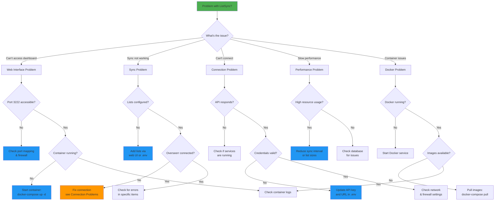
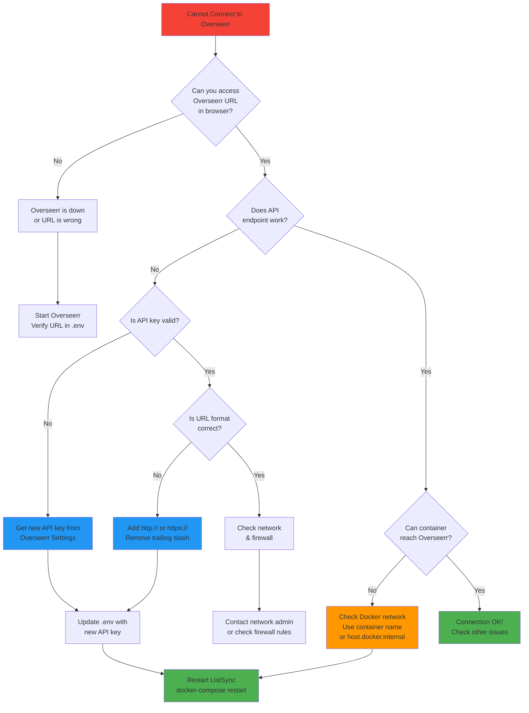
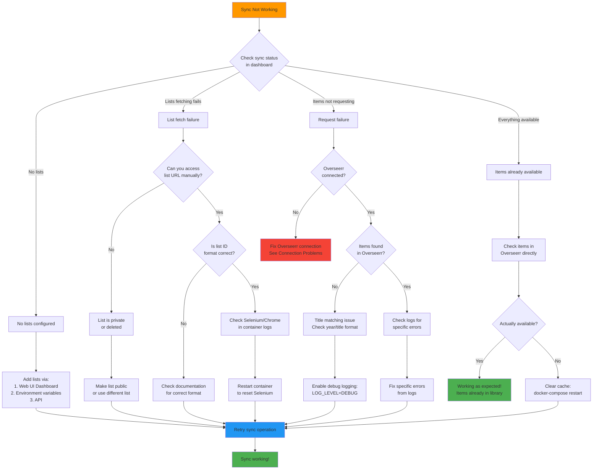

# Troubleshooting Guide - Complete ListSync Diagnostics

This comprehensive troubleshooting guide helps you diagnose and resolve common issues with ListSync using systematic diagnostic flows and detailed solutions.

## 📋 Table of Contents

1. [Quick Diagnostics](#quick-diagnostics)
2. [Common Issues](#common-issues)
3. [Connection Problems](#connection-problems)
4. [Sync Issues](#sync-issues)
5. [Performance Problems](#performance-problems)
6. [Web Interface Issues](#web-interface-issues)
7. [List Provider Issues](#list-provider-issues)
8. [Docker-Specific Issues](#docker-specific-issues)
9. [Manual Installation Issues](#manual-installation-issues)
10. [Advanced Debugging](#advanced-debugging)
11. [Getting Help](#getting-help)

## 🔍 Quick Diagnostics

### Diagnostic Decision Tree



### Health Check Checklist

Run these quick checks to identify the issue category:

```bash
# 1. Check system health
curl http://localhost:4222/api/system/health

# 2. Check Docker containers (if using Docker)
docker-compose ps

# 3. Check logs for errors
docker-compose logs --tail=50 listsync-full

# 4. Verify Overseerr connection
curl -H "X-Api-Key: your-api-key" http://your-overseerr-url/api/v1/status
```

### Status Indicators

| Component | Healthy | Unhealthy | Check Command |
|-----------|---------|-----------|---------------|
| **Database** | ✅ Connected | ❌ Connection failed | `curl localhost:4222/api/system/health` |
| **Process** | ✅ Running | ❌ Not running | `docker-compose ps` |
| **Overseerr** | ✅ Connected | ❌ Connection failed | `curl -H "X-Api-Key: key" http://overseerr-url/api/v1/status` |
| **Web UI** | ✅ Accessible | ❌ Not loading | `curl -I localhost:3222` |
| **API** | ✅ Responding | ❌ Not responding | `curl localhost:4222/api/system/health` |

## 🚨 Common Issues

### "No lists configured" Error

#### Symptoms
- Sync fails with "No lists configured" message
- Dashboard shows 0 lists
- API returns empty lists array

#### Causes
- Environment variables not set
- Database not properly initialized
- Configuration file missing or corrupted

#### Solutions

**1. Check Environment Variables**
```bash
# Verify lists are configured
echo $IMDB_LISTS
echo $TRAKT_LISTS
echo $LETTERBOXD_LISTS

# Check .env file
cat .env | grep -E "(IMDB|TRAKT|LETTERBOXD|MDBLIST|STEVENLU)_LISTS"
```

**2. Add Lists via Web Interface**
- Go to http://localhost:3222/dashboard/lists
- Click "Add New List"
- Enter your list details
- Save configuration

**3. Add Lists via Environment**
```bash
# Add to .env file
IMDB_LISTS=top,boxoffice
TRAKT_SPECIAL_LISTS=trending:movies

# Restart container
docker-compose restart
```

**4. Verify Database**
```bash
# Check database file exists
ls -la data/list_sync.db

# Check database contents
sqlite3 data/list_sync.db "SELECT * FROM lists;"
```

### "Already available" for Everything

#### Symptoms
- All items show as "already available" even for new content
- No items are being requested
- Sync completes but no new requests made

#### Causes
- Items already exist in your media library
- Overseerr has different availability rules
- 4K vs standard quality mismatch
- Cached data showing outdated status

#### Solutions

**1. Check Overseerr Directly**
- Log into Overseerr web interface
- Search for the specific titles
- Verify their actual status
- Check if they're already requested or available

**2. Review 4K Settings**
```bash
# Check your 4K setting
OVERSEERR_4K=false  # or true

# Test with different 4K setting
# Edit .env and restart
docker-compose restart
```

**3. Clear Cache and Retry**
```bash
# Restart with fresh data
docker-compose down
docker volume prune
docker-compose up -d

# Or clear specific cache
rm -rf data/cache/*
```

**4. Check Item Status in Database**
```bash
# Check what's in the database
sqlite3 data/list_sync.db "SELECT title, status, last_synced FROM synced_items ORDER BY last_synced DESC LIMIT 10;"
```

### Sync Stops After Few Items

#### Symptoms
- Sync process stops after processing only a few items
- No error messages in logs
- Sync status shows as "completed" but incomplete

#### Causes
- Rate limiting from list providers
- Memory issues causing crashes
- Network timeouts
- Selenium/browser crashes
- Database locks

#### Solutions

**1. Check for Rate Limiting**
```bash
# Look for rate limit messages in logs
docker-compose logs | grep -i "rate\|limit\|429"

# Check provider-specific logs
docker-compose logs | grep -i "imdb\|trakt\|letterboxd"
```

**2. Increase Memory Allocation**
```yaml
# In docker-compose.yml
services:
  listsync-full:
    mem_limit: 2g
    mem_reservation: 1g
```

**3. Reduce Concurrent Processing**
```bash
# Reduce special list limits
TRAKT_SPECIAL_ITEMS_LIMIT=20  # Lower from default 50

# Reduce parallel workers
MAX_WORKERS=2  # Lower from default 4
```

**4. Check Resource Usage**
```bash
# Monitor container resources
docker stats listsync-full

# Check system resources
htop
free -h
df -h
```

## 🔌 Connection Problems

### Connection Troubleshooting Flowchart



### Cannot Connect to Overseerr

#### Error Messages
- "Connection refused"
- "Host unreachable"
- "Invalid API key"
- "Timeout connecting to Overseerr"

#### Debugging Steps

**1. Test Network Connectivity**
```bash
# From inside container
docker exec -it listsync-full curl http://your-overseerr-url

# Test specific API endpoint
curl -H "X-Api-Key: your-key" http://your-overseerr-url/api/v1/status

# Test from host machine
curl -H "X-Api-Key: your-key" http://your-overseerr-url/api/v1/status
```

**2. Check API Key**
```bash
# Get API key from Overseerr
# Settings → General → API Key

# Test in browser
http://your-overseerr-url/api/v1/status?apikey=your-key

# Test with curl
curl "http://your-overseerr-url/api/v1/status?apikey=your-key"
```

**3. Verify URL Format**
```bash
# Correct formats
OVERSEERR_URL=http://192.168.1.100:5055
OVERSEERR_URL=https://overseerr.yourdomain.com
OVERSEERR_URL=http://overseerr:5055  # Docker container name

# Incorrect (missing protocol)
OVERSEERR_URL=overseerr.yourdomain.com  # ❌
OVERSEERR_URL=overseerr.yourdomain.com/  # ❌ (trailing slash)
```

**4. Docker Networking**
```bash
# If Overseerr is also in Docker
OVERSEERR_URL=http://overseerr:5055  # Use container name

# Check Docker network
docker network ls
docker network inspect list-sync_default

# Test container-to-container connectivity
docker exec -it listsync-full ping overseerr
```

**5. Firewall and Network Issues**
```bash
# Check if port is accessible
telnet your-overseerr-url 5055

# Check firewall rules
sudo ufw status
sudo iptables -L

# Check if service is listening
netstat -tlnp | grep 5055
```

### Web Interface Not Loading

#### Symptoms
- http://localhost:3222 not accessible
- "Connection refused" in browser
- Blank page or loading indefinitely
- 502 Bad Gateway error

#### Solutions

**1. Check Container Status**
```bash
docker-compose ps
# Should show "Up" status for listsync-full

# Check container logs
docker-compose logs listsync-full
```

**2. Check Port Mapping**
```bash
# Verify ports are exposed
docker-compose config | grep -A5 ports

# Check if port is in use
netstat -tlnp | grep :3222

# Test port accessibility
curl -I http://localhost:3222
```

**3. Check Frontend Logs**
```bash
# Look for frontend startup issues
docker-compose logs listsync-full | grep -i frontend
docker-compose logs listsync-full | grep -i nuxt
docker-compose logs listsync-full | grep -i error
```

**4. Restart Container**
```bash
# Restart specific container
docker-compose restart listsync-full

# Or restart all services
docker-compose down
docker-compose up -d
```

**5. Check Resource Usage**
```bash
# Check if container has enough resources
docker stats listsync-full

# Check system resources
free -h
df -h
```

## 🔄 Sync Issues

### Sync Failure Diagnostic



### Lists Not Being Fetched

#### Symptoms
- Lists show 0 items or "Failed to fetch"
- Error messages about list access
- Timeout errors when fetching lists

#### Debugging

**1. Check List Accessibility**
```bash
# Test list URLs manually in browser
https://www.imdb.com/chart/top
https://www.imdb.com/list/ls123456789
https://trakt.tv/lists/123456
https://letterboxd.com/username/list-name
```

**2. Verify List IDs**
```bash
# IMDb list examples
IMDB_LISTS=top                    # ✅ Chart
IMDB_LISTS=ls123456789           # ✅ List ID
IMDB_LISTS=https://www.imdb.com/list/ls123456789  # ✅ Full URL

# Trakt examples  
TRAKT_LISTS=123456               # ✅ Numeric ID
TRAKT_SPECIAL_LISTS=trending:movies  # ✅ Special format
```

**3. Check for Browser Issues**
```bash
# Look for Selenium errors
docker-compose logs | grep -i "selenium\|chrome\|webdriver"

# Check Chrome installation in container
docker exec -it listsync-full google-chrome --version
```

**4. Test Individual Providers**
```bash
# Test IMDb provider
docker exec -it listsync-full python -c "
from list_sync.providers.imdb import fetch_imdb_list
print(fetch_imdb_list('top'))
"

# Test Trakt provider
docker exec -it listsync-full python -c "
from list_sync.providers.trakt import fetch_trakt_list
print(fetch_trakt_list('123456'))
"
```

### Slow Sync Performance

#### Symptoms
- Syncs take very long time to complete
- High CPU or memory usage
- Timeout errors during sync

#### Optimization Steps

**1. Reduce List Sizes**
```bash
# Limit special lists
TRAKT_SPECIAL_ITEMS_LIMIT=25  # Reduce from 50+

# Use fewer lists initially
IMDB_LISTS=top  # Start with one list
```

**2. Increase Sync Interval**
```bash
# Sync less frequently
SYNC_INTERVAL=24  # Once per day instead of hourly
```

**3. Monitor Resource Usage**
```bash
# Check Docker stats
docker stats listsync-full

# Check system resources
htop
iostat -x 1
```

**4. Optimize Database**
```bash
# Check database size
ls -lh data/list_sync.db

# Optimize database
sqlite3 data/list_sync.db "VACUUM; ANALYZE;"

# Check for database locks
sqlite3 data/list_sync.db "PRAGMA database_list;"
```

### Title Matching Issues

#### Symptoms
- Many items showing as "not found" that should exist
- Low success rate in sync results
- Items found but not requested

#### Debugging

**1. Check Overseerr Search**
- Manually search for failing titles in Overseerr
- Note any differences in title format
- Check if items exist in Overseerr database

**2. Enable Debug Logging**
```bash
# Add to .env
LOG_LEVEL=DEBUG
VERBOSE_LOGGING=true

# Restart and check logs for matching details
docker-compose restart
docker-compose logs | grep -i "matching\|similarity"
```

**3. Check Year Matching**
```bash
# Look for year-related matching problems
docker-compose logs | grep -i "year"

# Check if year data is available
docker exec -it listsync-full python -c "
from list_sync.providers.imdb import fetch_imdb_list
items = fetch_imdb_list('top')
for item in items[:5]:
    print(f'{item[\"title\"]} ({item.get(\"year\", \"No year\")})')
"
```

**4. Test Search Algorithm**
```bash
# Test search with specific titles
docker exec -it listsync-full python -c "
from list_sync.api.overseerr import OverseerrClient
client = OverseerrClient('http://overseerr:5055', 'your-api-key', '1')
result = client.search_media('The Shawshank Redemption', 'movie', 1994)
print(result)
"
```

## ⚡ Performance Problems

### High Memory Usage

#### Symptoms
- Container uses excessive RAM
- System becomes slow or unresponsive
- Out of memory errors

#### Solutions

**1. Set Memory Limits**
```yaml
# In docker-compose.yml
services:
  listsync-full:
    mem_limit: 1g
    mem_reservation: 512m
```

**2. Reduce Concurrent Operations**
```bash
# Process fewer items at once
TRAKT_SPECIAL_ITEMS_LIMIT=20

# Reduce parallel workers
MAX_WORKERS=2

# Increase sync interval
SYNC_INTERVAL=12
```

**3. Clear Browser Cache**
```bash
# Restart container to clear browser cache
docker-compose restart

# Or clear specific cache directories
docker exec -it listsync-full rm -rf /tmp/.com.google.Chrome*
```

**4. Monitor Memory Usage**
```bash
# Check container memory usage
docker stats listsync-full

# Check memory usage inside container
docker exec -it listsync-full free -h
docker exec -it listsync-full ps aux --sort=-%mem
```

### High CPU Usage

#### Symptoms
- High CPU utilization
- System becomes unresponsive
- Slow sync operations

#### Solutions

**1. Check for Infinite Loops**
```bash
# Look for repeated error messages
docker-compose logs --tail=100 | grep -E "(ERROR|WARNING)" | sort | uniq -c

# Check for stuck processes
docker exec -it listsync-full ps aux
```

**2. Reduce Processing Load**
```bash
# Sync less frequently
SYNC_INTERVAL=24

# Use fewer lists
IMDB_LISTS=top  # Start with minimal lists

# Reduce parallel processing
MAX_WORKERS=1
```

**3. Check for Resource Contention**
```bash
# Check system load
uptime
htop

# Check for other processes using CPU
ps aux --sort=-%cpu | head -10
```

**4. Optimize Database Queries**
```bash
# Check database performance
sqlite3 data/list_sync.db "EXPLAIN QUERY PLAN SELECT * FROM synced_items WHERE status = 'requested';"

# Add indexes if needed
sqlite3 data/list_sync.db "CREATE INDEX IF NOT EXISTS idx_status ON synced_items(status);"
```

### Slow Database Operations

#### Symptoms
- Slow sync operations
- Database timeout errors
- High I/O wait times

#### Solutions

**1. Optimize Database Settings**
```bash
# Set database pragmas
sqlite3 data/list_sync.db "PRAGMA journal_mode = WAL;"
sqlite3 data/list_sync.db "PRAGMA synchronous = NORMAL;"
sqlite3 data/list_sync.db "PRAGMA cache_size = 10000;"
sqlite3 data/list_sync.db "PRAGMA temp_store = memory;"
```

**2. Add Database Indexes**
```sql
-- Add indexes for common queries
CREATE INDEX IF NOT EXISTS idx_synced_items_last_synced ON synced_items(last_synced);
CREATE INDEX IF NOT EXISTS idx_synced_items_status ON synced_items(status);
CREATE INDEX IF NOT EXISTS idx_synced_items_overseerr_id ON synced_items(overseerr_id);
CREATE INDEX IF NOT EXISTS idx_synced_items_imdb_id ON synced_items(imdb_id);
```

**3. Vacuum and Analyze Database**
```bash
# Optimize database
sqlite3 data/list_sync.db "VACUUM; ANALYZE;"

# Check database size
ls -lh data/list_sync.db
```

**4. Check Disk I/O**
```bash
# Check disk usage
df -h

# Check I/O wait
iostat -x 1

# Check for disk errors
dmesg | grep -i error
```

## 🌐 Web Interface Issues

### Dashboard Shows Incorrect Data

#### Symptoms
- Wrong statistics displayed
- Outdated information
- Missing data
- Inconsistent state

#### Solutions

**1. Clear Browser Cache**
- Hard refresh: Ctrl+F5 (Windows/Linux) or Cmd+Shift+R (Mac)
- Clear browser cache and cookies
- Try incognito/private mode

**2. Check API Connectivity**
```bash
# Test API directly
curl http://localhost:4222/api/system/health
curl http://localhost:4222/api/analytics/overview

# Check API response times
curl -w "@curl-format.txt" -o /dev/null -s http://localhost:4222/api/system/health
```

**3. Restart Frontend**
```bash
# Restart container
docker-compose restart listsync-full

# Or restart just the frontend
docker-compose restart listsync-full
```

**4. Check Data Consistency**
```bash
# Check database directly
sqlite3 data/list_sync.db "SELECT COUNT(*) FROM synced_items;"
sqlite3 data/list_sync.db "SELECT COUNT(*) FROM lists;"

# Compare with API response
curl http://localhost:4222/api/processed | jq '.total_items'
```

### Real-time Updates Not Working

#### Symptoms
- Dashboard doesn't update automatically
- Manual refresh required
- WebSocket connection errors

#### Solutions

**1. Check WebSocket Connections**
- Open browser developer tools
- Check Network tab for WebSocket connections
- Look for connection errors or timeouts

**2. Verify Server-Sent Events**
```bash
# Test SSE endpoint
curl http://localhost:4222/api/logs/stream

# Check for SSE errors in logs
docker-compose logs | grep -i "sse\|websocket\|stream"
```

**3. Check CORS Settings**
```bash
# Verify CORS configuration
CORS_ALLOWED_ORIGINS=http://localhost:3222
CORS_ALLOWED_METHODS=GET,POST,PUT,DELETE,OPTIONS
CORS_ALLOWED_HEADERS=Content-Type,Authorization,X-Requested-With
```

**4. Check Network Issues**
```bash
# Test network connectivity
ping localhost
telnet localhost 4222

# Check for firewall issues
sudo ufw status
sudo iptables -L
```

## 📚 List Provider Issues

### IMDb Lists

#### Common Issues
- "Access denied" errors
- Empty results from valid lists
- Slow loading times
- CAPTCHA challenges

#### Solutions

**1. Verify List is Public**
- Open list URL in incognito browser
- Ensure no login required
- Check if list is still accessible

**2. Check for CAPTCHA**
```bash
# Look for CAPTCHA-related messages
docker-compose logs | grep -i "captcha\|verification"

# Check if Chrome is being detected
docker-compose logs | grep -i "bot\|detected"
```

**3. Use Alternative Format**
```bash
# Try different formats
IMDB_LISTS=ls123456789  # Instead of full URL
IMDB_LISTS=https://www.imdb.com/list/ls123456789  # Full URL

# Try different list types
IMDB_LISTS=top  # Chart instead of user list
```

**4. Check Rate Limiting**
```bash
# Look for rate limit messages
docker-compose logs | grep -i "rate\|limit\|429"

# Add delays between requests
IMDB_REQUEST_DELAY=2  # 2 seconds between requests
```

### Trakt Lists

#### Common Issues
- Invalid list IDs
- Special list format errors
- Rate limiting
- Authentication issues

#### Solutions

**1. Verify List ID Format**
```bash
# Regular lists (numeric)
TRAKT_LISTS=123456

# Special lists (category:type)
TRAKT_SPECIAL_LISTS=trending:movies,popular:shows

# Check Trakt URL format
# https://trakt.tv/lists/123456 -> use 123456
```

**2. Check Trakt Status**
- Visit https://trakt.tv to ensure service is available
- Verify your list URLs work in browser
- Check Trakt API status

**3. Handle Rate Limiting**
```bash
# Add delays between requests
TRAKT_REQUEST_DELAY=1

# Reduce concurrent requests
TRAKT_MAX_CONCURRENT=2
```

**4. Check Authentication**
```bash
# Add Trakt API credentials if needed
TRAKT_API_KEY=your_trakt_api_key
TRAKT_CLIENT_ID=your_client_id
```

### Letterboxd Lists

#### Common Issues
- Watchlist vs regular list confusion
- User privacy settings
- Pagination problems
- Slow loading

#### Solutions

**1. Use Correct Format**
```bash
# Regular lists
LETTERBOXD_LISTS=username/list-name

# Watchlists
LETTERBOXD_LISTS=username/watchlist

# Check URL format
# https://letterboxd.com/username/list-name -> use username/list-name
```

**2. Check List Privacy**
- Ensure lists are public
- Test URLs in incognito browser
- Verify user hasn't changed privacy settings

**3. Handle Pagination**
```bash
# Increase pagination limit
LETTERBOXD_PAGE_LIMIT=20

# Add delays for pagination
LETTERBOXD_PAGE_DELAY=2
```

**4. Check for Changes**
- Verify list still exists
- Check if user renamed the list
- Ensure list hasn't been deleted

## 🐳 Docker-Specific Issues

### Container Won't Start

#### Error Messages
- "Port already in use"
- "Permission denied"
- "Image not found"
- "Container exited with code 1"

#### Solutions

**1. Port Conflicts**
```bash
# Check what's using the port
sudo netstat -tlnp | grep :3222
sudo netstat -tlnp | grep :4222

# Change ports in docker-compose.yml
ports:
  - "8080:3222"  # Use different host port
  - "8081:4222"
```

**2. Permission Issues**
```bash
# Fix Docker permissions
sudo chmod 666 /var/run/docker.sock

# Add user to docker group
sudo usermod -aG docker $USER
# Log out and back in

# Fix file permissions
sudo chown -R $USER:$USER .
```

**3. Image Issues**
```bash
# Pull latest image
docker-compose pull

# Rebuild if using local build
docker-compose build --no-cache

# Check available images
docker images | grep list-sync
```

**4. Resource Issues**
```bash
# Check available disk space
df -h

# Check available memory
free -h

# Clean up Docker resources
docker system prune -a
```

### Container Keeps Restarting

#### Symptoms
- Container starts then immediately exits
- Restart loop in docker-compose ps
- Exit code 1 or 2

#### Debugging

**1. Check Exit Codes**
```bash
# Look at container status
docker-compose ps

# Check exit reason
docker logs listsync-full

# Check container details
docker inspect listsync-full
```

**2. Run Interactively**
```bash
# Start container without daemon mode
docker-compose up

# Or run bash to debug
docker run -it --entrypoint bash ghcr.io/woahai321/list-sync:main
```

**3. Check Resource Limits**
```bash
# Check if container hit resource limits
docker stats listsync-full

# Check system resources
htop
free -h
```

**4. Check Dependencies**
```bash
# Check if required services are running
docker-compose ps

# Check network connectivity
docker exec -it listsync-full ping google.com
```

### Volume Mount Issues

#### Symptoms
- Configuration not persisting
- Data loss after restart
- Permission denied errors

#### Solutions

**1. Check Volume Permissions**
```bash
# Ensure data directory is writable
chmod 755 ./data
chown -R $USER:$USER ./data

# Check SELinux (if applicable)
ls -laZ ./data
```

**2. Verify Mount Paths**
```bash
# Check volume configuration
docker-compose config | grep -A5 volumes

# Inspect container mounts
docker inspect listsync-full | grep -A10 Mounts
```

**3. Check Volume Drivers**
```bash
# Check available volume drivers
docker volume ls

# Check volume details
docker volume inspect list-sync_data
```

**4. Fix SELinux Issues**
```bash
# Check SELinux status
sestatus

# Fix SELinux context
chcon -Rt svirt_sandbox_file_t ./data

# Or disable SELinux temporarily
sudo setenforce 0
```

## 💻 Manual Installation Issues

### Python Version Problems

#### Error Messages
- "Python version not supported"
- "Module not found"
- "Syntax errors"

#### Solutions

**1. Check Python Version**
```bash
python3 --version  # Should be 3.9+

# Install newer Python (Ubuntu)
sudo apt install python3.9 python3.9-venv

# Use specific Python version
python3.9 -m venv venv
```

**2. Virtual Environment Issues**
```bash
# Recreate virtual environment
rm -rf venv
python3 -m venv venv
source venv/bin/activate
pip install -r requirements.txt
```

**3. Module Import Issues**
```bash
# Check installed packages
pip list

# Reinstall requirements
pip install -r requirements.txt --force-reinstall

# Check Python path
python3 -c "import sys; print(sys.path)"
```

### Node.js/Frontend Issues

#### Common Problems
- Build failures
- Dependency conflicts
- Port conflicts
- Module not found errors

#### Solutions

**1. Node.js Version**
```bash
node --version  # Should be 18+

# Install/update Node.js
curl -fsSL https://deb.nodesource.com/setup_18.x | sudo -E bash -
sudo apt-get install -y nodejs
```

**2. Clean Installation**
```bash
cd listsync-nuxt
rm -rf node_modules package-lock.json
npm cache clean --force
npm install
```

**3. Build Issues**
```bash
# Check build logs
npm run build 2>&1 | tee build.log

# Check for specific errors
npm run build | grep -i error

# Try different Node.js version
nvm use 18
npm install
npm run build
```

### Chrome/Selenium Issues

#### Error Messages
- "Chrome not found"
- "WebDriver errors"
- "Selenium timeouts"
- "Chrome crashed"

#### Solutions

**1. Install Chrome**
```bash
# Ubuntu/Debian
wget -q -O - https://dl.google.com/linux/linux_signing_key.pub | sudo apt-key add -
sudo sh -c 'echo "deb [arch=amd64] http://dl.google.com/linux/chrome/deb/ stable main" >> /etc/apt/sources.list.d/google-chrome.list'
sudo apt update
sudo apt install google-chrome-stable
```

**2. Fix Dependencies**
```bash
# Install Chrome dependencies
sudo apt install libxss1 libappindicator1 libindicator7

# Install additional dependencies
sudo apt install libnss3 libatk-bridge2.0-0 libdrm2 libxcomposite1 libxdamage1 libxrandr2 libgbm1 libxss1 libasound2
```

**3. Test Chrome**
```bash
# Test headless Chrome
google-chrome --headless --no-sandbox --disable-gpu --dump-dom https://google.com

# Test with Selenium
python3 -c "
from seleniumbase import SB
with SB(uc=True, headless=True) as sb:
    sb.open('https://google.com')
    print('Chrome test successful')
"
```

**4. Fix Permission Issues**
```bash
# Fix Chrome permissions
sudo chmod +x /usr/bin/google-chrome

# Fix user permissions
sudo usermod -a -G audio,video $USER
```

## 🔧 Advanced Debugging

### Log Analysis

#### Log Levels
```bash
# Set log level
LOG_LEVEL=DEBUG  # DEBUG, INFO, WARNING, ERROR

# Enable verbose logging
VERBOSE_LOGGING=true

# Enable specific log categories
LOG_CATEGORIES=sync,providers,api
```

#### Log Analysis Commands
```bash
# View real-time logs
docker-compose logs -f listsync-full

# Filter by log level
docker-compose logs listsync-full | grep ERROR
docker-compose logs listsync-full | grep WARNING

# Search for specific terms
docker-compose logs listsync-full | grep -i "overseerr\|sync\|error"

# Last 100 lines
docker-compose logs --tail=100 listsync-full

# Logs from specific time
docker-compose logs --since="2024-01-15T10:00:00" listsync-full
```

#### Log File Locations
```bash
# Docker logs
docker-compose logs listsync-full

# Application logs
tail -f data/list_sync.log

# System logs
journalctl -u listsync-backend -f
journalctl -u listsync-frontend -f

# Supervisor logs
tail -f logs/supervisord.log
```

### Database Debugging

#### Database Inspection
```bash
# Connect to database
sqlite3 data/list_sync.db

# View tables
.tables

# Check lists
SELECT * FROM lists;

# Check recent sync results
SELECT * FROM synced_items ORDER BY last_synced DESC LIMIT 10;

# Check sync statistics
SELECT status, COUNT(*) FROM synced_items GROUP BY status;

# Check database integrity
PRAGMA integrity_check;

# Check database size
SELECT page_count * page_size as size FROM pragma_page_count(), pragma_page_size();
```

#### Database Performance
```bash
# Check slow queries
sqlite3 data/list_sync.db "EXPLAIN QUERY PLAN SELECT * FROM synced_items WHERE status = 'requested';"

# Check indexes
sqlite3 data/list_sync.db ".indices"

# Analyze query performance
sqlite3 data/list_sync.db "ANALYZE;"
```

### Network Debugging

#### Network Testing
```bash
# Test connectivity from container
docker exec -it listsync-full curl http://your-overseerr-url

# Check DNS resolution
docker exec -it listsync-full nslookup your-overseerr-url

# Test specific ports
docker exec -it listsync-full nc -zv your-overseerr-url 5055

# Check routing
docker exec -it listsync-full ip route
```

#### Network Configuration
```bash
# Check Docker network
docker network ls
docker network inspect list-sync_default

# Check container networking
docker exec -it listsync-full ip addr
docker exec -it listsync-full netstat -tlnp
```

### Performance Profiling

#### Resource Monitoring
```bash
# Monitor container resources
docker stats listsync-full

# Monitor system resources
htop
iostat -x 1
vmstat 1

# Monitor disk I/O
iotop
```

#### Application Profiling
```bash
# Enable performance logging
PERFORMANCE_LOGGING=true

# Monitor specific operations
docker exec -it listsync-full python -c "
import cProfile
import pstats
from list_sync.main import run_sync
cProfile.run('run_sync()', 'profile.stats')
p = pstats.Stats('profile.stats')
p.sort_stats('cumulative').print_stats(10)
"
```

## 🆘 Getting Help

### Before Asking for Help

#### 1. Gather Information
```bash
# System info
uname -a
docker --version
docker-compose --version

# Container status
docker-compose ps

# Recent logs
docker-compose logs --tail=50 listsync-full > listsync-logs.txt

# Configuration
cp .env .env.backup
```

#### 2. Test Basic Functionality
```bash
# Health check
curl http://localhost:4222/api/system/health

# Manual sync test
curl -X POST http://localhost:4222/api/sync/trigger

# Check system status
curl http://localhost:4222/api/system/status
```

#### 3. Sanitize Sensitive Information
- Remove API keys from logs
- Replace URLs with placeholders
- Remove personal list IDs
- Remove any personal information

### Information to Include

When reporting issues, include:

- **Installation method** (Docker/manual)
- **Operating system** and version
- **Docker/Docker Compose versions** (if applicable)
- **Configuration** (sanitized .env file)
- **Error messages** (exact text)
- **Steps to reproduce**
- **Expected vs actual behavior**
- **Recent logs** (relevant portions)
- **System resources** (RAM, CPU, disk space)

### Support Channels

#### 1. GitHub Issues
- **URL**: https://github.com/Woahai321/list-sync/issues
- **Use for**: Bug reports, feature requests, configuration help
- **Response time**: 1-3 business days

#### 2. GitHub Discussions
- **URL**: https://github.com/Woahai321/list-sync/discussions
- **Use for**: General questions, setup help, community support
- **Response time**: Community-driven

#### 3. Self-Help Resources
- **Documentation**: This comprehensive guide
- **API Documentation**: http://localhost:4222/docs
- **Example Configurations**: Check `envsample.txt`
- **Source Code**: Review the codebase for understanding

### Creating Effective Issue Reports

#### Issue Title
```
[BUG] Sync fails with "Connection refused" error
[FEATURE] Add support for custom list providers
[CONFIG] Help with multi-instance setup
```

#### Issue Body Template
```markdown
## Description
Brief description of the issue

## Environment
- OS: Ubuntu 20.04
- Docker: 20.10.21
- ListSync: latest
- Installation method: Docker

## Configuration
```bash
# Sanitized .env file
OVERSEERR_URL=https://overseerr.example.com
OVERSEERR_API_KEY=***sanitized***
IMDB_LISTS=top
```

## Steps to Reproduce
1. Start ListSync with docker-compose up -d
2. Go to dashboard and click "Sync Now"
3. See error message

## Expected Behavior
Sync should complete successfully

## Actual Behavior
Sync fails with "Connection refused" error

## Logs
```
# Relevant log excerpts
2024-01-15T10:30:00Z ERROR: Connection refused
```

## Additional Context
Any other relevant information
```

### Community Support

#### Best Practices
1. **Search first** - Check existing issues and discussions
2. **Be specific** - Provide detailed information
3. **Be patient** - Community support is volunteer-based
4. **Be respectful** - Follow community guidelines
5. **Help others** - Share solutions when you find them

#### Contributing Solutions
- Share working configurations
- Document solutions for common issues
- Improve documentation
- Submit pull requests for fixes

---

This comprehensive troubleshooting guide covers all major issues you might encounter with ListSync. For additional help, refer to the [User Guide](user-guide.md) or [API Reference](api-reference.md).
