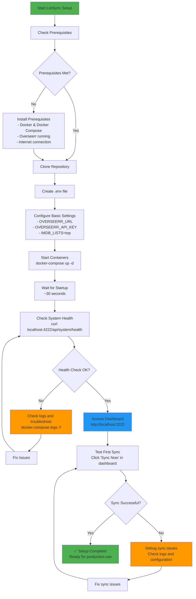
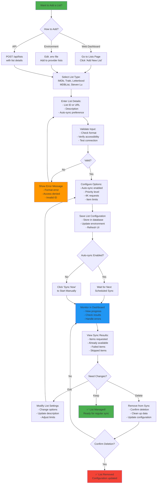
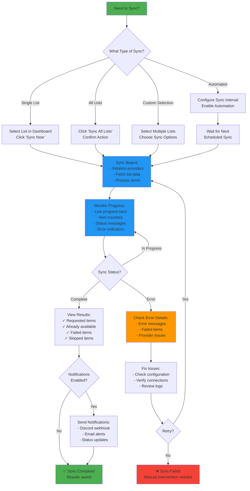

# User Guide - Complete ListSync Usage Guide

This comprehensive guide covers all aspects of using ListSync, from initial setup to advanced configuration and monitoring. Each section includes detailed step-by-step workflows with visual diagrams.

## 📋 Table of Contents

1. [Getting Started](#getting-started)
2. [Web Dashboard Overview](#web-dashboard-overview)
3. [List Management](#list-management)
4. [Sync Operations](#sync-operations)
5. [Analytics & Monitoring](#analytics--monitoring)
6. [Configuration Management](#configuration-management)
7. [Advanced Features](#advanced-features)
8. [Troubleshooting](#troubleshooting)
9. [Best Practices](#best-practices)

## 🚀 Getting Started

### First-Time Setup Workflow



### Prerequisites Checklist

**System Requirements:**
- [ ] Docker 20.10+ installed
- [ ] Docker Compose 2.0+ installed
- [ ] 2GB RAM available (4GB recommended)
- [ ] 1GB free disk space
- [ ] Internet connection for list fetching

**Overseerr Setup:**
- [ ] Overseerr instance running and accessible
- [ ] API key obtained from Overseerr settings
- [ ] User ID identified for making requests
- [ ] Network connectivity confirmed

**Network Requirements:**
- [ ] Port 3222 available for web dashboard
- [ ] Port 4222 available for API backend
- [ ] Access to external list providers (IMDb, Trakt, etc.)

### Quick Start Steps

1. **Clone and Configure**
   ```bash
   git clone https://github.com/Woahai321/list-sync.git
   cd list-sync
   cp envsample.txt .env
   ```

2. **Edit Configuration**
   ```bash
   # Edit .env file with your details
   OVERSEERR_URL=https://your-overseerr-url.com
   OVERSEERR_API_KEY=your_api_key_here
   IMDB_LISTS=top
   ```

3. **Deploy and Test**
   ```bash
   docker-compose up -d
   # Wait ~30 seconds, then test
   curl http://localhost:4222/api/system/health
   ```

4. **Access Dashboard**
   - Open http://localhost:3222 in your browser
   - Click "Sync Now" to test your first sync

## 🖥️ Web Dashboard Overview

### Dashboard Navigation

```mermaid
graph TB
    Dashboard[Web Dashboard :3222] --> Nav[Navigation Menu]
    
    Nav --> Home[🏠 Dashboard<br/>Overview & Quick Actions]
    Nav --> Lists[📋 Lists<br/>Manage Your Lists]
    Nav --> Sync[🔄 Sync<br/>Sync Operations]
    Nav --> History[📊 History<br/>Sync History & Analytics]
    Nav --> Settings[⚙️ Settings<br/>Configuration]
    
    Home --> QuickActions[Quick Actions Panel]
    Home --> Stats[Statistics Overview]
    Home --> RecentActivity[Recent Activity]
    Home --> SystemStatus[System Status]
    
    Lists --> AddList[Add New List]
    Lists --> ListGrid[Lists Grid View]
    Lists --> BulkActions[Bulk Actions]
    Lists --> ListFilters[Filter & Search]
    
    Sync --> ManualSync[Manual Sync]
    Sync --> AutoSync[Automated Sync]
    Sync --> SyncProgress[Sync Progress]
    Sync --> SyncSettings[Sync Settings]
    
    History --> SyncHistory[Sync History]
    History --> Analytics[Analytics Dashboard]
    History --> FailedItems[Failed Items]
    History --> ProcessedItems[Processed Items]
    
    Settings --> OverseerrConfig[Overseerr Configuration]
    Settings --> NotificationSettings[Notification Settings]
    Settings --> SyncSettings[Sync Settings]
    Settings --> ThemeSettings[Theme Settings]
    
    style Dashboard fill:#4CAF50
    style Home fill:#2196F3
    style Lists fill:#FF9800
    style Sync fill:#9C27B0
    style History fill:#607D8B
    style Settings fill:#795548
```



### Dashboard Features

**Real-time Updates:**
- Live sync progress with progress bars
- Real-time statistics updates
- Automatic refresh of data
- WebSocket connections for instant updates

**Responsive Design:**
- Works on desktop, tablet, and mobile
- Adaptive layout for different screen sizes
- Touch-friendly interface elements
- Optimized for all devices

**Theme Support:**
- Light and dark mode themes
- Persistent theme preferences
- System theme detection
- Custom theme options

## 📚 List Management

### Adding Lists - Complete Workflow



### List Provider Details

#### IMDb Lists

**Supported Formats:**
```bash
# Chart Lists
IMDB_LISTS=top,boxoffice,moviemeter,tvmeter

# User Lists
IMDB_LISTS=ls123456789,ls987654321

# User Watchlists
IMDB_LISTS=ur123456789,ur987654321

# Full URLs
IMDB_LISTS=https://www.imdb.com/list/ls123456789
```

**Available Charts:**
- `top` - IMDb Top 250 Movies
- `boxoffice` - Box Office
- `moviemeter` - Most Popular Movies
- `tvmeter` - Most Popular TV Shows

**Configuration Options:**
- Auto-sync: Include in automated sync cycles
- Priority: High, Normal, Low sync priority
- 4K Requests: Request 4K versions when available
- Item Limit: Maximum items to sync (optional)

#### Trakt Lists

**Regular Lists:**
```bash
# Numeric IDs from Trakt URLs
TRAKT_LISTS=123456,789012,345678
```

**Special Collections:**
```bash
# Trending and Popular content
TRAKT_SPECIAL_LISTS=trending:movies,popular:shows,anticipated:movies
TRAKT_SPECIAL_ITEMS_LIMIT=50
```

**Special List Categories:**
| Category | Movies | TV Shows |
|----------|--------|----------|
| **Trending** | `trending:movies` | `trending:shows` |
| **Popular** | `popular:movies` | `popular:shows` |
| **Anticipated** | `anticipated:movies` | `anticipated:shows` |
| **Recommendations** | `recommendations:movies` | `recommendations:shows` |

#### Letterboxd Lists

**Format:**
```bash
# User lists
LETTERBOXD_LISTS=username/list-name,username/favorites

# Watchlists
LETTERBOXD_LISTS=username/watchlist,friend/watchlist

# Full URLs
LETTERBOXD_LISTS=https://letterboxd.com/username/list-name
```

#### MDBList Collections

**Format:**
```bash
# User collections
MDBLIST_LISTS=username/collection-name,curator/best-movies

# Full URLs
MDBLIST_LISTS=https://mdblist.com/lists/username/collection-name
```

#### Steven Lu Lists

**Format:**
```bash
# Only one list available
STEVENLU_LISTS=stevenlu
```

### Managing Existing Lists

**List Actions Available:**
- **Edit** - Modify list configuration and options
- **Sync Now** - Trigger immediate sync for this list
- **View Items** - See list contents and sync status
- **Enable/Disable** - Toggle list in sync operations
- **Delete** - Remove list from sync permanently

**Bulk Operations:**
- **Select Multiple** - Checkbox selection for multiple lists
- **Bulk Sync** - Sync all selected lists simultaneously
- **Bulk Enable/Disable** - Toggle multiple lists at once
- **Export Configuration** - Save list configuration to file
- **Import Configuration** - Load list configuration from file

## 🔄 Sync Operations

### Sync Operation Decision Flow



### Manual Sync Operations

#### Single List Sync
1. **Navigate to Lists page**
2. **Find your desired list**
3. **Click "Sync Now" button**
4. **Monitor progress in real-time**
5. **Review results when complete**

#### Full Sync (All Lists)
1. **Go to Sync page**
2. **Click "Sync All Lists" button**
3. **Confirm the action**
4. **Watch progress dashboard**
5. **Receive completion notification**

#### Custom Sync (Selected Lists)
1. **Go to Lists page**
2. **Select multiple lists using checkboxes**
3. **Click "Bulk Sync" button**
4. **Choose sync options**
5. **Execute custom sync operation**

### Automated Sync Configuration

#### Sync Scheduling Options
```bash
# Sync intervals (in hours)
SYNC_INTERVAL=24    # Once per day
SYNC_INTERVAL=12    # Twice per day
SYNC_INTERVAL=6     # Every 6 hours
SYNC_INTERVAL=1     # Every hour
SYNC_INTERVAL=0.5   # Every 30 minutes (minimum)
SYNC_INTERVAL=0     # Manual sync only
```

#### Automated Features
- **Smart Retry** - Automatic retry on failures
- **Rate Limiting** - Respectful API usage
- **Error Recovery** - Resume from interruptions
- **Progress Notifications** - Discord/email updates
- **Resource Management** - Memory and CPU optimization

### Sync Status Monitoring

#### Real-time Updates
- **Progress Bars** - Visual sync progress indicators
- **Item Counters** - Processed/total items display
- **Status Messages** - Current operation details
- **Error Indicators** - Failed items highlighting
- **Time Estimates** - Estimated completion time

#### Sync Results Breakdown
- **Success Count** - Successfully requested items
- **Already Available** - Items already in library
- **Already Requested** - Previously requested items
- **Failed Items** - Items that couldn't be processed
- **Skipped Items** - Items excluded by filters

## 📊 Analytics & Monitoring

### Dashboard Analytics Overview

```mermaid
graph TB
    Analytics[Analytics Dashboard] --> Overview[Overview Metrics]
    Analytics --> Detailed[Detailed Analytics]
    Analytics --> Monitoring[Monitoring Tools]
    
    Overview --> TotalLists[Total Lists<br/>Configured lists count]
    Overview --> TotalItems[Total Items<br/>All items across lists]
    Overview --> SuccessRate[Success Rate<br/>Overall sync success %]
    Overview --> LastSync[Last Sync<br/>Most recent operation]
    
    Detailed --> SyncHistory[Sync History<br/>Timeline view]
    Detailed --> ProviderPerf[Provider Performance<br/>Success rates by provider]
    Detailed --> MediaBreakdown[Media Breakdown<br/>Movies vs TV shows]
    Detailed --> ErrorPatterns[Error Patterns<br/>Common failure reasons]
    
    Monitoring --> RealTime[Real-time Updates<br/>Live data refresh]
    Monitoring --> Alerts[Alert System<br/>Threshold notifications]
    Monitoring --> Logs[Log Viewer<br/>Structured log access]
    Monitoring --> Health[Health Checks<br/>System status monitoring]
    
    style Analytics fill:#4CAF50
    style Overview fill:#2196F3
    style Detailed fill:#FF9800
    style Monitoring fill:#9C27B0
```



### Performance Metrics

#### Key Performance Indicators
- **Average Sync Time** - Time per sync operation
- **Items Per Hour** - Processing rate
- **API Response Time** - Overseerr API performance
- **Error Rate** - Failure percentage
- **Success Rate** - Overall success percentage

#### Provider Analytics
- **Provider Performance** - Success rates by provider
- **Response Times** - Provider response performance
- **Error Patterns** - Common failure reasons
- **Item Distribution** - Content across providers

### Monitoring Alerts

#### Notification Settings
```bash
# Discord webhook for sync notifications
DISCORD_WEBHOOK_URL=https://discord.com/api/webhooks/123456789/abcdef...

# Email alerts (if configured)
EMAIL_NOTIFICATIONS=true
SMTP_SERVER=smtp.gmail.com
SMTP_PORT=587
SMTP_USERNAME=your-email@gmail.com
SMTP_PASSWORD=your-app-password
```

#### Alert Types
- **Sync Completion** - Operation finished successfully
- **Sync Failures** - Operations that failed
- **High Error Rates** - Unusual failure patterns
- **System Health** - Service availability issues
- **Performance Warnings** - Resource usage alerts

## ⚙️ Configuration Management

### Environment Configuration

#### Core Settings
```bash
# Overseerr/Jellyseerr Connection
OVERSEERR_URL=http://your-overseerr-url:5055
OVERSEERR_API_KEY=your-api-key-here
OVERSEERR_USER_ID=1
OVERSEERR_4K=false

# Sync Configuration
SYNC_INTERVAL=24
AUTOMATED_MODE=true
```

#### List Configuration
```bash
# IMDb Lists (comma-separated)
IMDB_LISTS=top,ls123456789,ur987654321

# Trakt Lists
TRAKT_LISTS=username/watchlist,other/list
TRAKT_SPECIAL_LISTS=trending:movies,popular:shows
TRAKT_SPECIAL_ITEMS_LIMIT=50

# Other Providers
LETTERBOXD_LISTS=username/watchlist
MDBLIST_LISTS=username/collection
STEVENLU_LISTS=stevenlu
```

### Web-based Configuration

#### Settings Interface
- **Connection Settings** - Overseerr/Jellyseerr configuration
- **Sync Settings** - Intervals and automation
- **Provider Settings** - List configuration
- **Notification Settings** - Discord/email setup
- **Advanced Settings** - Performance tuning

#### Configuration Validation
- **Connection Testing** - Verify API connectivity
- **List Validation** - Check list accessibility
- **Setting Verification** - Validate configuration values
- **Error Reporting** - Configuration issue alerts

### Backup & Restore

#### Configuration Backup
```bash
# Export settings
curl -X GET http://localhost:4222/api/config/export > config-backup.json

# Backup database
cp data/list_sync.db data/list_sync.db.backup

# Backup environment
cp .env .env.backup
```

#### Configuration Restore
```bash
# Import settings
curl -X POST http://localhost:4222/api/config/import -d @config-backup.json

# Restore database
cp data/list_sync.db.backup data/list_sync.db

# Restart services
docker-compose restart
```

## 🔧 Advanced Features

### Multi-Instance Deployments

#### Scenario: Multiple Overseerr Instances
```yaml
# docker-compose-multi.yml
version: "3.8"

services:
  listsync-main:
    image: ghcr.io/woahai321/list-sync:main
    environment:
      - OVERSEERR_URL=https://overseerr.example.com
      - OVERSEERR_API_KEY=${MAIN_API_KEY}
      - IMDB_LISTS=ls123456789,top
    volumes:
      - ./data-main:/usr/src/app/data

  listsync-4k:
    image: ghcr.io/woahai321/list-sync:main
    environment:
      - OVERSEERR_URL=https://overseerr-4k.example.com
      - OVERSEERR_API_KEY=${4K_API_KEY}
      - OVERSEERR_4K=true
      - IMDB_LISTS=top,boxoffice
    volumes:
      - ./data-4k:/usr/src/app/data
```

### Custom Provider Development

#### Adding New List Providers
1. **Create provider function**
2. **Register with decorator**
3. **Handle different input formats**
4. **Add to environment configuration**
5. **Test and validate**

### Integration Examples

#### Home Assistant Integration
```yaml
# configuration.yaml
shell_command:
  trigger_listsync: "docker exec listsync python -m list_sync --sync-now"
  
sensor:
  - platform: command_line
    name: "ListSync Status"
    command: 'docker logs listsync --tail 1 | grep -o "Sync completed\|Error\|Running"'
    scan_interval: 300
```

#### Plex Integration
```python
# plex-integration.py
from plexapi.server import PlexServer
import requests

def sync_plex_watchlist_to_overseerr():
    plex = PlexServer(PLEX_URL, PLEX_TOKEN)
    watchlist = plex.watchlist()
    
    # Format for ListSync
    media_items = []
    for item in watchlist:
        media_items.append({
            "title": item.title,
            "year": item.year,
            "media_type": "movie" if item.type == "movie" else "tv",
            "imdb_id": item.guid if "imdb://" in item.guid else None
        })
    
    # Trigger ListSync via API
    requests.post('http://listsync:4222/api/sync/trigger', json={
        'custom_list': media_items
    })
```

## 🔧 Troubleshooting

### Common Issues Quick Reference

| Issue | Quick Fix | Full Guide |
|-------|-----------|------------|
| **Can't access dashboard** | Check port 3222, restart container | [Web Interface Issues](#web-interface-issues) |
| **Sync not working** | Check Overseerr connection, verify lists | [Sync Issues](#sync-issues) |
| **All items "already available"** | Check 4K settings, verify Overseerr | [Already Available Issue](#already-available-issue) |
| **High memory usage** | Reduce list limits, increase sync interval | [Performance Issues](#performance-issues) |
| **Container won't start** | Check port conflicts, permissions | [Docker Issues](#docker-issues) |

### Diagnostic Tools

#### Health Check Commands
```bash
# System health
curl http://localhost:4222/api/system/health

# Detailed status
curl http://localhost:4222/api/system/status

# Check logs
docker-compose logs -f listsync-full

# Test API connectivity
curl -H "X-Api-Key: your-key" http://your-overseerr-url/api/v1/status
```

#### Log Analysis
```bash
# View real-time logs
docker-compose logs -f listsync-full

# Filter by log level
docker-compose logs listsync-full | grep ERROR

# Search for specific terms
docker-compose logs listsync-full | grep -i "overseerr\|sync\|error"

# Last 100 lines
docker-compose logs --tail=100 listsync-full
```

## 📋 Best Practices

### List Management Best Practices

#### Organization
- **Descriptive Names** - Use clear, descriptive list names
- **Categorization** - Group related lists by type or purpose
- **Priority Setting** - Set appropriate priorities for important lists
- **Regular Cleanup** - Remove unused or outdated lists

#### Performance
- **Reasonable Intervals** - Don't sync more frequently than necessary
- **List Size Management** - Monitor large lists for performance impact
- **Provider Distribution** - Balance load across different providers
- **Resource Monitoring** - Watch system resources during sync

### Sync Strategy Best Practices

#### Timing
- **Off-peak Hours** - Schedule syncs during low usage periods
- **Staggered Syncing** - Avoid simultaneous operations
- **Maintenance Windows** - Plan syncs around maintenance schedules
- **User Activity** - Consider user request patterns

#### Error Handling
- **Monitor Failures** - Watch error rates and patterns
- **Retry Logic** - Configure appropriate retry attempts
- **Fallback Plans** - Have alternative sync strategies
- **Alert Thresholds** - Set appropriate alert levels

### Security Best Practices

#### API Keys
- **Secure Storage** - Use environment variables for sensitive data
- **Regular Rotation** - Update API keys periodically
- **Access Monitoring** - Watch for unusual activity
- **Backup Keys** - Keep secure backups of important keys

#### Network Security
- **Firewall Rules** - Restrict unnecessary access
- **HTTPS Usage** - Use secure connections where possible
- **Network Monitoring** - Monitor traffic patterns
- **Update Management** - Keep system components updated

### Monitoring Best Practices

#### Regular Checks
- **Daily Status** - Check sync operations daily
- **Weekly Reviews** - Review performance metrics weekly
- **Monthly Analysis** - Analyze trends monthly
- **Quarterly Planning** - Plan improvements quarterly

#### Alerting
- **Critical Alerts** - Immediate attention needed
- **Warning Alerts** - Potential issues to monitor
- **Info Notifications** - Status updates and confirmations
- **Scheduled Reports** - Regular summary reports

---

This comprehensive user guide provides detailed coverage of all ListSync functionality. For additional support, refer to the [Troubleshooting Guide](troubleshooting.md) or the [API Reference](api-reference.md) for advanced usage scenarios.
