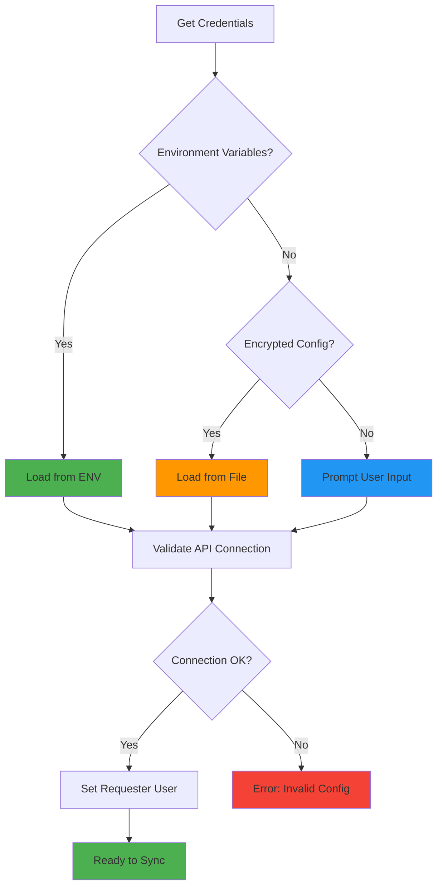
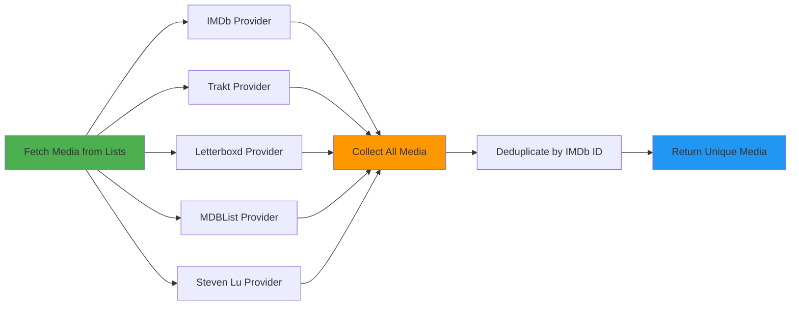
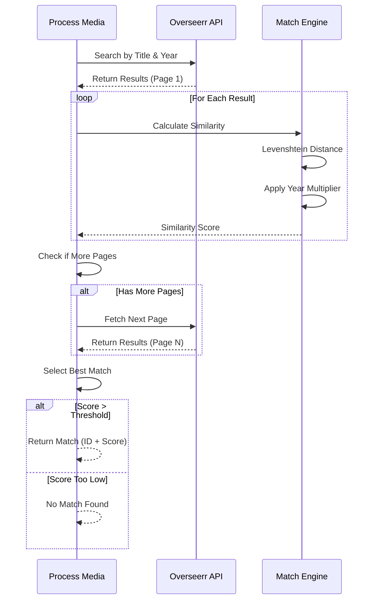
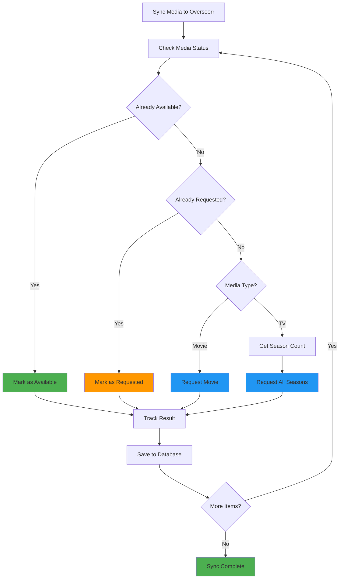

# 🔧 How ListSync Works - Complete Technical Guide

## Overview

ListSync is a sophisticated automation tool that bridges your watchlists from various platforms (IMDb, Trakt, Letterboxd, MDBList, StevenLu) with your media server infrastructure (Overseerr/Jellyseerr). This document provides comprehensive technical details about the tool's architecture, data flow, and implementation.

## 🏗️ Architecture Overview

### Core Components

1. **Main Application (`main.py`)**: Orchestrates the entire sync process and handles user interactions
2. **Provider System (`providers/`)**: Modular system for fetching data from different list services
3. **API Client (`api/overseerr.py`)**: Handles communication with Overseerr/Jellyseerr APIs
4. **Database Layer (`database.py`)**: SQLite-based persistence for tracking lists and sync state
5. **Configuration Management (`config.py`)**: Handles settings, credentials, and environment variables
6. **User Interface (`ui/`)**: CLI interface for interactive mode and display functions
7. **Utilities (`utils/`)**: Helper functions, logging, and web driver management

### Technology Stack

- **Python 3.9+**: Core language with modern async/await patterns
- **SeleniumBase**: Web scraping framework with undetected Chrome for bypassing bot detection
- **SQLite**: Lightweight database for local data persistence
- **Requests**: HTTP library for API communications
- **Cryptography**: AES encryption for secure credential storage
- **Docker**: Containerization for consistent deployment

## 🔄 Data Flow and Processing Pipeline

### 1. Initialization Phase


**Process Steps:**
- Creates necessary directories (`data/`)
- Initializes SQLite database with required tables:
  - `lists`: Stores configured list information
  - `synced_items`: Tracks processed media items and their status
  - `sync_interval`: Stores automation settings
- Prepares Selenium WebDriver with undetected Chrome configuration

### 2. Configuration and Authentication



**Configuration Hierarchy:**
- **Environment Variables**: Prioritizes Docker/environment-based configuration (highest priority)
- **Encrypted Storage**: Falls back to encrypted local config file using Fernet encryption
- **Interactive Setup**: Prompts for credentials if none found (lowest priority)
- **API Validation**: Tests Overseerr connection and sets requester user

### 3. List Processing Pipeline



#### Provider Registration System

Each provider is registered using a decorator pattern:

```python
@register_provider("imdb")
def fetch_imdb_list(list_id: str) -> List[Dict[str, Any]]:
    # Implementation
```

#### Provider-Specific Processing

**IMDb Provider (`providers/imdb.py`)**:
- Handles multiple input formats: list IDs (ls/ur), chart names, full URLs
- Uses Selenium with anti-bot detection measures
- Supports pagination for large lists
- Extracts: title, year, IMDb ID, media type
- Special handling for charts (Top 250, Box Office, etc.)

**Trakt Provider (`providers/trakt.py`)**:
- Regular lists: Uses Selenium for web scraping
- Special lists: Direct API access for trending/popular/anticipated content
- Supports shortcut format: `trending:movies`, `popular:shows`
- Configurable item limits for special lists

**Letterboxd Provider (`providers/letterboxd.py`)**:
- Handles pagination with "Older" button navigation
- Extracts movie data from list and watchlist pages
- Deals with Letterboxd's dynamic loading

**MDBList Provider (`providers/mdblist.py`)**:
- Handles infinite scroll for complete list extraction
- Supports both full URLs and username/listname format
- Automatically expands shortened formats

**StevenLu Provider (`providers/stevenlu.py`)**:
- Fetches from JSON API endpoint
- Simple HTTP request-based implementation

### 4. Media Search and Resolution



#### Search Algorithm

The Overseerr client implements sophisticated matching:

1. **Query Processing**: Strips years from titles, handles special characters
2. **Pagination**: Searches through multiple result pages
3. **Similarity Scoring**: Uses Levenshtein distance for title matching
4. **Year Weighting**: 
   - Exact year match: 2x score multiplier
   - ±1 year: 1.5x score multiplier
   - No year data: Base similarity only
5. **Threshold Filtering**: Different thresholds for exact year matches vs. fuzzy matches

#### Scoring System

```python
score = base_similarity * year_multiplier
min_similarity = 0.5 if exact_year_match else 0.7
```

### 5. Request Processing and Status Management



#### Status Checking

For each media item, the system:
1. Checks if already available in the media server
2. Verifies if already requested
3. Determines if request should be made
4. Handles different request types (movie vs. TV series)

#### TV Series Handling

- Automatically requests all available seasons
- Extracts season count from Overseerr metadata
- Handles multi-season series appropriately

### 6. Database Persistence and Tracking

#### Schema Design

```sql
-- Lists table: Stores configured watchlists
CREATE TABLE lists (
    id INTEGER PRIMARY KEY AUTOINCREMENT,
    list_type TEXT NOT NULL,        -- imdb, trakt, letterboxd, etc.
    list_id TEXT NOT NULL,          -- List identifier or URL
    UNIQUE(list_type, list_id)
);

-- Synced items: Tracks processed media
CREATE TABLE synced_items (
    id INTEGER PRIMARY KEY AUTOINCREMENT,
    title TEXT NOT NULL,
    media_type TEXT NOT NULL,       -- movie or tv
    imdb_id TEXT,                   -- External identifier
    overseerr_id INTEGER,           -- Internal Overseerr ID
    status TEXT,                    -- requested, available, etc.
    last_synced TIMESTAMP DEFAULT CURRENT_TIMESTAMP
);

-- Sync interval: Automation settings
CREATE TABLE sync_interval (
    id INTEGER PRIMARY KEY AUTOINCREMENT,
    interval_hours REAL NOT NULL   -- Supports decimal hours
);
```

#### Data Consistency

- **Deduplication**: Uses IMDb ID as primary deduplication key
- **State Tracking**: Prevents repeated requests for same content
- **Cleanup**: Automatic removal of old sync records (30+ days)
- **Conflict Resolution**: UPSERT operations for data consistency

## 🔁 Automation and Scheduling

### Automated Mode

When `AUTOMATED_MODE=true`:

```
load_env_lists() → automated_sync() → schedule_next_sync() → repeat
```

#### Threading Model

- **Main Thread**: Handles user interface and immediate operations
- **Scheduler Thread**: Manages automated sync timing
- **Worker Threads**: Parallel processing of media items (ThreadPoolExecutor)

#### Signal Handling

Graceful shutdown handling for:
- SIGINT (Ctrl+C)
- SIGTERM (Docker stop)
- Cleanup of resources and database connections

### Sync Intervals

- **Configurable**: Supports decimal hours (e.g., 0.5 = 30 minutes)
- **Persistent**: Stored in database between runs
- **Default**: 24 hours if not specified
- **Environment Override**: `SYNC_INTERVAL` environment variable

## 🛡️ Error Handling and Resilience

### Provider-Level Error Handling

- **Network Timeouts**: Configurable timeouts with retry logic
- **Rate Limiting**: Automatic backoff for 429 responses
- **Bot Detection**: Anti-detection measures in Selenium drivers
- **Partial Failures**: Continue processing other lists if one fails

### API Error Handling

- **Connection Failures**: Retry with exponential backoff
- **Invalid Responses**: Graceful degradation and logging
- **Authentication Issues**: Clear error messages and re-authentication prompts

### Data Validation

- **Input Sanitization**: URL validation and format checking
- **Type Validation**: Ensures data consistency throughout pipeline
- **Schema Enforcement**: Database constraints prevent invalid data

## 🔐 Security and Privacy

### Credential Management

- **Encryption**: AES-256 encryption for stored credentials using Fernet
- **Environment Variables**: Support for secure environment-based configuration
- **No Hardcoding**: No credentials stored in code or logs
- **Password Protection**: User-defined encryption passwords

### Data Security

- **Local Storage**: All data kept locally in SQLite database
- **No External Transmission**: Credentials never sent to third parties
- **Secure Communication**: HTTPS for all external API calls
- **Minimal Data Collection**: Only necessary metadata stored

## 🎛️ Configuration System

### Configuration Hierarchy

1. **Environment Variables**: Highest priority (Docker/container deployments)
2. **Encrypted Config File**: Local encrypted storage
3. **User Prompts**: Interactive input as fallback

### Environment Variables

```bash
# Required
OVERSEERR_URL=https://overseerr.example.com
OVERSEERR_API_KEY=your-api-key

# Optional
OVERSEERR_USER_ID=1                    # Default: 1
SYNC_INTERVAL=24                       # Default: 24 hours
AUTOMATED_MODE=true                    # Default: false
OVERSEERR_4K=false                     # Default: false
TRAKT_SPECIAL_ITEMS_LIMIT=20          # Default: 20

# Lists (comma-separated)
IMDB_LISTS=ls123456789,ur987654321
TRAKT_LISTS=12345,67890
TRAKT_SPECIAL_LISTS=trending:movies
LETTERBOXD_LISTS=https://letterboxd.com/user/list/name/
MDBLIST_LISTS=username/listname
STEVENLU_LISTS=stevenlu

# Notifications
DISCORD_WEBHOOK_URL=https://discord.com/api/webhooks/...
```

## 🔍 Monitoring and Notifications

### Discord Integration

- **Webhook Support**: Real-time notifications via Discord webhooks
- **Sync Summaries**: Detailed reports of sync operations
- **Error Notifications**: Immediate alerts for failures
- **Statistics**: Item counts and processing times

### Logging System

- **Structured Logging**: Comprehensive logging with different levels
- **File Output**: Persistent logs in `data/` directory
- **Console Output**: Colored terminal output for user feedback
- **Debug Mode**: Verbose logging for troubleshooting

## 🚀 Performance Optimizations

### Parallel Processing

- **Concurrent Requests**: ThreadPoolExecutor for media processing
- **Batch Operations**: Database operations batched for efficiency
- **Connection Pooling**: Reused HTTP connections where possible

### Caching and Memoization

- **Search Result Caching**: Temporary caching of Overseerr search results
- **Status Checking**: Skip recently checked items (48-hour window)
- **Database Indexing**: Optimized queries with proper indexes

### Resource Management

- **Selenium Driver Reuse**: Single driver instance per provider session
- **Memory Management**: Explicit cleanup of large data structures
- **Network Optimization**: Request batching and connection reuse

## 🔧 Development and Extensibility

### Provider Development

To add a new list provider:

```python
from . import register_provider

@register_provider("newservice")
def fetch_newservice_list(list_id: str) -> List[Dict[str, Any]]:
    """
    Fetch list from new service.
    
    Returns:
        List of dicts with required keys:
        - title: Media title
        - year: Release year (optional)
        - media_type: "movie" or "tv"
        - imdb_id: IMDb identifier (optional but recommended)
    """
    # Implementation here
    return media_items
```

### API Client Extension

The Overseerr client can be extended for other media servers by:
1. Implementing the same interface
2. Adapting the search and request methods
3. Maintaining the same return data structure

### Database Schema Evolution

- **Migration Support**: Built-in schema upgrade capabilities
- **Backward Compatibility**: Maintains compatibility with existing data
- **Data Export**: SQLite allows easy data migration and backup

## 🐛 Debugging and Troubleshooting

### Debug Mode

Enable verbose logging:
```bash
export LOG_LEVEL=DEBUG
```

### Common Issues and Solutions

1. **Selenium Timeouts**: Increase wait times in provider code
2. **API Rate Limits**: Adjust request intervals in config
3. **Bot Detection**: Update Selenium options or use different user agents
4. **Database Locks**: Ensure proper connection handling and timeouts

### Log Analysis

Key log patterns to monitor:
- `"API connection successful"`: Confirms Overseerr connectivity
- `"Found X items in Y list"`: Successful list processing
- `"Rate limited"`: API throttling detection
- `"Error fetching"`: Provider-specific failures

## 📊 Performance Metrics

### Benchmarks

Typical performance characteristics:
- **IMDb Lists**: 50-100 items per minute (depending on list size)
- **Trakt Lists**: 30-80 items per minute
- **API Requests**: Limited by Overseerr rate limits (typically 10-20 req/sec)
- **Database Operations**: 1000+ operations per second on modern systems

### Scalability Considerations

- **List Size**: Efficiently handles lists with 1000+ items
- **Multiple Lists**: Processes multiple lists concurrently
- **Long-Running**: Designed for 24/7 automated operation
- **Resource Usage**: Typically <100MB RAM, minimal CPU when idle
