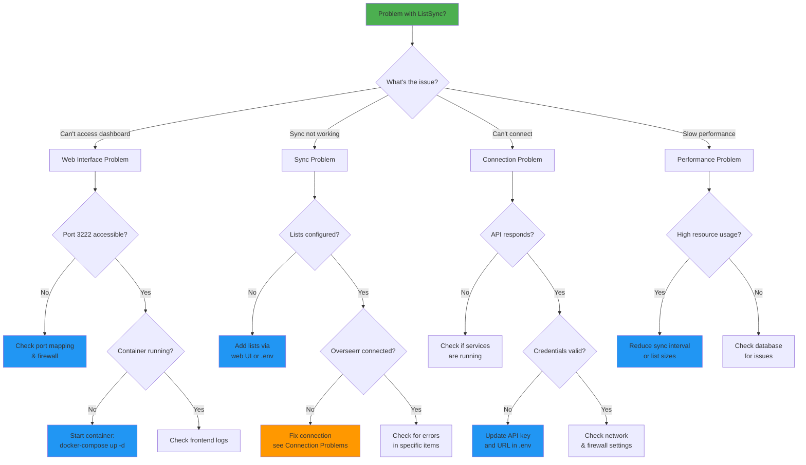
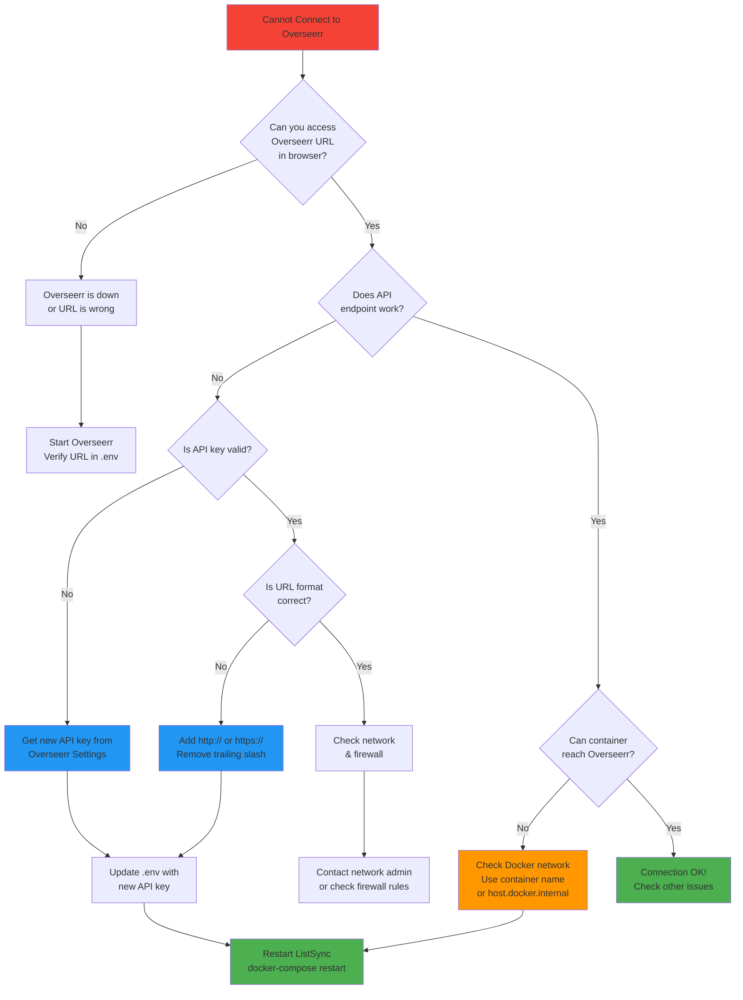
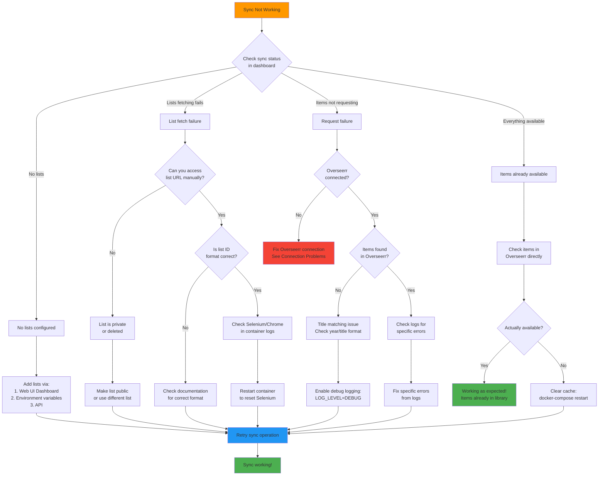
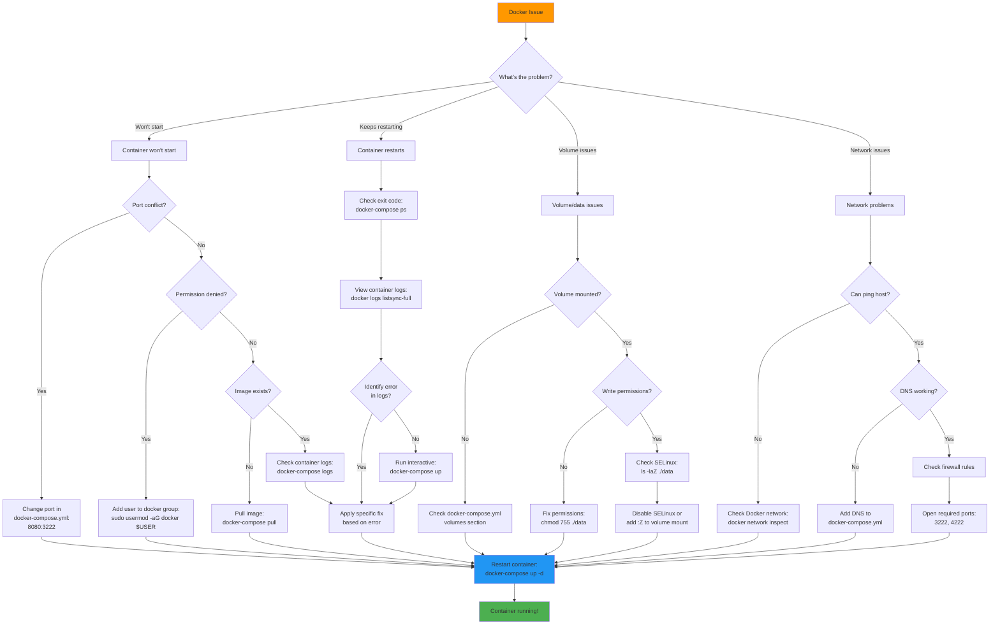

# Troubleshooting Guide

This guide helps you diagnose and resolve common issues with ListSync. Follow the steps systematically for the best results.

## 📋 Table of Contents

1. [Quick Diagnostics](#quick-diagnostics)
2. [Common Issues](#common-issues)
3. [Connection Problems](#connection-problems)
4. [Sync Issues](#sync-issues)
5. [Performance Problems](#performance-problems)
6. [Web Interface Issues](#web-interface-issues)
7. [List Provider Issues](#list-provider-issues)
8. [Docker-Specific Issues](#docker-specific-issues)
9. [Manual Installation Issues](#manual-installation-issues)
10. [Debugging Tools](#debugging-tools)
11. [Getting Help](#getting-help)

## 🔍 Quick Diagnostics

### Diagnostic Decision Tree



### Health Check Checklist

Run these quick checks to identify the issue category:

```bash
# 1. Check system health
curl http://localhost:4222/api/system/health

# 2. Check Docker containers (if using Docker)
docker-compose ps

# 3. Check logs for errors
docker-compose logs --tail=50 listsync-full

# 4. Verify Overseerr connection
curl -H "X-Api-Key: your-api-key" http://your-overseerr-url/api/v1/status
```

### Status Indicators

| Component | Healthy | Unhealthy | Check |
|-----------|---------|-----------|--------|
| **Database** | ✅ Connected | ❌ Connection failed | File exists, writable |
| **Process** | ✅ Running | ❌ Not running | ListSync process active |
| **Overseerr** | ✅ Connected | ❌ Connection failed | API key valid, URL accessible |
| **Web UI** | ✅ Accessible | ❌ Not loading | Port 3222 accessible |
| **API** | ✅ Responding | ❌ Not responding | Port 4222 accessible |

## 🚨 Common Issues

### "No lists configured" Error

**Symptoms**: Sync fails with "No lists configured" message

**Causes**:
- Environment variables not set
- Database not properly initialized
- Configuration file missing

**Solutions**:
1. **Check environment variables**:
   ```bash
   # Verify lists are configured
   echo $IMDB_LISTS
   echo $TRAKT_LISTS
   ```

2. **Add lists via web interface**:
   - Go to http://localhost:3222/dashboard/lists
   - Click "Add New List"
   - Enter your list details

3. **Add lists via environment**:
   ```bash
   # Add to .env file
   IMDB_LISTS=top,boxoffice
   
   # Restart container
   docker-compose restart
   ```

### "Already available" for Everything

**Symptoms**: All items show as "already available" even for new content

**Causes**:
- Items already exist in your media library
- Overseerr has different availability rules
- 4K vs standard quality mismatch

**Solutions**:
1. **Check Overseerr directly**:
   - Log into Overseerr web interface
   - Search for the specific titles
   - Verify their actual status

2. **Review 4K settings**:
   ```bash
   # Check your 4K setting
   OVERSEERR_4K=false  # or true
   ```

3. **Clear cache and retry**:
   ```bash
   # Restart with fresh data
   docker-compose down
   docker volume prune
   docker-compose up -d
   ```

### Sync Stops After Few Items

**Symptoms**: Sync process stops after processing only a few items

**Causes**:
- Rate limiting from list providers
- Memory issues
- Network timeouts
- Selenium/browser crashes

**Solutions**:
1. **Check for rate limiting**:
   ```bash
   # Look for rate limit messages in logs
   docker-compose logs | grep -i "rate\|limit\|429"
   ```

2. **Increase memory allocation**:
   ```yaml
   # In docker-compose.yml
   services:
     listsync-full:
       mem_limit: 2g  # Increase memory limit
   ```

3. **Reduce concurrent processing**:
   ```bash
   # Reduce special list limits
   TRAKT_SPECIAL_ITEMS_LIMIT=20  # Lower from default
   ```

## 🔌 Connection Problems

### Connection Troubleshooting Flowchart



### Cannot Connect to Overseerr

**Error Messages**:
- "Connection refused"
- "Host unreachable"
- "Invalid API key"

**Debugging Steps**:

1. **Test network connectivity**:
   ```bash
   # From inside container
   docker exec -it listsync-full curl http://your-overseerr-url
   
   # Test specific API endpoint
   curl -H "X-Api-Key: your-key" http://your-overseerr-url/api/v1/status
   ```

2. **Check API key**:
   ```bash
   # Get API key from Overseerr
   # Settings → General → API Key
   
   # Test in browser
   http://your-overseerr-url/api/v1/status?apikey=your-key
   ```

3. **Verify URL format**:
   ```bash
   # Correct formats
   OVERSEERR_URL=http://192.168.1.100:5055
   OVERSEERR_URL=https://overseerr.yourdomain.com
   
   # Incorrect (missing protocol)
   OVERSEERR_URL=overseerr.yourdomain.com  # ❌
   ```

4. **Docker networking**:
   ```bash
   # If Overseerr is also in Docker
   OVERSEERR_URL=http://overseerr:5055  # Use container name
   
   # Check Docker network
   docker network ls
   docker network inspect list-sync_default
   ```

### Web Interface Not Loading

**Symptoms**: 
- http://localhost:3222 not accessible
- "Connection refused" in browser
- Blank page or loading indefinitely

**Solutions**:

1. **Check container status**:
   ```bash
   docker-compose ps
   # Should show "Up" status for listsync-full
   ```

2. **Check port mapping**:
   ```bash
   # Verify ports are exposed
   docker-compose config | grep -A5 ports
   
   # Check if port is in use
   netstat -tlnp | grep :3222
   ```

3. **Check logs**:
   ```bash
   # Look for frontend startup issues
   docker-compose logs listsync-full | grep -i frontend
   ```

4. **Restart container**:
   ```bash
   docker-compose restart listsync-full
   ```

## 🔄 Sync Issues

### Sync Failure Diagnostic



### Lists Not Being Fetched

**Symptoms**: Lists show 0 items or "Failed to fetch"

**Debugging**:

1. **Check list accessibility**:
   ```bash
   # Test list URLs manually in browser
   https://www.imdb.com/chart/top
   https://www.imdb.com/list/ls123456789
   ```

2. **Verify list IDs**:
   ```bash
   # IMDb list examples
   IMDB_LISTS=top                    # ✅ Chart
   IMDB_LISTS=ls123456789           # ✅ List ID
   IMDB_LISTS=https://www.imdb.com/list/ls123456789  # ✅ Full URL
   
   # Trakt examples  
   TRAKT_LISTS=123456               # ✅ Numeric ID
   TRAKT_SPECIAL_LISTS=trending:movies  # ✅ Special format
   ```

3. **Check for browser issues**:
   ```bash
   # Look for Selenium errors
   docker-compose logs | grep -i "selenium\|chrome\|webdriver"
   ```

### Slow Sync Performance

**Symptoms**: Syncs take very long time to complete

**Optimization Steps**:

1. **Reduce list sizes**:
   ```bash
   # Limit special lists
   TRAKT_SPECIAL_ITEMS_LIMIT=25  # Reduce from 50+
   
   # Use fewer lists initially
   IMDB_LISTS=top  # Start with one list
   ```

2. **Increase sync interval**:
   ```bash
   # Sync less frequently
   SYNC_INTERVAL=24  # Once per day instead of hourly
   ```

3. **Monitor resource usage**:
   ```bash
   # Check Docker stats
   docker stats listsync-full
   
   # Check system resources
   htop
   ```

### Title Matching Issues

**Symptoms**: Many items showing as "not found" that should exist

**Debugging**:

1. **Check Overseerr search**:
   - Manually search for failing titles in Overseerr
   - Note any differences in title format

2. **Enable debug logging**:
   ```bash
   # Add to .env
   LOG_LEVEL=DEBUG
   
   # Restart and check logs for matching details
   docker-compose restart
   docker-compose logs | grep -i "matching\|similarity"
   ```

3. **Year matching issues**:
   ```bash
   # Look for year-related matching problems
   docker-compose logs | grep -i "year"
   ```

## ⚡ Performance Problems

### High Memory Usage

**Symptoms**: Container uses excessive RAM, system becomes slow

**Solutions**:

1. **Set memory limits**:
   ```yaml
   # In docker-compose.yml
   services:
     listsync-full:
       mem_limit: 1g
       mem_reservation: 512m
   ```

2. **Reduce concurrent operations**:
   ```bash
   # Process fewer items at once
   TRAKT_SPECIAL_ITEMS_LIMIT=20
   
   # Increase sync interval
   SYNC_INTERVAL=12
   ```

3. **Clear browser cache**:
   ```bash
   # Restart container to clear browser cache
   docker-compose restart
   ```

### High CPU Usage

**Symptoms**: High CPU utilization, system becomes unresponsive

**Solutions**:

1. **Check for infinite loops**:
   ```bash
   # Look for repeated error messages
   docker-compose logs --tail=100 | grep -E "(ERROR|WARNING)" | sort | uniq -c
   ```

2. **Reduce processing load**:
   ```bash
   # Sync less frequently
   SYNC_INTERVAL=24
   
   # Use fewer lists
   IMDB_LISTS=top  # Start with minimal lists
   ```

## 🌐 Web Interface Issues

### Dashboard Shows Incorrect Data

**Symptoms**: Wrong statistics, outdated information, missing data

**Solutions**:

1. **Clear browser cache**:
   - Hard refresh: Ctrl+F5 (Windows/Linux) or Cmd+Shift+R (Mac)
   - Clear browser cache and cookies

2. **Check API connectivity**:
   ```bash
   # Test API directly
   curl http://localhost:4222/api/system/health
   curl http://localhost:4222/api/analytics/overview
   ```

3. **Restart frontend**:
   ```bash
   docker-compose restart listsync-full
   ```

### Real-time Updates Not Working

**Symptoms**: Dashboard doesn't update automatically, manual refresh required

**Solutions**:

1. **Check WebSocket connections**:
   - Open browser developer tools
   - Check Network tab for WebSocket connections
   - Look for connection errors

2. **Verify server-sent events**:
   ```bash
   # Test SSE endpoint
   curl http://localhost:4222/api/logs/stream
   ```

3. **Check CORS settings**:
   ```bash
   # Verify CORS configuration
   CORS_ALLOWED_ORIGINS=http://localhost:3222
   ```

## 📚 List Provider Issues

### IMDb Lists

**Common Issues**:
- "Access denied" errors
- Empty results from valid lists
- Slow loading times

**Solutions**:
1. **Verify list is public**:
   - Open list URL in incognito browser
   - Ensure no login required

2. **Check for CAPTCHA**:
   ```bash
   # Look for CAPTCHA-related messages
   docker-compose logs | grep -i "captcha\|verification"
   ```

3. **Use alternative format**:
   ```bash
   # Try different formats
   IMDB_LISTS=ls123456789  # Instead of full URL
   ```

### Trakt Lists

**Common Issues**:
- Invalid list IDs
- Special list format errors
- Rate limiting

**Solutions**:
1. **Verify list ID format**:
   ```bash
   # Regular lists (numeric)
   TRAKT_LISTS=123456
   
   # Special lists (category:type)
   TRAKT_SPECIAL_LISTS=trending:movies,popular:shows
   ```

2. **Check Trakt status**:
   - Visit https://trakt.tv to ensure service is available
   - Verify your list URLs work in browser

### Letterboxd Lists

**Common Issues**:
- Watchlist vs regular list confusion
- User privacy settings
- Pagination problems

**Solutions**:
1. **Use correct format**:
   ```bash
   # Regular lists
   LETTERBOXD_LISTS=username/list-name
   
   # Watchlists
   LETTERBOXD_LISTS=username/watchlist
   ```

2. **Check list privacy**:
   - Ensure lists are public
   - Test URLs in incognito browser

## 🐳 Docker-Specific Issues

### Docker Troubleshooting Flowchart



### Container Won't Start

**Error Messages**:
- "Port already in use"
- "Permission denied"
- "Image not found"

**Solutions**:

1. **Port conflicts**:
   ```bash
   # Check what's using the port
   sudo netstat -tlnp | grep :3222
   
   # Change ports in docker-compose.yml
   ports:
     - "8080:3222"  # Use different host port
   ```

2. **Permission issues**:
   ```bash
   # Fix Docker permissions
   sudo chmod 666 /var/run/docker.sock
   
   # Add user to docker group
   sudo usermod -aG docker $USER
   # Log out and back in
   ```

3. **Image issues**:
   ```bash
   # Pull latest image
   docker-compose pull
   
   # Rebuild if using local build
   docker-compose build --no-cache
   ```

### Volume Mount Issues

**Symptoms**: Configuration not persisting, data loss after restart

**Solutions**:

1. **Check volume permissions**:
   ```bash
   # Ensure data directory is writable
   chmod 755 ./data
   
   # Check SELinux (if applicable)
   ls -laZ ./data
   ```

2. **Verify mount paths**:
   ```bash
   # Check volume configuration
   docker-compose config | grep -A5 volumes
   
   # Inspect container mounts
   docker inspect listsync-full | grep -A10 Mounts
   ```

### Container Keeps Restarting

**Symptoms**: Container starts then immediately exits, restart loop

**Debugging**:

1. **Check exit codes**:
   ```bash
   # Look at container status
   docker-compose ps
   
   # Check exit reason
   docker logs listsync-full
   ```

2. **Run interactively**:
   ```bash
   # Start container without daemon mode
   docker-compose up
   
   # Or run bash to debug
   docker run -it --entrypoint bash ghcr.io/woahai321/list-sync:main
   ```

## 💻 Manual Installation Issues

### Python Version Problems

**Error Messages**:
- "Python version not supported"
- "Module not found"
- "Syntax errors"

**Solutions**:

1. **Check Python version**:
   ```bash
   python3 --version  # Should be 3.8+
   
   # Install newer Python if needed
   sudo apt install python3.9 python3.9-venv
   ```

2. **Virtual environment issues**:
   ```bash
   # Recreate virtual environment
   rm -rf venv
   python3 -m venv venv
   source venv/bin/activate
   pip install -r requirements.txt
   ```

### Node.js/Frontend Issues

**Common Problems**:
- Build failures
- Dependency conflicts
- Port conflicts

**Solutions**:

1. **Node.js version**:
   ```bash
   node --version  # Should be 18+
   
   # Install/update Node.js
   curl -fsSL https://deb.nodesource.com/setup_18.x | sudo -E bash -
   sudo apt-get install -y nodejs
   ```

2. **Clean installation**:
   ```bash
   cd listsync-nuxt
   rm -rf node_modules package-lock.json
   npm cache clean --force
   npm install
   ```

### Chrome/Selenium Issues

**Error Messages**:
- "Chrome not found"
- "WebDriver errors"
- "Selenium timeouts"

**Solutions**:

1. **Install Chrome**:
   ```bash
   # Ubuntu/Debian
   wget -q -O - https://dl.google.com/linux/linux_signing_key.pub | sudo apt-key add -
   sudo sh -c 'echo "deb [arch=amd64] http://dl.google.com/linux/chrome/deb/ stable main" >> /etc/apt/sources.list.d/google-chrome.list'
   sudo apt update
   sudo apt install google-chrome-stable
   ```

2. **Fix dependencies**:
   ```bash
   # Install Chrome dependencies
   sudo apt install libxss1 libappindicator1 libindicator7
   ```

3. **Test Chrome**:
   ```bash
   # Test headless Chrome
   google-chrome --headless --no-sandbox --disable-gpu --dump-dom https://google.com
   ```

## 🛠️ Debugging Tools

### Log Analysis

```bash
# View real-time logs
docker-compose logs -f listsync-full

# Filter by log level
docker-compose logs listsync-full | grep ERROR

# Search for specific terms
docker-compose logs listsync-full | grep -i "overseerr\|sync\|error"

# Last 100 lines
docker-compose logs --tail=100 listsync-full
```

### API Testing

```bash
# Test all major endpoints
curl http://localhost:4222/api/system/health
curl http://localhost:4222/api/lists
curl http://localhost:4222/api/analytics/overview
curl http://localhost:4222/api/processed?limit=5

# Test with verbose output
curl -v http://localhost:4222/api/system/status
```

### Database Inspection

```bash
# Connect to database directly
sqlite3 data/list_sync.db

# View tables
.tables

# Check lists
SELECT * FROM lists;

# Check recent sync results
SELECT * FROM synced_items ORDER BY last_synced DESC LIMIT 10;
```

### Container Debugging

```bash
# Enter running container
docker exec -it listsync-full bash

# Check processes inside container
docker exec -it listsync-full ps aux

# Check container resources
docker stats listsync-full

# Inspect container configuration
docker inspect listsync-full
```

### Network Testing

```bash
# Test connectivity from container
docker exec -it listsync-full curl http://your-overseerr-url

# Check DNS resolution
docker exec -it listsync-full nslookup your-overseerr-url

# Test specific ports
docker exec -it listsync-full nc -zv your-overseerr-url 5055
```

## 🆘 Getting Help

### Before Asking for Help

1. **Gather information**:
   ```bash
   # System info
   docker --version
   docker-compose --version
   
   # Container status
   docker-compose ps
   
   # Recent logs
   docker-compose logs --tail=50 listsync-full > listsync-logs.txt
   ```

2. **Test basic functionality**:
   ```bash
   # Health check
   curl http://localhost:4222/api/system/health
   
   # Manual sync test
   curl -X POST http://localhost:4222/api/sync/trigger
   ```

3. **Sanitize sensitive information**:
   - Remove API keys from logs
   - Replace URLs with placeholders
   - Remove personal list IDs

### Information to Include

When reporting issues, include:

- **Installation method** (Docker/manual)
- **Operating system** and version
- **Docker/Docker Compose versions** (if applicable)
- **Configuration** (sanitized .env file)
- **Error messages** (exact text)
- **Steps to reproduce**
- **Expected vs actual behavior**
- **Recent logs** (relevant portions)

### Support Channels

1. **GitHub Issues**: [https://github.com/soluify/list-sync/issues](https://github.com/soluify/list-sync/issues)
   - Bug reports
   - Feature requests
   - Configuration help

2. **GitHub Discussions**: [https://github.com/soluify/list-sync/discussions](https://github.com/soluify/list-sync/discussions)
   - General questions
   - Setup help
   - Community support

3. **Discord**: [Join our Discord](https://discord.gg/your-invite-link)
   - Real-time help
   - Community chat
   - Quick questions

### Self-Help Resources

- **Documentation**: Read all docs in the `/docs` folder
- **Example Configurations**: Check `envsample.txt` for examples
- **API Documentation**: Use http://localhost:4222/docs for API reference
- **Source Code**: Review the codebase for understanding implementation

---

**Remember**: Most issues are configuration-related. Double-check your environment variables, API keys, and network connectivity before seeking help. 